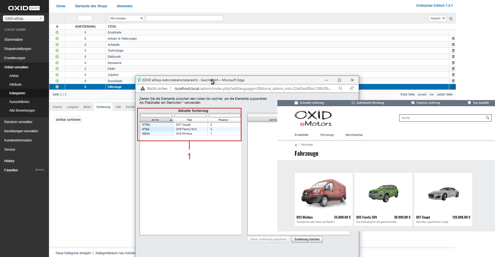

Artikelreihenfolge festlegen
============================

Legen Sie die Reihenfolge fest, in der Artikel in einer Kategorie angezeigt werden.

* eine Schnellsortierung basierend auf einem einzelnen Artikelmerkmal in auf- oder absteigender Reihenfolge durchführen.
* eine manuelle Sortierung vornehmen.
* den Kunden Ihres OXID eShops ermöglichen, die Artikel einer Kategorie nach vorgegebenen Kriterien zu sortieren.

Artikel automatisch sortieren
-----------------------------

Wählen Sie ein Artikelmerkmal, beispielsweise :guilabel:`Titel`, :guilabel:`Preis` oder :guilabel:`Angelegt am`, nach dem automatisch sortiert werden soll.

Legen Sie fest, ob die Artikel nach diesem Artikelmerkmal auf- oder absteigend sortiert werden sollen.

|procedure|

1. Wählen Sie :menuselection:`Artikel verwalten --> Kategorien`.
#. Wählen Sie in der Kategorieliste die gewünschte Kategorie.
#. Öffnen Sie auf der Registerkarte :guilabel:`Stamm` die Dropdown-Liste :guilabel:`Schnellsortierung`.
#. Wählen Sie ein Artikelmerkmal für die Schnellsortierung.
#. Wählen Sie :guilabel:`asc` oder :guilabel:`desc` für eine aufsteigende oder eine absteigende Sortierung.
#. Speichern Sie Ihre Einstellungen.

Artikel manuell anordnen
------------------------

Bringen Sie die Artikel einer Kategorie manuell in eine bestimmte Reihenfolge.

|procedure|

1. Wählen Sie :menuselection:`Artikel verwalten --> Kategorien`.
#. Wählen Sie die gewünschte Kategorie aus der Kategorieliste.
#. Stellen Sie sicher, dass auf der Registerkarte :guilabel:`Stamm` in der Dropdown-Liste :guilabel:`Schnellsortierung` die Option :guilabel:`keine Sortierung` gewählt ist.
#. Wählen Sie auf der Registerkarte :guilabel:`Sortierung`die Schaltfläche :guilabel:`Artikel sortieren`.
#. Verschieben Sie die Artikel in der gewünschten Reihenfolge in die rechte Liste des Zuordnungsfensters.
#. Wählen Sie :guilabel:`Neue Sortierung` speichern.

|result|

In der linken Liste wird die nun aktuelle Sortierung angezeigt (:ref:`oxbafq01`, Pos. 1). In der Spalte :guilabel:`Position` stehen die für die Sortierung zuständigen Werte.

.. _oxbafq01:

   Abb.: Artikelreihenfolge manuell festlegen

Kundenseitiges Sortieren ermöglichen
------------------------------------

Legen Sie fest, ob und nach welchen Kriterien Ihre Kunden die Artikel in Kategorien sortieren können.

|procedure|

1. Wählen Sie zu :menuselection:`Stammdaten --> Grundeinstellungen`.
#. Wählen Sie auf der Registerkarte :guilabel:`Einstell.` den Abschnitt :guilabel:`Artikel`.
#. Stellen Sie sicher, dass das Kontrollkästchen :guilabel:`Benutzer können Artikellisten sortieren` aktiviert ist (:ref:`oxbafq02`, Pos. 1).
#. Legen Sie die Felder für die Sortierung fest (:ref:`oxbafq02`, Pos. 2).

   Sie haben folgenden Möglichkeiten:

   * ``oxtitle``: Titel (Name) der Artikel
   * ``oxprice``: Preis der Artikel
   * ``xvarminprice``: Der niedrigste Preis der Artikel, wenn Varianten mit verschiedenen Preisen verwendet werden.
   * ``oxartnum``: Artikelnummern
   * ``oxrating``: Die Bewertung der Artikel
   * ``oxstock``: Lagerbestand der Artikel

   Jedes Feld muss in einer Zeile stehen.

   Die Sortierfelder entsprechen den Datenbankfeldern der Tabelle ``oxarticles``.

   .. _oxbafq02:

   .. figure:: ../../media/screenshots/oxbafq02.png
      :alt: Kundenseitiges Sortieren konfigurieren
      :width: 650
      :class: with-shadow

      Abb.: Kundenseitiges Sortieren konfigurieren

#. Speichern Sie Ihre Einstellungen.

|result|

In unserem Beispiel können die Kunden zusätzlich zu Titel und Preis auch nach der Artikelnummer sortieren (:ref:`oxbafq02`, Pos. 3).

Dafür haben wir in den Stammdaten den standardmäßig eingetragenen Feldern ``oxtitle``  und ``oxvarminprice``  das Feld ``oxartnum``  hinzugefügt (:ref:`oxbafq02`, Pos. 2).

.. seealso:: :doc:`Kategorien - Registerkarte Stamm <../kategorien/registerkarte-stamm>` | :doc:`Kategorien - Registerkarte Sortierung <../kategorien/registerkarte-sortierung>`

.. Intern: oxbafq, Status: