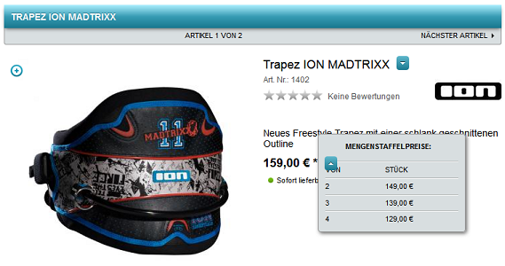

Staffelpreise
=============
Mit den Staffelpreisen kann für ausgesuchte Artikel ein Mengenrabatt gewährt werden. Sobald eine bestimmte Menge eines Artikels gekauft wird, wird der Artikel günstiger. Für einen bestimmten Mengenbereich wird ein absoluter Preis oder ein prozentualer Rabatt definiert. Mehrere Mengenbereiche bilden so eine Staffel mit unterschiedlichen Artikelpreisen.

Im OXID eShop werden die Staffelpreise auf der Detailseite des Artikels angezeigt, sobald der Kunde auf die Schaltfläche :guilabel:`Mengenstaffelpreise` klickt. Abhängig von der beim Kauf angegebenen Menge wird der dafür vorgesehene Staffelpreis im Warenkorb verwendet und angezeigt.

Staffelpreise konfigurieren
---------------------------

Der Staffelpreis wird in der Artikelverwaltung festgelegt.

* Gehen Sie zu :menuselection:`Artikel verwalten --> Artikel`.
* Wählen Sie den gewünschten Artikel aus der Artikelliste.
* Auf der Registerkarte :guilabel:`Lager` finden Sie die Eingabefelder :guilabel:`Menge von`, :guilabel:`bis` und :guilabel:`Preis`.
* Geben Sie einen Mengenbereich an und legen Sie einen Preis fest. Wählen Sie aus, ob die Preisangabe absolut oder prozentual ist.
* Speichern Sie den Staffelpreis.
* Sie können weitere Staffelpreise hinzufügen.

.. hint:: Bitte beachten Sie, dass bei der Staffel mit der größten Artikelanzahl immer eine ausreichend große Menge im Feld :guilabel:`bis` steht, beispielsweise 999999. Anderenfalls würde bei der Überschreitung der obersten Staffelmenge wieder der Originalpreis des Artikels gelten.

Staffelpreise in Kombination mit Rabatten verwenden
---------------------------------------------------

Staffelpreise ähneln Rabatten.

Die Kombination von Staffelpreisen mit Rabatten hängt von der Art des Rabatts ab. Produkt- und kategoriespezifische Rabatte prüfen den Einkaufspreis gegen den Originalpreis, während allgemeine Rabatte die staffelbereinigte Gesamtbestellsumme berücksichtigen.

Produkt- und kategorie-spezifische Rabatte
^^^^^^^^^^^^^^^^^^^^^^^^^^^^^^^^^^^^^^^^^^

Wenn Sie Rabatte für Produkte mit Staffelpreisen konfigurieren, wird der :emphasis:`Einkaufspreis` des Rabatts mit dem ursprünglichen :emphasis:`Produktpreis` verglichen, nicht mit dem Staffelpreis.

.. todo: #SP: "ursprünglichen :emphasis:`Produktpreis`" -- sonst sprechen wir von "Originalpreis" oder?

|example|

* Sie haben ein Produkt mit einem ursprünglichen Preis von 10,00 EUR.
* Das Produkt hat einen Staffelpreis für Mengen von 10 bis 99 Stück in Höhe von 9,00 EUR.
* Sie fügen einen Rabatt von 50 % für das Produkt hinzu, der an einen :guilabel:`Einkaufspreis` von 100,00 EUR gebunden ist.

Wenn Sie zehn Artikel in den Warenkorb legen, beträgt die ursprüngliche Preissumme 100,00 EUR, wodurch der 50 %-Rabatt ausgelöst wird. Da die Menge von zehn Artikeln den Staffelpreis von 9,00 EUR aktiviert, ergibt sich eine Gesamtbestellsumme von 45,00 EUR (nach Anwendung des Rabatts auf die staffelbereinigte Summe).

**Erläuterung des Rechenwegs (produkt- oder kategoriespezifischer Rabatt mit 10 Artikeln):**

Das System priorisiert die Prüfung des :emphasis:`Einkaufspreises` auf Basis der ursprünglichen Preissumme, um die Rabattbedingung auszulösen. Anschließend wird der Staffelpreis auf die Menge angewendet, und der Rabatt wirkt sich auf die staffelbereinigte Summe aus. Der detaillierte Ablauf ist wie folgt:

.. list-table::
   :header-rows: 1
   :widths: 10 50 25 15

   * - Schritt
     - Beschreibung
     - Berechnung
     - Ergebnis
   * - 1
     - Ursprüngliche Preissumme ermitteln (für Rabattbedingung)
     - 10 × 10,00 EUR
     - 100,00 EUR
   * - 2
     - Rabattbedingung prüfen und Rabattfaktor anwenden (da Summe ≥ 100,00 EUR)
     - Rabatt triggern: 50 % (Faktor 0,5)
     - Rabatt aktiviert
   * - 3
     - Staffelpreis anwenden (Menge 10 passt zu 10–99)
     - 10 × 9,00 EUR
     - 90,00 EUR (staffelbereinigte Summe)
   * - 4
     - Rabatt auf staffelbereinigte Summe anwenden
     - 90,00 EUR × 0,5
     - 45,00 EUR (Gesamtsumme)

Fügen Sie einen weiteren Artikel hinzu, so dass insgesamt elf gleiche Produkte im Warenkorb sind. Mit dem Staffelpreis erreichen Sie eine Zwischensumme von 99,00 EUR. Die ursprüngliche Preissumme (ohne Staffelpreis) beträgt jedoch 110,00 EUR, weshalb der 50 %-Rabatt angewendet wird. Sie zahlen 49,50 EUR.

**Erläuterung des Rechenwegs (produkt- oder kategoriespezifischer Rabatt mit 11 Artikeln):**

Ähnlich wie oben wird die Rabattbedingung auf der ursprünglichen Summe geprüft, der Staffelpreis separat angewendet und der Rabatt dann auf die staffelbereinigte Summe angewendet:

.. list-table::
   :header-rows: 1
   :widths: 10 50 25 15

   * - Schritt
     - Beschreibung
     - Berechnung
     - Ergebnis
   * - 1
     - Ursprüngliche Preissumme ermitteln (für Rabattbedingung)
     - 11 × 10,00 EUR
     - 110,00 EUR
   * - 2
     - Rabattbedingung prüfen und Rabattfaktor anwenden (da Summe ≥ 100,00 EUR)
     - Rabatt triggern: 50 % (Faktor 0,5)
     - Rabatt aktiviert
   * - 3
     - Staffelpreis anwenden (Menge 11 passt zu 10–99)
     - 11 × 9,00 EUR
     - 99,00 EUR (staffelbereinigte Summe)
   * - 4
     - Rabatt auf staffelbereinigte Summe anwenden
     - 99,00 EUR × 0,5
     - 49,50 EUR (Gesamtsumme)

Allgemeine Rabatte
^^^^^^^^^^^^^^^^^^

Allgemeine Rabatte vergleichen den konfigurierten :emphasis:`Einkaufspreis` mit der Gesamtbestellsumme, die unter Berücksichtigung der Staffelpreise berechnet wird.

|example|

Dasselbe Szenario wie zuvor, aber diesmal mit einem allgemeinen Rabatt. Wenn Sie zehn Artikel in den Warenkorb legen, beträgt die Gesamtbestellsumme aufgrund des Staffelpreises (ab einer Menge von zehn) 90,00 EUR. Der 50 %-Rabatt wird nicht angewendet, da die Gesamtbestellsumme unter 100,00 EUR liegt.

**Erläuterung des Rechenwegs (allgemeiner Rabatt mit 10 Artikeln):**

Bei allgemeinen Rabatten erfolgt die Prüfung der Bedingung nach Anwendung der Staffelpreise, was zu einer anderen Logik führt:

.. list-table::
   :header-rows: 1
   :widths: 10 50 25 15

   * - Schritt
     - Beschreibung
     - Berechnung
     - Ergebnis
   * - 1
     - Staffelpreis anwenden (Menge 10 passt zu 10–99)
     - 10 × 9,00 EUR
     - 90,00 EUR (Gesamtsumme)
   * - 2
     - Rabattbedingung prüfen (auf staffelbereinigter Summe)
     - 90,00 EUR < 100,00 EUR
     - Kein Rabatt
   * - 3
     - Finale Summe
     - Keine weitere Anpassung
     - 90,00 EUR (Gesamtsumme)

Fügen Sie nun ein weiteres Produkt in den Warenkorb hinzu, z. B. ein Produkt mit einem Preis von 15,00 EUR. Die Gesamtbestellsumme beträgt nun 105,00 EUR. Der :emphasis:`Einkaufspreis` wird erreicht, und der 50 %-Rabatt wird angewendet.

**Erläuterung des Rechenwegs (allgemeiner Rabatt mit 10 Artikeln + Zusatzprodukt):**

Die Staffelpreise werden zuerst auf die relevanten Produkte angewendet, dann die Gesamtsumme geprüft und der Rabatt auf die gesamte Summe appliziert:

.. list-table::
   :header-rows: 1
   :widths: 10 50 25 15

   * - Schritt
     - Beschreibung
     - Berechnung
     - Ergebnis
   * - 1
     - Staffelpreis für Hauptprodukt anwenden
     - 10 × 9,00 EUR
     - 90,00 EUR
   * - 2
     - Zusatzprodukt addieren
     - 90,00 EUR + 15,00 EUR
     - 105,00 EUR (Gesamtsumme)
   * - 3
     - Rabattbedingung prüfen und anwenden (da Summe ≥ 100,00 EUR)
     - 105,00 EUR × 0,5
     - 52,50 EUR (Gesamtsumme)

.. hint:: Rabatte aus Gutscheinserien werden stets auf Basis der Gesamtbestellsumme berechnet, da sie nur die Option :guilabel:`Min. Bestellsumme` verwenden und keinen :guilabel:`Einkaufspreis`, der mit Staffelpreisen in Konflikt geraten könnte.

  Weitere Informationen finden Sie unter :doc:`Gutscheinserien <../../betrieb/gutscheinserien/gutscheinserien>`.

.. seealso:: :doc:`Artikel - Registerkarte Lager <../artikel/registerkarte-lager>`

.. Intern: oxbafm, Status: