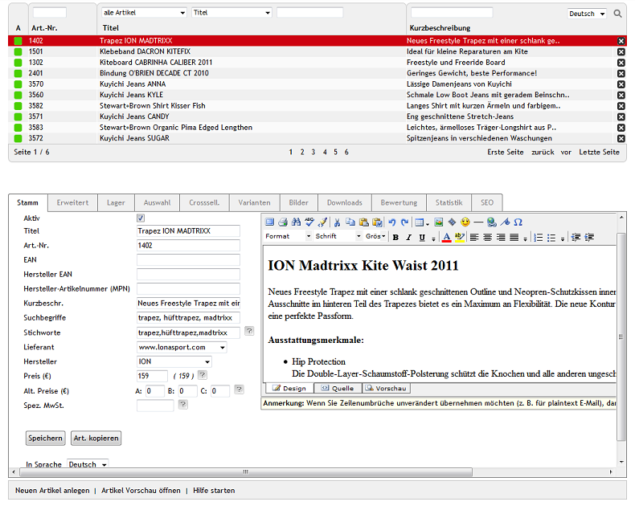

Artikel
=======
Artikel sind neben den Kategorien die eigentliche Basis des Warenkatalogs. Schließlich geht es in einem Onlineshop darum, Artikel gut zu präsentieren und zu verkaufen. Titel, Kurz- und Langbeschreibung sind die wichtigsten Artikeleigenschaften, aber es gibt viele weitere, mit denen sich Artikel detailliert beschreiben lassen. Dazu kommen Artikelbilder, welche den Artikel in unterschiedlichen Ansichten und aus verschiedenen Blickwinkeln zeigen sollten. Hochwertige Fotos sind wichtig, um den Artikel optimal zu präsentieren, und können kaufentscheidend sein.

   
Der Abschnitt \"Artikel\" informiert Sie über das Erstellen und Verwalten von Artikeln. Es werden alle Einstellungen erläutert, die Sie bei Artikeln vornehmen können. Der Abschnitt geht auf Attribute und Auswahllisten ebenso ein, wie auf Varianten und multidimensionale Varianten.

Artikel können im Administrationsbereich unter :menuselection:`Artikel verwalten -->  Artikel` bearbeitet werden. Es werden die Artikelliste und darunter der Eingabebereich für die Artikel angezeigt.

In der Artikelliste symbolisiert ein kleines grünes Quadrat am Anfang der Zeile einen aktiven Artikel. Wurde ein Artikel nicht aktiviert, fehlt dieses Symbol. Die Artikelliste zeigt die Artikelnummer, den Artikeltitel und die Kurzbeschreibung des Artikels. Nach Artikeln kann gesucht werden, indem Suchfelder und/oder Filter für Kategorien und Artikeleigenschaften verwendet werden. Geben Sie beispielsweise in das Suchfeld Art.-Nr. die Zahl 13 ein, so bekommen Sie alle Artikel aufgelistet, bei denen 13 in der Artikelnummer vorkommt. In den Demodaten sind das Kiteboards mit den Artikelnummern 1301, 1302, 1303 und 1304.

Artikel lassen sich durch einen Klick auf das Löschsymbol am Ende der Zeile endgültig aus der Datenbank entfernen. Wollen Sie einen Artikel nur zeitweise aus dem Shop nehmen, weil er derzeit nicht lieferbar ist, setzen Sie ihn auf inaktiv. Der Vorteil dabei ist, dass der Artikel nicht wieder neu angelegt werden muss, sobald er wieder auf Lager ist.

Wird ein Artikel aus der Artikelliste gewählt, werden dessen Informationen in den Eingabebereich geladen. Zum Erstellen eines neuen Artikels klicken Sie am unteren Bildschirmrand auf :guilabel:`Neuen Artikel anlegen`.

-----------------------------------------------------------------------------------------

Registerkarte Stamm
-------------------
**Inhalte**: aktiver Artikel, Titel, Artikelnummer, EAN, MPN, Kurz- und Langbeschreibung, Suchbegriffe, Lieferant und Hersteller, Preis und alternativer Preis, spezielle MwSt. |br|
:doc:`Artikel lesen <registerkarte-stamm>` |link|

Registerkarte Erweitert
-----------------------
**Inhalte**: Gewicht, Maße, Menge, Grundpreis, externe URL, Einkaufspreis, UVP, alternatives Template, suchbar und individualisierbar, immaterieller Artikel (Dienstleistung), versandkostenfrei, europäische Verbraucherrechterichtlinie 2013, Wegfall des Widerrufsrechts für immaterielle und Download-Artikel, kostenloser Artikel dazu, Kategorien zuordnen, Mediendateien als URL oder zum Download, Preise aktualisieren |br| 
:doc:`Artikel lesen <registerkarte-erweitert>` |link|

Registerkarte Lager
-------------------
**Inhalte**: Lagerbestand, Fremdlager, Artikel ausverkauft, offline oder nicht bestellbar, Lieferzeit, Artikel wieder lieferbar, Artikel auf Lager, Artikel nicht auf Lager, E-Mail zum Lagerbestand, Meldungen zum Lagerbestand, Staffelpreise, Menge, Mengenrabatt |br|
:doc:`Artikel lesen <registerkarte-lager>` |link|

Registerkarte Mall
------------------
Nur in der Enterprise Edition vorhanden |br|
**Inhalte**: Artikel vererben, Artikel verknüpfen, Elternshop, Subshop, Supershop, Multishop, Mall |br|
:doc:`Artikel lesen <registerkarte-mall>` |link|

Registerkarte Auswahl
---------------------
**Inhalte**: Attribute zuordnen, spezifische Eigenschaften, Auswahllisten zuordnen, typische Ausführungen, wiederverwendbar bei vielen Artikeln |br|
:doc:`Artikel lesen <registerkarte-auswahl>` |link|

Registerkarte Crosssell.
------------------------
**Inhalte**: Cross-Selling, Crossselling, Schon gesehen?, bidirektionales Cross-Selling, Zubehör |br|
:doc:`Artikel lesen <registerkarte-crosssell>` |link|

Registerkarte Varianten
-----------------------
**Inhalte**: Varianten, multidimensionale Varianten, Ausführungen eines Artikels, Vaterartikel, kaufbar, Vererbung, Name und Wert der Auswahl, Varianten aus Auswahllisten |br|
:doc:`Artikel lesen <registerkarte-varianten>` |link|

Registerkarte Bilder
--------------------
**Inhalte**: Artikelbilder, Thumbnail, Icon, Zoombild, Hochladen, Upload auf Webserver, automatisch generiert |br|
:doc:`Artikel lesen  <registerkarte-bilder>` |link|

Registerkarte Downloads
-----------------------
**Inhalte**: Download-Artikel, Downloadlinks, Meine Downloads, Anzahl der Downloads, Verfallszeit der Downloadlinks, hochgeladene Dateien |br|
:doc:`Artikel lesen <registerkarte-downloads>` |link|

Registerkarte Bewertung
-----------------------
**Inhalte**: Artikel-Bewertung, Sterne und Kommentare, Moderieren der Artikel-Bewertungen |br|
:doc:`Artikel lesen <registerkarte-bewertung>` |link|

Registerkarte Statistik
-----------------------
**Inhalte**: Erstellungsdatum, Änderungsdatum, Verkaufsrang, Bestellungen, Verkäufe, Stornierungen |br|
:doc:`Artikel lesen <registerkarte-statistik>` |link|

Registerkarte Rechte
--------------------
Nur in der Enterprise Edition vorhanden |br|
**Inhalte**: Artikel sichtbar, Artikel kaufbar, Benutzergruppen zuordnen, ausschließliches Recht, Rechte und Rollen, Berechtigung für Shop (Frontend) |br|
:doc:`Artikel lesen  <registerkarte-rechte>` |link|

Registerkarte SEO
-----------------
**Inhalte** : Suchmaschinenoptimierung, SEO, URL auswählen, URL fixieren, SEO URL, Meta-Tags, Stichwörter, meta name=\"keywords\", Beschreibung, meta name=\"description\" |br|
:doc:`Artikel lesen <registerkarte-seo>` |link|

.. seealso:: :doc:`Attribute <../attribute/attribute>` | :doc:`Auswahllisten <../auswahllisten/auswahllisten>` | :doc:`Kategorien <../kategorien/kategorien>` | :doc:`Artikel und Kategorien <../artikel-und-kategorien/artikel-und-kategorien>` | :doc:`Hersteller <../hersteller/hersteller>` | :doc:`Lieferanten <../lieferanten/lieferanten>`

.. Intern: oxbach, Status: