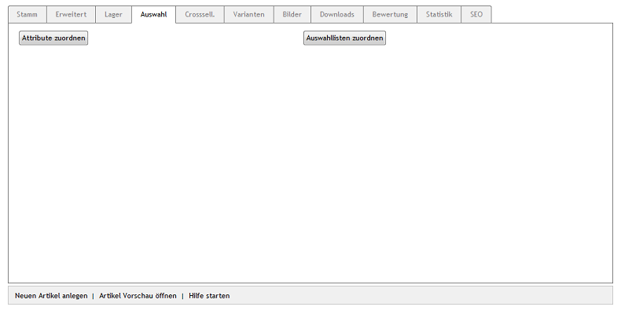
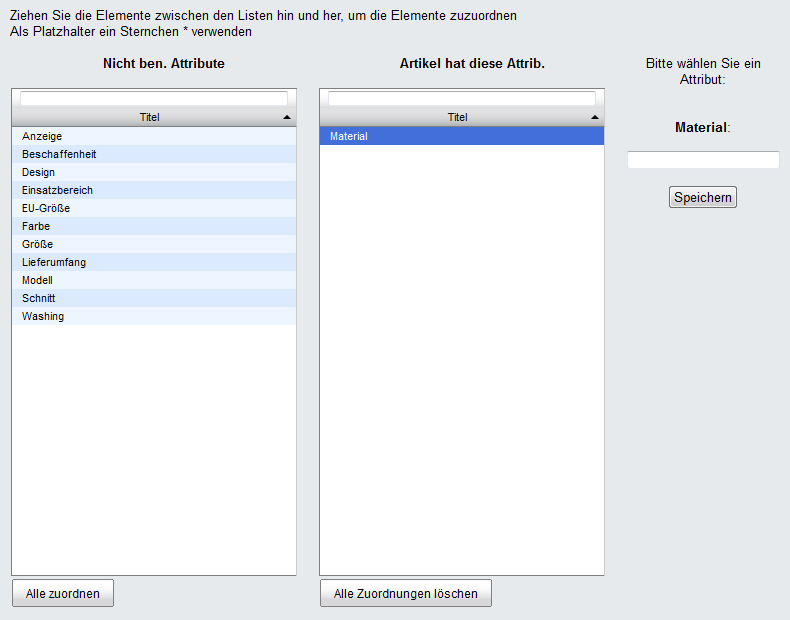

Registerkarte Auswahl
*********************
Auf der Registerkarte :guilabel:`Auswahl` können einem Artikel Attribute und/oder Auswahllisten zugeordnet werden.

Artikel können viele Eigenschaften haben. Für etliche Eigenschaften, wie beispielsweise Gewicht oder Abmessungen, bietet der OXID eShop Eingabe- und Einstellmöglichkeiten. Sie können sofort verwendet werden. Benötigen Sie weitere Eigenschaften, um Ihre Artikel zu charakterisieren, können Sie dafür Attribute erstellen und diese den Artikeln zuweisen. In der Detailansicht des Artikels wird eine neue Registerkarte :guilabel:`SPEZIFIKATION` eingeblendet, in der die Attribute und deren Werte angezeigt werden.

In Auswahllisten werden typische Ausführungen eines Artikels, beispielsweise dessen verschiedene Farben oder Größen, definiert. Es sind Vorlagen, die bei vielen Artikeln verwendet werden können. Artikel mit einer\Auswahlliste haben in der Detailansicht eine Dropdown-Liste, aus welcher der Kunde eine Ausführung auswählen kann. Die Auswahl, beispielsweise die Farbe oder die Größe des Artikels, wird mit der Bestellung gespeichert.

Die Schaltfläche :guilabel:`Attribute zuordnen` öffnet ein neues Fenster, in dem einen Artikel die Attribute zugewiesen werden können. Im Zuordnungsfenster werden in der linken Liste alle nicht benutzten Attribute angezeigt. Die gewünschten Attribute können per Drag \& Drop in die rechte Liste verschoben werden. Eine Mehrfachauswahl ist bei gedrückter Strg-Taste möglich. Nachdem ein Attribut in der rechten Liste markiert wurde, muss ein Wert für das Attribut eingetragen und gespeichert werden.

Ein weiteres Zuordnungsfenster wird mit der Schaltfläche :guilabel:`Auswahllisten zuordnen` geöffnet. Alle vorhandenen Auswahllisten werden angezeigt und können per Drag \& Drop in die rechte Liste des Zuordnungsfensters verschoben werden.

.. image:: ../../media/screenshots-de/oxbacm03.png
   :alt: Auswahllisten zuordnen
   :height: 320
   :width: 400

.. seealso:: `Attribute <../attribute/attribute>`_ | `Auswahllisten <../auswahllisten/auswahllisten>`_ | `Filtern von Artikeln <../artikel-und-kategorien/filtern-von-artikeln>`_