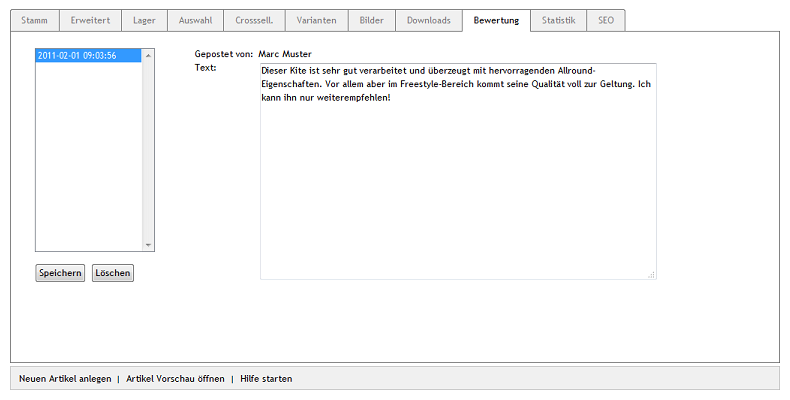

Registerkarte Bewertung
=======================
Kunden können die Artikel Ihres Shops bewerten. Dies sorgt für Transparenz und Vertrauen. In der Detailansicht eines Artikels können angemeldete Kunden bis zu fünf Sterne vergeben und einen Kommentar abgeben. Die Bewertungen und die durchschnittlich vergebenen Sterne werden am unteren Ende der Detailansicht angezeigt.

Auf dieser Registerkarte können die Bewertungen zu einem Artikel eingesehen, kleine Rechtschreibfehler korrigiert oder eine Bewertung notfalls auch gelöscht werden.

Alle Bewertungen sind unter :menuselection:`Artikel verwalten --> Artikel --> Alle Bewertungen` aufgelistet und führen über einen Link direkt zum Artikel.

.. image:: ../../media/screenshots-de/oxbacr02.png
   :alt: Alle Bewertungen
   :class: with-shadow
   :height: 87
   :width: 650

Sie können festlegen, ob Sie eine Bewertung freigeben wollen, bevor sie in der Detailansicht des Artikels angezeigt wird. Aktivieren Sie die Option :guilabel:`Artikelbewertungen moderieren: Sie werden erst veröffentlicht, wenn sie von einem Administrator aktiv gesetzt werden` in :menuselection:`Stammdaten --> Grundeinstellungen`, Registerkarte :guilabel:`System` unter :guilabel:`Weitere Einstellungen`.

Eine weitere Einstellung zu den Artikelbewertungen finden Sie in :menuselection:`Stammdaten --> Grundeinstellungen`, Registerkarte :guilabel:`Einstell.` unter :guilabel:`Weitere Einstellungen`. Es kann festgelegt werden, nach wievielen Tagen Kunden einen Artikel neu bewerten dürfen. Ohne einen Wert, dürfen Kunden einen Artikel generell nur einmal bewerten.

Alle Bewertungen werden mit Datum und Uhrzeit in einem Auswahlfeld aufgelistet. Die aktuellsten Bewertungen stehen am Ende der Liste. Wird eine Bestellung markiert, werden auf der rechten Seite der Name des Kunden und der Text der Bewertung angezeigt. Das Kontrollkästchen :guilabel:`Aktiv` ist nur sichtbar, wenn das Moderieren der Artikelbewertungen eingeschaltet wurde.

Änderungen an Bewertungen können gespeichert werden. Das Löschen einer Bewertung ist ebenfalls möglich. Löschen Sie nur Bewertungen, die keine sind (SPAM-Einträge). Lassen Sie auch negative Bewertungen zu. Sie können dazu ja mit einer eigenen Stellungnahme reagieren. Langfristig wird es für Vertrauen sorgen, wenn nicht nur positive Bewertungen zu lesen sind.

:guilabel:`Aktiv` |br|
Wenn die Bewertung in der Detailansicht des Artikels angezeigt werden soll, haken Sie dieses Kontrollkästchen an.

:guilabel:`Gepostet von` |br|
Vorname und Name des Kunden, der die Bewertung abgegeben hat.

:guilabel:`Text` |br|
Text der abgegebenen Bewertung, der editiert werden kann. Änderungen müssen mit der Schaltfläche :guilabel:`Speichern` in die Datenbank geschrieben werden.

.. Intern: oxbacr, Status:, F1: article_review.html