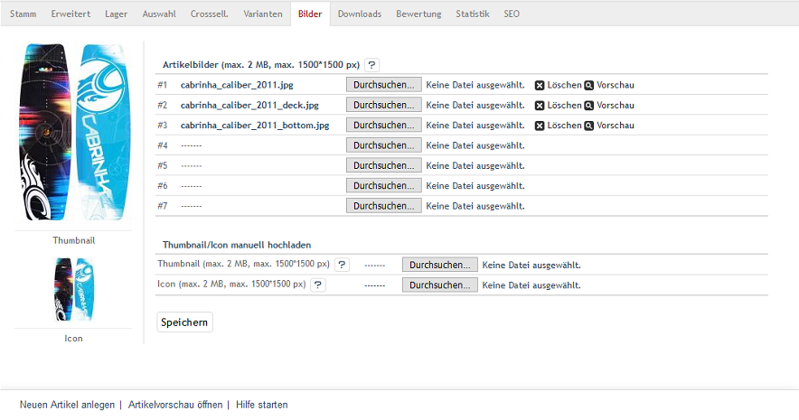

Registerkarte Bilder
====================
Artikel können bis zu zwölf Artikelbilder haben, die sehr wichtig für die optimale Präsentation der Artikel im Shop sind. Die Bilder sollten den Artikel in unterschiedlichen Ansichten und aus verschiedenen Blickwinkeln zeigen. Artikelbilder werden in der Detailansicht des Artikels angezeigt. Hinzu kommen die Zoombilder, die ebenfalls auf der Detailseite aufrufbar sind. Kleinere Artikelbilder - Thumbnails und Icons - zeigen den Artikel in den Artikellisten, in Produktboxen und im Warenkorb. Die Standardgrößen der Artikel werden in den Einstellungen des Themes festgelegt. Eine detaillierte Beschreibung dazu finden Sie in :doc:`Bilder <../../konfiguration/bilder>` im Abschnitt \"Konfiguration\".

Die Registerkarte :guilabel:`Bilder` bietet die Möglichkeit, sieben Artikelbilder auf den Webserver zu laden. Ein Blick in die Verzeichnisstruktur lässt aber erkennen, dass bis zu 12 Artikelbilder möglich sind. Die zusätzlichen Artikelbilder müssen entweder per FTP auf den Webserver geladen oder das Template für den Administrationsbereich muss für die größere Zahl von Uploads angepasst werden. Informationen zum Bilder-Handling und zur Verzeichnisstruktur der Artikelbilder ab OXID eShop 4.5.1 finden Sie im englischsprachigen Tutorial `Image handling changes <https://oxidforge.org/en/image-handling-changes-since-version-4-5-1.html>`_ auf der OXIDforge.

Wurde das erste Artikelbild hochgeladen, wird das daraus generierte Thumbnail und das Icon auf der linken Seite der Registerkarte angezeigt. Für das Artikelbild selbst ist eine Vorschau verfügbar. Nicht mehr benötigte Artikelbilder können gelöscht werden. Damit werden sie nicht nur von der Registerkarte entfernt, sondern auch vom Webserver gelöscht.

:guilabel:`Artikelbilder (max. 2 MB, max. 1500*1500 px)` |br|
Für das Hochladen der Artikelbilder gelten Einschränkungen hinsichtlich der Dateigröße. Die Bilder sollten standardmäßig maximal 2 MB groß sein oder eine Auflösung bis höchstens 1500*1500 Pixel haben. Wird das Hochladen größerer Bilder erlaubt, kann es beim Generieren der verschiedenen Artikelbilder zu Problemen mit dem PHP-Speicherlimit kommen. Für das Hochladen und Generieren der Artikelbilder sind u.a. die Parameter upload_max_filesize und memory_limit in der Konfigurationsdatei :file:`php.ini` von Bedeutung.

:guilabel:`#1` - :guilabel:`#7` |br|
Laden Sie hier maximal sieben Artikelbilder auf den Webserver. Die Schaltfläche :guilabel:`Durchsuchen...` öffnet einen Dateidialog, in dem Sie die entsprechende Datei auf Ihrem Rechner auswählen können. Wenn Sie nun die Schaltfläche :guilabel:`Öffnen` drücken, werden Pfad und Dateinamen direkt übernommen. Speichern startet das Hochladen des Artikelbildes und schließt damit ab, dass der Dateiname beispielsweise im Feld :guilabel:`#1` steht. Gleichzeitig wurde das Thumbnail und das Icon erzeugt.

:guilabel:`Thumbnail/Icon manuell hochladen` |br|
Anstelle des automatisch generierten Thumbnails und/oder Icons kann ein anderes Bild für diese Artikelansichten verwendet werden.

:guilabel:`Thumbnail (max. 2 MB, max. 1500*1500 px)` |br|
Wenn Sie ein anderes, als das beim Hochladen des ersten Artikelbildes generierte Thumbnail möchten, laden Sie es hier hoch. Dabei wird das automatisch erzeugte Thumbnail überschrieben und das neue als Vorschau auf der linken Seite angezeigt.

:guilabel:`Icon (max. 2 MB, max. 1500*1500 px)` |br|
Möchten Sie ein spezielles Artikelbild als Icon verwenden, kann es hier hochgeladen werden. Es wird dabei das automatisch erzeugte Icon überschrieben. Eine Vorschau zeigt das neue Icon auf der linken Seite der Registerkarte.

.. Intern: oxbacp, Status:, F1: article_pictures.html