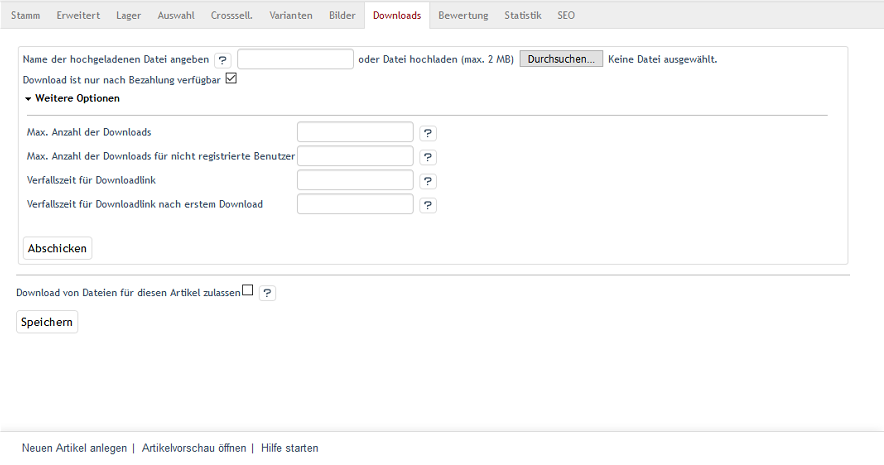
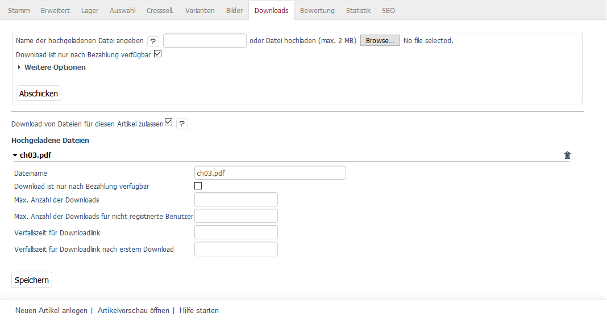

Registerkarte Downloads
=======================
Mit OXID eShop 4.6.0 wurde ein neuer Artikeltyp eingeführt: der Download-Artikel. Damit können beliebige Dateien, beispielsweise Software, Fotos, Musikdateien oder Dokumentvorlagen, zum Verkauf angeboten werden. Legt der Kunde einen Download-Artikel in den Warenkorb, erwirbt er alle dazugehörigen Dateien.

Nach der Bestellung finden sich die Downloadlinks unter :menuselection:`Konto --> Meine Downloads`. Die Dateien können heruntergeladen werden, sobald die Zahlung erfolgt ist. Werden beispielsweise Lastschrift oder Kreditkartenzahlung als Zahlungsart verwendet, ist das Herunterladen sofort möglich. Die E-Mail, welche die Bestellung bestätigt, enthält ebenfalls die Downloadlinks zu den bestellten Dateien, wenn die Bezahlung abgeschlossen ist.

Die Verwendung von Download-Artikeln im Shop muss global aktiviert werden. Im Administrationsbereich können in :menuselection:`Stammdaten --> Grundeinstellungen`, Registerkarte :guilabel:`Einstell.` unter :guilabel:`Download-Artikel` die Standardeinstellungen vorgenommen werden. Das sind - neben dem Aktivieren der Funktion - der Pfad zu den herunterladbaren Dateien und Festlegungen zur Anzahl der Downloads oder zur Verfallszeit der Links.

Die zum Artikel gehörenden Dateien werden auf der Registerkarte:guilabel:` Downloads` hochgeladen und deren spezielle Download-Einstellungen definiert. Für jeden Download-Artikel und für jede einzelne Datei können die Werte abweichend von den Standardeinstellungen festgelegt werden. Das erlaubt eine sehr filigrane Definition der Bedingungen für den Download.

:guilabel:`Name der hochgeladenen Datei angeben ... oder Datei hochladen (max. 2 MB)`

Hier können dem Artikel Dateien hinzugefügt werden. Eine Möglichkeit ist, die Dateien per FTP auf den Webserver hochzuladen. Da der Pfad bereits in den Standardeinstellungen definiert wurde, genügt es, den Dateinamen anzugeben. Die andere Möglichkeit ist, die Dateien hier hochzuladen. Die Schaltfläche :guilabel:`Durchsuchen...` öffnet einen Dateidialog, in dem Sie die entsprechende Datei auf Ihrem Rechner auswählen können. Wenn Sie nun die Schaltfläche :guilabel:`Öffnen` drücken, werden Pfad und Dateinamen direkt übernommen.

Das Betätigen der Schaltfläche :guilabel:`Abschicken` startet das Hochladen. Die Dateien werden unter :guilabel:`Hochgeladene Dateien` am unteren Ende des Eingabebereichs aufgelistet.

.. hint:: Wenn Sie Dateien per FTP auf den Webserver hochladen, beachten Sie bitte die Hinweise in der Textdatei aus dem Verzeichnis :file:`/out/downloads`.

:guilabel:`Download ist nur nach Bezahlung verfügbar`

Aktivieren Sie dieses Kontrollkästchen, um den Download erst dann zu ermöglichen, wenn die Bezahlung abgeschlossen ist. Unter :menuselection:`Bestellungen verwalten --> Bestellungen` kann in der Registerkarte :guilabel:`Stamm` die Bestellung auf bezahlt gesetzt werden. Mit der Schaltfläche :guilabel:`Versenden` auf dieser Registerkarte können die bestellten Downloadlinks an den Kunden verschickt werden. Auch im Konto sind die Downloads unter :guilabel:`Meine Downloads` ab diesem Moment aktiv.

:guilabel:`Weitere Optionen`

Es können für die Datei, die hochgeladen werden soll, Werte vorgegeben werden, die von den globalen Einstellungen abweichen. Sie überschreiben die Standardeinstellungen, die in :menuselection:`Stammdaten --> Grundeinstellung`, Registerkarte :guilabel:`Einstell.` unter :guilabel:`Downloads` für alle Artikel gesetzt wurden. Ohne Vorgabewerte gilt für die Datei eine unbegrenzte Anzahl von Downloads und keine zeitliche Beschränkung für die Downloadlinks.

:guilabel:`Max. Anzahl der Downloads`

Geben Sie hier an, wie oft Benutzer nach einer Bestellung den Link zum Download verwenden können.

:guilabel:`Max. Anzahl der Downloads für nicht registrierte Benutzer`

Geben Sie hier an, wie oft Benutzer, die ohne Registrierung bestellt haben, den Link zum Download verwenden können.

:guilabel:`Verfallszeit für Downloadlink`

Geben Sie die Zeit in Stunden an, die der Downloadlink nach der Bestellung gültig ist.

:guilabel:`Verfallszeit für Downloadlink nach erstem Download`

Geben Sie die Zeit in Stunden an, die der Downloadlink nach dem ersten Download gültig ist.

:guilabel:`Download von Dateien für diesen Artikel zulassen`

Dateien dieses Artikels können heruntergeladen werden, wenn das Kontrollkästchen angehakt ist. Ist das nicht der Fall, verhält sich der Artikel wie ein normaler Artikel. Alle hochgeladenen Dateien sind deaktiviert.

:guilabel:`Hochgeladene Dateien`

Dieser Bereich wird erst angezeigt, nachdem die erste Datei hochgeladen wurde. Er listet alle hochgeladenen Dateien mit ihrem Dateinamen auf. Ein Klick darauf zeigt die Einstellungen für den Download der Datei, die jederzeit geändert werden können. Dateien können hier auch durch einen Klick auf das kleine Kreuz am Ende der Zeile gelöscht werden, nachdem eine Sicherheitsabfrage bestätigt wurde.

.. Intern: oxbacq, Status:, F1: article_files.html