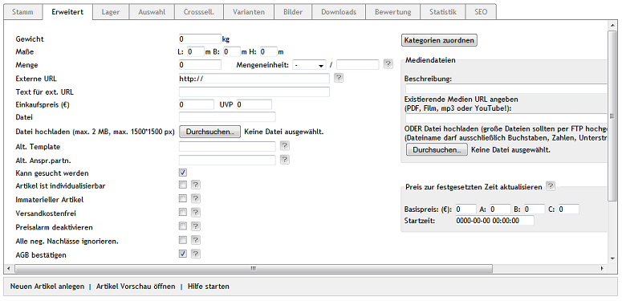

Registerkarte Erweitert
=======================
Die Registerkarte :guilabel:`Erweitert` bietet die Möglichkeit, spezielle Eigenschaften von Artikeln festzulegen und ihnen Informationsquellen, wie beispielsweise Dokumente, Videos oder Audiodateien hinzuzufügen.

:guilabel:`Gewicht`

Ein hier eingetragenes Gewicht wird bei der Berechnung der Versandkosten berücksichtigt. Die Maßeinheit für das Gewicht ist Kilogramm.

:guilabel:`Maße L:` ... :guilabel:`m B:` ... :guilabel:`m H:` ... :guilabel:`m`

Geben Sie Länge, Breite und Höhe des Artikels in Metern an, wenn die Versandkosten bezogen auf die Maße berechnet werden sollen.

:guilabel:`Menge` ... :guilabel:`Mengeneinheit`

Die Angabe von Menge und Mengeneinheit wird für Artikel benötigt, für welche ein Grundpreis angegeben werden muss. Der Grundpreis ist der Preis bezogen auf eine bestimmte Mengeneinheit wie Kilogramm oder Liter. Hinterlegen Sie hier die Menge des Artikels je Mengeneinheit. Wählen Sie eine Mengeneinheit aus der Liste oder tragen Sie eine Mengeneinheit ein, die nicht in der Liste zu finden ist.

Der Grundpreis wird in der Detailansicht des Artikels angezeigt.

Beispiel: Bei einem Artikel, der in einer 1,5 kg-Packung angeboten wird, tragen Sie 1,5 bei Menge ein und wählen :guilabel:`kg` als Mengeneinheit. Angenommen, der Artikel hat einen Preis von 3 €, wäre der Grundpreis 2 €/kg.

:guilabel:`Externe URL`

Link auf eine externe Internetseite, beispielsweise die Website des Herstellers, mit weiterführenden Informationen zum Artikel.

:guilabel:`Text für ext. URL`

Haben Sie auf eine externe Internetseite verlinkt, wird hier der Text für den Link eingetragen. Der Text wird, verlinkt mit der externen URL, in der Detailansicht des Artikels am Ende der Beschreibung angezeigt.

:guilabel:`Einkaufspreis (€)` ... :guilabel:`UVP` ...

Sie können hier den Einkaufspreis des Artikels erfassen. Dieser wird nicht im Shop angezeigt, kann aber sinnvoll für zu erstellende Auswertungen sein.

Über den UVP (Unverbindlicher Verbraucherpreis) haben Sie die Möglichkeit, einen Artikel günstiger anzubieten, als der Hersteller empfiehlt. Ist der UVP, also die Herstellervorgabe, größer als der Artikelpreis, wird in der Detailansicht des Artikels die normale Preisangabe um ein \"Statt\" mit durchgestrichenem UVP ergänzt.

:guilabel:`Datei`

Nach dem Hochladen einer Datei, steht hier deren Dateiname. Durch Löschen des Dateinamens und anschließendem Speichern wird diese Datei wieder aus der Detailansicht des Artikels in der Registerkarte :guilabel:`MEDIEN` entfernt.

:guilabel:`Datei hochladen (max. 2 MB)`

Eine zusätzliche Datei zum Artikel, beispielsweise ein Datenblatt oder eine Bedienungsanleitung, lässt sich hier hochladen. Nach dem Speichern steht der Dateiname im Eingabefeld :guilabel:`Datei`. Die Datei kann in der Detailansicht des Artikels, Registerkarte :guilabel:`MEDIEN` heruntergeladen werden. Um mehrere Dateien bereitzustellen und auch eine Beschreibung anstatt nur des Dateinamens zu haben, verwenden Sie bitte :guilabel:`Mediendateien`.

:guilabel:`Alt. Template`

Die Detailansicht des Artikels kann von der anderer Artikel abweichen, um ihn mit einer besonderen Aufmachung zu präsentieren. Grundlage dessen ist ein eigens dafür erstelltes Template, dessen Pfad und Namen hier eingetragen werden kann. Die Pfadangabe ist relativ zum Templateverzeichnis des verwendeten Themes.

Beispiel: Der Eintrag page/details/mydetails.tpl würde beim Theme \"Flow\" das Template :file:`mydetails.tpl` aus dem Verzeichnis :file:`/application/views/flow/tpl/page/details` aufrufen.

:guilabel:`Alt. Anspr.partn.`

Standardmäßig werden Fragen, die ein Kunde über die Detailansicht eines Artikels als E-Mail senden kann, an die E-Mail-Adresse geschickt, die unter :menuselection:`Stammdaten --> Grundeinstellungen` für die Info definiert wurde. Soll für einen bestimmten Artikel ein direkter Ansprechpartner zuständig sein, tragen Sie dessen E-Mail-Adresse hier ein. Alle Anfragen zum Artikel werden direkt an diesen Mitarbeiter versandt.

:guilabel:`Kann gesucht werden`

Das Kontrollkästchen ist standardmäßig aktiviert, damit Artikel durch die Suche im Shop gefunden werden können. Es kann manchmal auch sinnvoll sein, dass ein Artikel im Shop nicht zu finden ist. Ein Beispiel dafür ist ein Gratisartikel, der beim Kauf eines Artikels dazugegeben wird. Dieser sollte ja nicht mehrfach in den Warenkorb gelegt werden können.

:guilabel:`Artikel ist individualisierbar`

Bei aktiviertem Kontrollkästchen wird ein zusätzliches Eingabefeld auf der Detailseite des Artikels und im Warenkorb angezeigt. Kunden können Text in dieses Eingabefeld eingeben, um beim Kauf eine individuelle Information zu übermitteln. Das könnte Text sein, der auf ein T-Shirt, eine Tasse gedruckt oder in einen Ring graviert wird.

:guilabel:`Immaterieller Artikel`

Als immateriell wird ein Artikel gekennzeichnet, der kein Gegenstand ist, der nicht verpackt und an den Kunden geschickt wird. Das können beispielsweise Seminare oder Dienstleistungen sein. Sollen für alle immateriellen Artikel keine Versandkosten berechnet werden, dann muss :guilabel:`Nicht materielle Produkte nicht in die Berechnung der Versandkosten einbeziehen` in :menuselection:`Stammdaten --> Grundeinstellungen`, Registerkarte :guilabel:`Einstell.` unter :guilabel:`Weitere Einstellungen` aktiviert sein.

.. hint:: Wenn Sie Software anbieten wollen, verwenden Sie die Funktion \"Download-Artikel\", die mit OXID eShop 4.6.0 implementiert wurde.

:guilabel:`Versandkostenfrei`

Der Artikel wird bei der Versandkostenberechnung nicht berücksichtigt, wenn das Kontrollkästchen angehakt ist. Befindet sich dieser Artikel mit anderen Artikeln im Warenkorb, bedeutet das jedoch nicht, dass damit der gesamte Einkauf versandkostenfrei wird.

:guilabel:`Preisalarm deaktivieren`

In der Detailansicht eines Artikels können Kunden den Preisalarm nutzen, indem Sie einen Preis eintragen, zu dem sie den Artikel kaufen würden.

Im Administrationsbereich werden unter :menuselection:`Kundeninformationen --> Preisalarm` die Kundenanfragen gesammelt. Der Shopbetreiber kann den Kunden per E-Mail, die vom Shop vorbereitet wurde, informieren, sobald dieser Wunschpreis erreicht wird. Schalten Sie die Funktion Preisalarm hier für einen bestimmten Artikel ab.

:guilabel:`Alle neg. Nachlässe ignorieren.`

Wenn das Kontrollkästchen aktiviert ist, werden für diesen Artikel keine negativen Nachlässe, wie Rabatte und Gutscheine, berechnet.

:guilabel:`AGB bestätigen`

Nach der am 13. Juni 2014 in Kraft getretenen europäischen Verbraucherrechterichtlinie muss der Benutzer bei Dienstleistungen (immaterielle Artikel) und bei Download-Artikeln dem Wegfall des Widerrufsrechts zustimmen. Dafür wird im vierten Schritt des Bestellvorgangs ein nicht vorausgewähltes Kontrollkästchen mit entsprechendem Hinweis angezeigt. Die Funktion muss generell in :menuselection:`Stammdaten --> Grundeinstellungen` auf der Registerkarte :guilabel:`Einstell.` unter :guilabel:`Bestellungen` aktiviert sein.

.. hint:: Realisierung: OXID eShop 4.8.6/5.1.6

:guilabel:`Artikel dazu`

Mit dieser Schaltfläche können Sie dem Artikel einen kostenlosen Artikel zuordnen. Dieser wird beim Einkauf des Artikels mit in den Warenkorb gelegt.

.. hint:: Diese Funktion ist derzeit nur für die Community und Professional Edition verfügbar.

:guilabel:`In Sprache`

Der Artikel lässt sich auch in weiteren aktiven Sprachen des Shops bearbeiten. Wählen Sie eine Sprache aus der Liste aus.

:guilabel:`Kategorien zuordnen`

Ein Artikel kann zu einer oder zu mehreren Kategorien gehören. Die Schaltfläche :guilabel:`Kategorien zuordnen` öffnet ein neues Fenster.

.. image:: ../../media/screenshots-de/oxbacj02.png
   :alt: Kategorien zuordnen
   :height: 314
   :width: 400

In diesem Zuordnungsfenster werden in der linken Liste alle Kategorie angezeigt. Die Kategorien können per Drag \& Drop in die rechte Liste verschoben werden. Eine Mehrfachauswahl ist bei gedrückter Strg-Taste möglich. Damit ist die Zuordnung abgeschlossen. Ist der Artikel in mehreren Kategorien vorhanden, muss eine davon als Hauptkategorie festgelegt werden, um Duplicate Content (DC) zu vermeiden. Markieren Sie die Hauptkategorie in der rechten Liste und drücken Sie die Schaltfläche :guilabel:`Als Hauptkat. setzen`.

:guilabel:`Mediendateien`

Zu einem Artikel können zusätzliche Informationen in Form von Links oder Downloads in dessen Detailansicht bereitgestellt werden. Diese werden in der automatisch erstellten Registerkarte :guilabel:`MEDIEN` angezeigt. Es kann mehrere Mediendateien zu einem Artikel geben.

:guilabel:`Mediendateien` - :guilabel:`Beschreibung`

Tragen Sie hier die Beschreibung für die Mediendatei ein.

:guilabel:`Mediendateien` - :guilabel:`Existierende Medien URL angeben (PDF, Film, mp3 oder YouTube!)`

Geben Sie hier die URL ein, mit der die Mediendatei aufgerufen werden kann.

:guilabel:`Mediendateien` - :guilabel:`ODER Datei hochladen (große Dateien sollten per FTP hochgeladen werden) (Dateiname darf ausschließlich Buchstaben, Zahlen, Unterstrich (_) und Punkt enthalten.`

Laden Sie eine Datei hoch, die dem Kunden in der Detailansicht des Artikels auf der Registerkarte :guilabel:`MEDIEN` zum Download angeboten wird.

:guilabel:`Preis zur festgesetzten Zeit aktualisieren`

Die Preise eines Artikels können zu einem festgelegten Zeitpunkt geändert werden. Es lassen sich Datum und Zeitpunkt festlegen, ab dem die definierten Standardpreise aktualisiert werden sollen.

:guilabel:`Preis zur festgesetzten Zeit aktualisieren` - :guilabel:`Basispreis (€)` ... :guilabel:`A` ... :guilabel:`B` ... :guilabel:`C` ...

Tragen Sie die Preise ein, welche die bisher festgelegten Preise ersetzen sollen. Hat ein Preis den Wert \"0\", wird er nicht aktualisiert.

:guilabel:`Preis zur festgesetzten Zeit aktualisieren` - :guilabel:`Startzeit`

Legen Sie hier den Zeitpunkt der Preisaktualisierung fest.

.. seealso:: :doc:`Kategorien <../kategorien/kategorien>` | :doc:`Zuordnung von Artikeln zu Kategorien <../artikel-und-kategorien/zuordnung-von-artikeln-zu-kategorien>` | :doc:`Hauptkategorie eines Artikels <../artikel-und-kategorien/hauptkategorie-eines-artikels>` | :doc:`Preis pro Mengeneinheit (Grundpreis) <../artikel-und-kategorien/preis-pro-mengeneinheit-grundpreis>` | :doc:`Artikel als Zugabe <../../betrieb/rabatte/artikel-als-zugabe>`

.. Intern: oxbacj, Status:, F1: article_extend.html