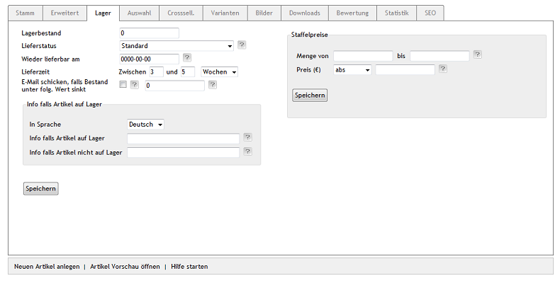

Registerkarte Lager
===================
Eine in den OXID eShop integrierte Lagerverwaltung zeigt den Kunden die Verfügbarkeit von Artikeln an und reduziert den Lagerbestand bei Bestellung. Der Shopbetreiber wird per E-Mail darüber informiert, wenn der Lagerbestand eines Artikels unter eine festgelegte Anzahl von Exemplaren sinkt.

Um die `Lagerverwaltung <../../konfiguration/lagerverwaltung>`_ nutzen zu können, muss diese in :menuselection:`Stammdaten --> Grundeinstellungen`, Registerkarte :guilabel:`Einstell.` unter :guilabel:`Lager` aktiviert und konfiguriert werden.

:guilabel:`Lagerbestand`

Geben Sie beim Erstellen eines Artikels dessen Anfangsbestand ein. Der Bestand verringert sich bei jeder Bestellung. Wieviel Exemplare des Artikels aktuell auf Lager sind, wird hier angezeigt und kann bei Veränderungen des Lagerbestandes auch angepasst werden.

Der Lagerbestand wird in der Detailansicht des Artikels durch ein kleines Symbol und eine Statusmeldung veranschaulicht.

* grünes Symbol: Artikel ist in ausreichender Menge vorhanden
* gelbes Symbol: Artikel ist nur noch in geringer Menge vorrätig
* rotes Symbol: Artikel ist nicht auf Lager

:guilabel:`Lieferstatus`

Ist ein Artikel ausverkauft, kann das im Shop auf verschieden Weise dargestellt werden.

Wurde :guilabel:`Standard` als Lieferstatus festgelegt, kann der Artikel auch bestellt werden, wenn er ausverkauft ist. Er muss nachbestellt werden. Da bei :guilabel:`Fremdlager` der eigentliche Lagerbestand nicht bekannt ist, kann der Artikel immer bestellt werden. Er wird nicht als ausverkauft angezeigt. Mit der Auswahl :guilabel:`Wenn ausverkauft offline` legen Sie fest, dass der Artikel im Shop nicht mehr angezeigt wird, sobald er ausverkauft ist. Bei :guilabel:`Wenn Ausverkauft nicht bestellbar`, ist der Artikel im Shop sichtbar, kann aber nicht bestellt werden. Er hat keine Schaltfläche :guilabel:`In den Warenkorb`.

:guilabel:`Wieder lieferbar am`

Informieren Sie die Kunden, ab wann der Artikel wieder geliefert werden kann. Das Datum muss im Format JJJJ-MM-TT (Jahr vierstellig, Monat und Tag zweistellig) angegeben werden. Es wird zusammen mit dem Hinweis :guilabel:`Lieferbar ab` in der Detailansicht des Artikels angezeigt.

:guilabel:`Lieferzeit Zwischen` ... :guilabel:`und` ...

Legen Sie hier die Lieferzeit des Artikels fest. Werden beide Werte verwendet, wird die Lieferzeit in der Detailansicht des Artikels als Zeitspanne angezeigt, beispielsweise Lieferzeit: 2 - 5 Tage. Ohne den ersten Wert, wird die Lieferzeit fix angezeigt, beispielsweise Lieferzeit: 5 Tage. Die Lieferzeit kann auch in Wochen oder Monaten angegeben werden.

:guilabel:`E-Mail schicken, falls Bestand unter folg. Wert sinkt`

Wenn Sie per E-Mail informiert werden möchten, wenn der Lagerbestand unter einen bestimmten Wert sinkt, aktivieren Sie das Kontrollkästchen und geben Sie den gewünschten Wert ein.

:guilabel:`Info falls Artikel auf Lager`

Für jeden Artikel kann festgelegt werden, welcher Text angezeigt wird, wenn der Artikel auf Lager ist oder nicht. Wird kein Text hinterlegt, wird eine Standardmeldung ausgegeben. Das muss in :menuselection:`Stammdaten --> Grundeinstellungen`, Registerkarte :guilabel:`Einstell.` unter :guilabel:`Lager` aktiviert worden sein.

:guilabel:`Info falls Artikel auf Lager` - :guilabel:`In Sprache`

Die Meldungen können für alle aktiven Sprachen des Shops definiert werden. Wählen Sie die gewünschte Sprache aus der Liste.

:guilabel:`Info falls Artikel auf Lager`

Information zu diesem Artikel, wenn dieser auf Lager ist. Ersetzt die Standardmeldung :guilabel:`Sofort lieferbar`.

:guilabel:`Info falls Artikel nicht auf Lager`

Information zu diesem Artikel, wenn dieser nicht auf Lager ist. Ersetzt die Standardmeldung :guilabel:`Dieser Artikel ist nicht auf Lager und muss erst nachbestellt werden`.

:guilabel:`Staffelpreise`

Staffelpreise sind ein Rabatt, der beim Kauf einer bestimmten Menge von Artikeln gewährt wird. Der Rabatt wird einem Mengenbereich als absoluter Preis oder prozentual zugewiesen. Mehrere Mengenbereiche bilden eine Staffel mit unterschiedlichen Artikelpreisen.

:guilabel:`Staffelpreise` - :guilabel:`Menge von` ... :guilabel:`bis` ...

Geben Sie die Artikelmenge für einen Mengenbereich ein.

.. hint:: Achten Sie darauf, dass im letzten Mengenbereich eine ausreichend große Menge im Feld :guilabel:`bis` angegeben wurde, beispielsweise 99999. Ist diese Zahl zu niedrig, gilt bei Überschreitung dieser Menge wieder der Originalpreis.

:guilabel:`Staffelpreise` - :guilabel:`Preis (€)`

Geben Sie den Artikelpreis für eine Mengeneinheit ein. Dieser kann ein absoluter Preis oder ein Preis in Prozent sein.

.. seealso:: :doc:`Staffelpreise <../artikel-und-kategorien/staffelpreise>`

.. Intern: oxaack, Status:, F1: article_stock.html