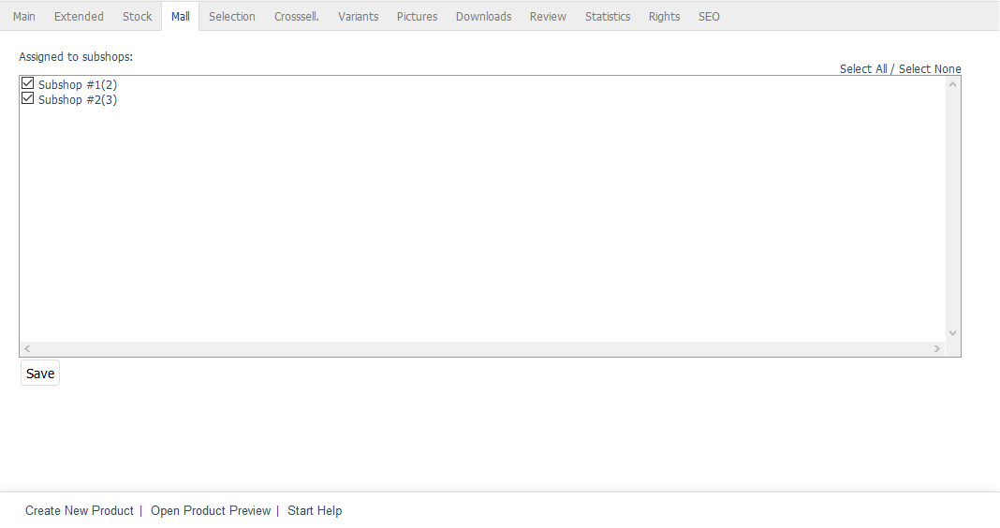

Mall tab
==================
The :guilabel:`Mall` tab is only available for products in Enterprise Edition.

Products can be inherited when creating shops. If this option is selected, a new shop will contain all products of the parent shop. The inherited products can have customised prices if this is specified in the Mall settings of the new shop. Assignments such as categories, selection lists, attributes and cross-selling can be shop-specific. The SEO settings can also be customised. Most product characteristics such as title, product number, short description, etc. can’t be changed.

The :guilabel:`Mall` tab can be used to manage product assignments to subshops and supershops. This tab will be empty for multishops since they can load and display products from all stores without such an assignment.

The inheritance of all products for a shop can be undone. To do this, uncheck the inheritance settings box in the :guilabel:`Mall` tab of the subshop or supershop under :menuselection:`Master Settings --> Core Settings`.

:guilabel:`Assigned to following subshops` |br|
Check or uncheck the appropriate box to assign/unassign a product to/from subshops and supershops. If the box is not checked, the product will be available in the parent shop but not in the respective subshop or supershop.

Use the :guilabel:`Select All` and :guilabel:`Select None` link on the right side of the window to assign/unassign the products to/from all shops. Any changes made must be saved and will immediately be effective for subshops or supershops.

.. Intern: oxbacl, Status:, F1: article_mall.html