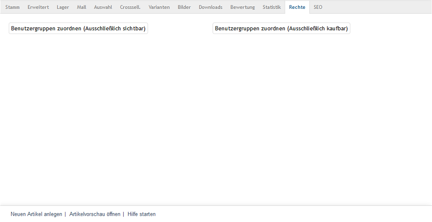

Registerkarte Rechte
********************
Die Registerkarte :guilabel:`Rechte` bei Artikeln gibt es nur in der Enterprise Edition.

Auf der Registerkarte :guilabel:`Rechte` können einem Artikel Benutzergruppen zugeordnet werden, deren Benutzer diesen Artikel im Shop sehen dürfen und/oder kaufen können. Diese Zuordnung ist Teil der Rechte- und Rollenverwaltung der Enterprise Edition.

Das ausschließliche Recht legt zum einen fest, dass der Artikel nur für Benutzer, die den zugewiesenen Benutzergruppen angehören, nach Anmeldung am Shop sichtbar ist. Allen übrigen Benutzern und Benutzergruppen wird dieser Artikel niemals angezeigt. Wurden Benutzergruppen als ausschließlich kaufbar zugewiesen, gibt es zum anderen für nicht berechtigte Benutzer keine Möglichkeit, den Artikel in den Warenkorb zu legen. Mit der Schaltfläche :guilabel:`Mehr Informationen` kann lediglich die Detailseite des Artikels aus einer Artikelübersicht heraus aufgerufen werden. Auch dort fehlt die Schaltfläche :guilabel:`In den Warenkorb legen`, solange der Kunde nicht am Shop angemeldet ist und er der berechtigten Benutzergruppe angehört.

Um einem Artikel Benutzergruppen zuzuweisen, betätigen Sie die Schaltfläche :guilabel:`Benutzergruppen zuordnen (Ausschließlich sichtbar)` bzw. :guilabel:`Benutzergruppen zuordnen (Ausschließlich kaufbar)`. Es öffnet sich jeweils ein Zuordnungsfenster, in dem Sie Artikel aus der Liste :guilabel:`Alle Benutzergruppen` auswählen können.

.. image:: ../../media/screenshots-de/oxbact02.png
   :alt: Benutzergruppen zuordnen (Ausschließlich sichtbar)
   :height: 314
   :width: 400

Die Benutzergruppen lassen sich nach Titel filtern und sortieren. Ziehen Sie die gewünschten Benutzergruppen mit der Maus von der linken in die rechte Liste. Eine Mehrfachauswahl ist bei gedrückter Strg-Taste möglich. Die Zuordnung ist abgeschlossen.

.. seealso:: `Rechte und Rollen <../../enterprise-edition/rechte-und-rollen/rechte-und-rollen>`_