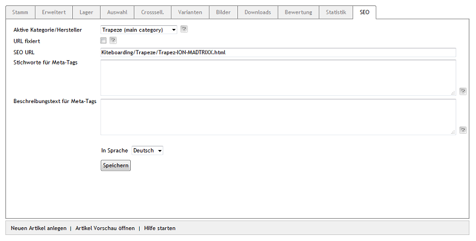

Registerkarte SEO
*****************
Die Registerkarte :guilabel:`SEO` des Artikels beinhaltet Informationen und\Einstellungen, die für Suchmaschinen relevant sind.

Mit der Sprachumstellung am unteren Ende des Eingabebereichs lassen sich die Informationen und Einstellungen auch in einer weiteren aktiven Sprache bearbeiten.

:guilabel:`Aktive Kategorie/Hersteller`

Ein Artikel kann unterschiedliche SEO URLs haben, abhängig davon, wie er aufgerufen wird. Das kann der Aufruf über eine Kategorie, über die Marke (den Hersteller) oder über ein Stichwort sein. Wählen Sie hier aus, welche URL Sie anzeigen und anpassen möchten.

:guilabel:`URL fixiert`

Ändern sich Daten eines Artikels, wie beispielsweise der Titel oder die Kategoriezuordnung, wird die SEO URL neu berechnet. Sie können das für eine ausgewählte URL deaktivieren, indem dieses Kontrollkästchen angehakt wurde. Eine bestehende SEO URL bleibt dadurch unverändert.

:guilabel:`SEO URL`

Die ausgewählte URL des Artikels wird angezeigt. Sie kann geändert und auch fixiert werden.

:guilabel:`Stichworte für Meta-Tags`

Die Stichwörter, die von Suchmaschinen ausgewertet werden, sind in den HTML-Quelltext (Meta Keywords) eingebunden. Wenn Sie nichts eingeben, werden die Stichwörter automatisch, beispielsweise aus dem Titel des Artikels, den Kategorien und den Suchbegriffen erzeugt.

:guilabel:`Beschreibungstext für Meta-Tags`

Dieser Beschreibungstext wird in den HTML-Quelltext (Meta Description) eingebunden. Dieser Text wird von vielen Suchmaschinen bei den Suchergebnissen angezeigt. Wenn Sie nichts eingeben, wird die Beschreibung automatisch aus dem Langtext des Artikels erzeugt.

:guilabel:`In Sprache`

Wählen Sie eine Sprache aus der Liste aus, für die Sie die SEO-Informationen und -Einstellungen bearbeiten möchten.

.. Intern: oxaacu, Status:, F1: article_seo.html