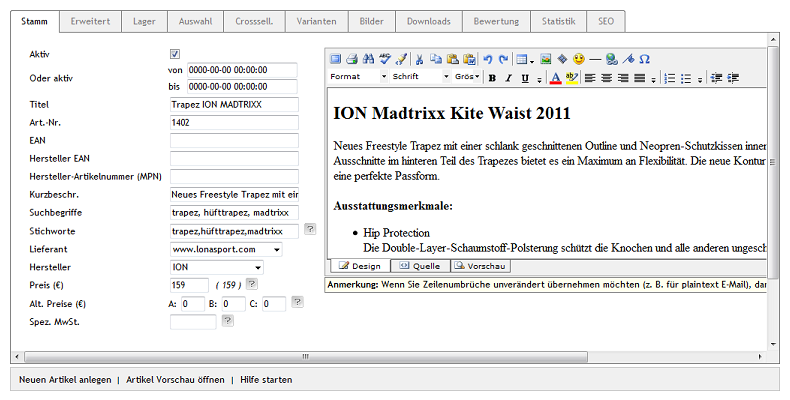

Registerkarte Stamm
===================
Die Registerkarte :guilabel:`Stamm` nimmt wichtige Informationen zum Artikel auf. Erstellen oder bearbeiten Sie hier einen Artikel. Wenn Sie einen Artikel neu anlegen, können Sie ihn direkt einer Kategorie zuzuordnen. Verwenden Sie dafür die Dropdown-Liste :guilabel:`In Kategorie` am unteren Ende des Eingabebereichs. Nach dem Speichern des Artikels ist die schnelle Zuordnung der Kategorie auf dieser Registerkarte nicht mehr möglich.

Mit der Sprachumstellung, die erst nach Anlegen des Artikels unten im Eingabebereich angezeigt wird, lassen sich die Informationen und Einstellungen zum Artikel direkt in einer weiteren Sprache bearbeiten.

:guilabel:`Aktiv` |br|
Aktivieren Sie dieses Kontrollkästchen, damit der Artikel im Shop angezeigt wird. Wenn ein Artikel nicht aktiviert wurde, ist er in der Datenbank vorhanden, erscheint jedoch nicht im Shop.

:guilabel:`Oder aktiv von` ... :guilabel:`bis` ... |br|
Es kann ein Zeitraum definiert werden, in dem ein Artikel aktiv ist. Auf diese Weise lässt sich beispielsweise ein Angebot umsetzen, das nur für eine bestimmte Zeit gültig sein soll. Anfang und Ende müssen im Format JJJJ-MM-TT HH:MM:SS angegeben werden. Datum und Zeit des Endes der Aktivierung sind nicht optional. Wollen Sie einen Artikel im Grunde nur ab einem bestimmten Datum aktiv schalten, geben Sie einfach eine weit in der Zukunft liegende Endezeit ein.

.. hint:: Damit diese Einstellung auf der Registerkarte sichtbar ist, muss :guilabel:`Beim Laden von Artikeln \"Aktiv von/bis\" berücksichtigen` unter :menuselection:`Stammdaten --> Grundeinstellungen`, Registerkarte :guilabel:`Perform.` aktiv sein. Zusätzlich darf das Kontrollkästchen :guilabel:`Aktiv` beim Artikel nicht angehakt sein.

:guilabel:`Titel` |br|
Der Artikel wird mit diesem Titel im Shop angezeigt. Vergeben Sie prägnante Artikeltitel mit genauen Informationen. Das ist informativ für die Besucher des Shops und gleichermaßen interessant für Suchmaschinen.

:guilabel:`Art.-Nr.` |br|
Versehen Sie den Artikel mit einer eindeutigen Artikelnummer. Diese wird dem Kunden im Shop in der Detailansicht des Artikels angezeigt. Darüber ist der Artikel auch suchbar. Wie die Artikelnummer aufgebaut sein muss, ist nicht vorgeschrieben. Das hängt von der Anzahl der Artikel ab oder aber auch davon, ob die Artikelnummer beispielsweise durch ein Warenwirtschaftssystem vorgegeben wird.

:guilabel:`EAN` |br|
Eindeutige Produktkennzeichnung, welche hier hinterlegt werden kann. Für Europa ist dies die `Europäische Artikelnummer (EAN) <http://de.wikipedia.org/wiki/European_Article_Number>`_ . In Amerika ist es der `Universal Product Code (UPC) <http://de.wikipedia.org/wiki/Universal_Product_Code>`_ und in Japan die Japanese Article Number (JAN). Das Feld kann auch die `Internationale Standardbuchnummer (ISBN) <http://de.wikipedia.org/wiki/ISBN>`_ aufnehmen.

:guilabel:`Hersteller EAN` |br|
Zusatzfeld für eine weitere Kategorisierung des Artikels, beispielsweise die EAN-Identifizierung des Herstellers (Zahlen 4 bis 7 des Barcodes).

:guilabel:`Hersteller-Artikelnummer (MPN)` |br|
MPN (Manufacturer's Part Number). Nummer, welche dem Artikel eindeutig einem Hersteller zuordnet.

:guilabel:`Kurzbeschr.` |br|
Beschreiben Sie den Artikel mit wenigen Worten. Die Kurzbeschreibung wird in der Detailansicht des Artikels zusammen mit Titel, Artikelnummer, Preis und Artikelbild angezeigt. Diese Informationen charakterisieren den Artikel und der Kunde kann sie auf einen Blick erfassen.

:guilabel:`Suchbegriffe` |br|
Geben Sie hier Begriffe ein, mit welchen der Artikel im Shop gesucht werden kann. Ergänzen Sie dabei die im Titel und in der Beschreibung eines Artikels vorkommenden Wörter und verwenden Sie Verallgemeinerungen. So finden Kunden auch Artikel im Shop, wenn sie nach einem Begriff suchen, der weder im Titel noch in der Beschreibung eines Artikels enthalten ist. Trennen Sie mehrere Suchbegriffe durch Leerzeichen oder Komma.

:guilabel:`Lieferant` |br|
Wählen Sie hier den Lieferant des Artikels aus. Lieferanten werden unter :menuselection:`Stammdaten --> Lieferanten` erstellt und bearbeitet.

:guilabel:`Hersteller` |br|
Sie können den Hersteller des Artikels aus der Liste auswählen. Hersteller werden unter :menuselection:`Stammdaten --> Hersteller` erstellt und bearbeitet.

:guilabel:`Preis (€)` |br|
Tragen Sie hier den Verkaufspreis des Artikels ein. Standard ist der Bruttopreis. Der Preis wird an die Varianten eines Artikels vererbt, wenn für diese kein gesonderter Preis festgelegt wurde.

Es ist auch möglich, die Eingabe des Preises auf netto umzustellen. Die Einstellung dafür finden Sie in :menuselection:`Stammdaten --> Grundeinstellungen`, Registerkarte :guilabel:`Einstell.` unter :guilabel:`Weitere Einstellungen`. Sie gilt generell für alle Artikel. Neben dem Eingabefeld für den Preis wird immer in Klammern der tatsächliche Verkaufspreis angezeigt. Gibt es für einen Artikel einen Rabatt, wird auch dessen rabattierter Preis angezeigt.

:guilabel:`Alt. Preise (€)` |br|
In den drei Feldern können alternative Preise hinterlegt werden. Diese sind direkt mit den Benutzergruppen \"Preis A\", \"Preis B\" und \"Preis C\" verbunden. Damit lassen sich für bestimmte Kunden eigene Preise anstelle des regulären Preises einrichten und anzeigen.

:guilabel:`Spez. MwSt.` |br|
Benötigen Artikel eine vom Standard im Shop abweichende Mehrwertsteuer, kann dieser Mehrwertsteuersatz hier eingetragen werden. Der Mehrwertsteuersatz, welcher standardmäßig im Shop verwendet wird, ist in :menuselection:`Stammdaten --> Grundeinstellungen`, Registerkarte :guilabel:`Einstell.` unter :guilabel:`Mehrwertsteuer` festgelegt.

:guilabel:`In Sprache` |br|
Der Artikel lässt sich auch in weiteren aktiven Sprachen des Shops bearbeiten. Wählen Sie eine Sprache aus der Liste aus.

Langbeschreibung des Artikels
-----------------------------
Auf der rechten Seite der Registerkarte :guilabel:`Stamm` geben Sie die Langbeschreibung des Artikels ein. In der Enterprise und der Professional Edition kann die ausführliche Beschreibung des Artikels komfortabel in einen Editor eingegeben werden. Der Editor bietet die Möglichkeit der Textformatierung, des Einfügens von Bildern und von Links. In der Community Edition kann standardmäßig nur Text in ein großes Eingabefeld eingetragen werden, der sich aber mit HTML-Tags formatieren lässt. Einen guten Überblick zur Auszeichnungen von Text mit HTML-Tags erhalten Sie bei `SelfHTML <https://wiki.selfhtml.org/>`_ .

Der Langtext wird im Shop in der Detailansicht des Artikels als Beschreibung angezeigt.

.. seealso:: :doc:`Alternative Preise für Benutzergruppen <../artikel-und-kategorien/alternative-preise-fuer-benutzergruppen>` | :doc:`Hersteller <../hersteller/hersteller>` | :doc:`Lieferanten <../lieferanten/lieferanten>`

.. Intern: oxbaci, Status:, F1: article_main.html
.. Screenshot #summernote