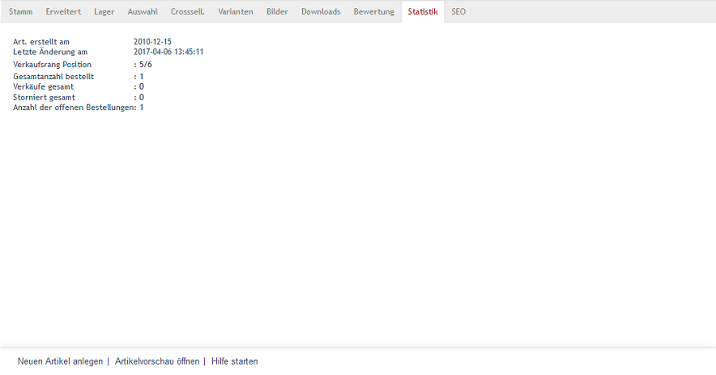

Registerkarte Statistik
=======================
Auf der Registerkarte :guilabel:`Statistik` werden einige verkaufsrelevante Informationen zum Artikel, beispielsweise zur Anzahl der Verkäufe, zum Verkaufsrang oder zum Status von Bestellungen, bereitgestellt.

:guilabel:`Art. erstellt am` |br|
Datum, an dem der Artikel erstellt wurde.

:guilabel:`Letzte Änderung am` |br|
Datum, an dem der Artikel zuletzt geändert wurde.

:guilabel:`Verkaufsrang Position` |br|
Es wird angezeigt, welchen Platz der Artikel in der Liste der verkauften Artikel einnimmt. Je mehr Stück eines Artikels verkauft wurden, desto höher ist sein Verkaufsrang. Beispiel: 2/60 bedeutet, dass insgesamt sechzig Artikel verkauft wurden. Der Artikel, dessen Statistik eingesehen wird, nimmt darunter den zweiten Platz ein.

:guilabel:`Gesamtanzahl bestellt` |br|
Diese Zahl gibt an, wie oft der Artikel bisher bestellt wurde.

:guilabel:`Verkäufe gesamt` |br|
Diese Zahl zeigt, wie oft der Artikel bisher verkauft wurde.

:guilabel:`Storniert gesamt` |br|
Diese Zahl informiert darüber, wie oft der Artikel bisher storniert wurde.

:guilabel:`Anzahl der offenen Bestellungen` |br|
Diese Zahl gibt an, wie viele Bestellungen für den Artikel noch offen und zu bearbeiten sind.

.. Intern: oxbacs, Status:, F1: article_overview.html