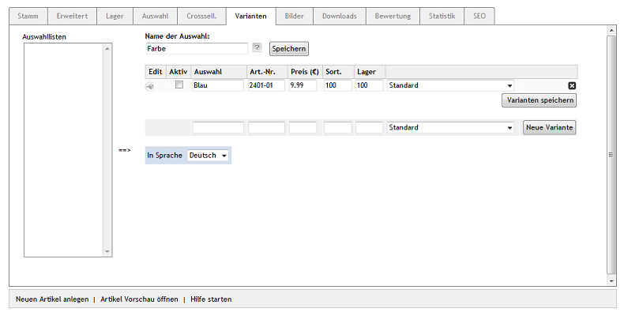
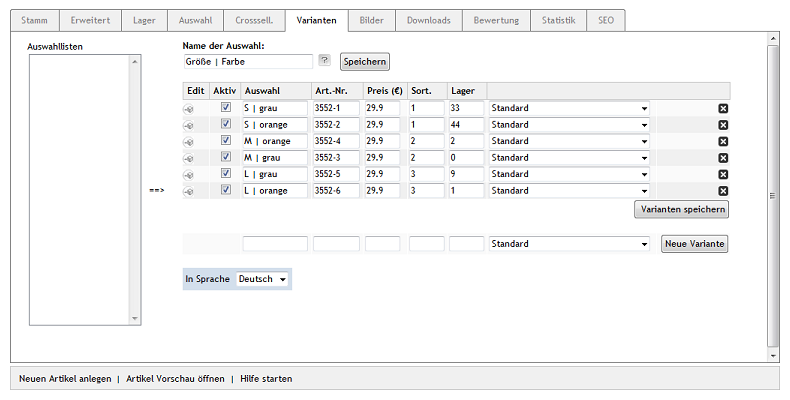

Registerkarte Varianten
***********************
Mit Varianten können verschiedene Ausführungen ein und desselben Artikels umgesetzt werden. Typische Ausführungen sind beispielsweise die unterschiedlichen Größen bei Kleidungsstücken oder mehrere Farben, in denen ein Artikel angeboten wird.

Das Prinzip der Varianten ist, dass zunächst ein Artikel - der so genannte Vaterartikel - erstellt wird. Er nimmt alle Basisinformationen auf, die an die Varianten vererbt werden. Die Langbeschreibung, die Sie beim Vaterartikel geschrieben haben, wird bei den Varianten angezeigt, es sei denn, eine Variante hat davon abweichend eine andere Langbeschreibung. Varianten können die Einstellungen des Vaterartikels übernehmen, oder andere Preise, separate Artikelnummern, eigene Artikelbilder, unterschiedliche Lagerbestände usw. haben.

In der Regel ist der Vaterartikel selbst nicht kaufbar. Dies wird als globale Einstellung in :menuselection:`Stammdaten --> Grundeinstellungen`, Registerkarte :guilabel:`System` unter :guilabel:`Varianten` festgelegt.

Auf der Registerkarte :guilabel:`Varianten` werden die Varianten des Artikels erstellt. Im Feld :guilabel:`Name der Auswahl` wird der Begriff eingetragen, der die Varianten charakteristisch unterscheidet, beispielsweise \"Größe\", \"Material\" oder \"Farbe\". Dieser wird als Name der Dropdown-Liste angezeigt, mit der man die Varianten in der Detailansicht des Artikels auswählen kann.

Multidimensionale Varianten stellen eine Mehrfachauswahl von charakteristischen Eigenschaften eines Artikels zur Verfügung. In der Detailansicht eines Artikels gibt es dadurch mehrere Dropdownlisten zur Auswahl, beispielsweise \"Größe\" und \"Farbe\". Die Mehrfachauswahl wird durch eine besondere Syntax in den Feldern :guilabel:`Name der Auswahl` und :guilabel:`Auswahl` umgesetzt. Das Pipezeichen (|) trennt jeweils die verschiedenen Eigenschaften und deren Werte.

:guilabel:`Auswahllisten`

Hier werden die vorhandenen Auswahllisten angezeigt. Sie können dazu verwendet werden, per Mausklick Varianten daraus zu erstellen. Haben Sie für Ihre Artikel immer wiederkehrende Ausführungen, sollten Sie entsprechende Auswahllisten als Vorlage anlegen. Nun brauchen Sie die Auswahlliste jeweils nur markieren und auf den Pfeil zu drücken, der nach rechts in Richtung Tabelle zeigt. Alle Varianten werden angelegt und können bei Bedarf weiter bearbeitet, aktiviert und gespeichert werden. Werden mehrere Auswahllisten zugewiesen, entstehen dadurch multidimensionale Varianten.

:guilabel:`Name der Auswahl`

Geben Sie hier einen Begriff ein, wodurch sich die Varianten unterscheiden. Dieser wird in der Detailansicht des Artikels als Name der Dropdown-Liste für die Variantenauswahl angezeigt. Der Besucher sollte auf einen Blick erkennen, was er in der Liste auswählen kann. Der Name der Auswahl wird separat gespeichert.

Beispiel für multidimensionale Varianten: Größe | Farbe

Um eine Variante zu erstellen, werden die Eingabefelder in der Tabelle ausgefüllt. Die Variante muss aktiviert und gespeichert werden. Um der Tabelle eine weitere Variante hinzuzufügen, betätigen Sie die Schaltfläche :guilabel:`Neue Variante`.

:guilabel:`Edit`

Beim Klick auf das Symbol für das Editieren wird die Variante in der Artikelverwaltung geöffnet. Die Ansicht ist nahezu identisch wie bei einem ganz normalen Artikel. Es lassen sich alle üblichen Einstellungen vornehmen und Informationen hinterlegen. Hinzugekommen ist bei den meisten Registerkarten lediglich eine erste Zeile :guilabel:`Variante von`. Die Registerkarte :guilabel:`Stamm` hat eine zusätzliche Dropdown-Liste :guilabel:`Gehe zu`, über die direkt der Vaterartikel oder eine andere Variante angezeigt werden kann.

:guilabel:`Aktiv`

Mit einem angehakten Kontrollkästchen ist die Variante aktiv und wird beim Artikel zur Auswahl angezeigt.

:guilabel:`Auswahl`

Eintrag, den man in der Dropdown-Liste in der Detailansicht des Artikels auswählen kann. Unterscheiden sich die Varianten beispielsweise in der Farbe, muss in diesem Feld die Farbe selbst stehen.

:guilabel:`Art.-Nr.`

Artikelnummer der Variante. Ohne eine Eingabe wird die Artikelnummer des Vaterartikels verwendet.

:guilabel:`Preis (€)`

Preis der Variante. Wird kein Preis eingetragen, wird der Preis des Vaterartikels verwendet.

:guilabel:`Sort.`

Tragen Sie hier eine Zahl ein, welche die Sortierung des Eintrags in der Dropdown-Liste bestimmt. Die Variante mit der kleinsten Zahl für Sortierung wird in der Auswahl an erster Stelle angezeigt.

:guilabel:`Lager`

Lagerbestand der Variante. In der daneben stehenden Liste kann das Verhalten ausgewählt werden, wenn die Variante nicht auf Lager ist. Siehe :guilabel:`Lieferstatus` auf der Registerkarte :guilabel:`Lager`.

:guilabel:`In Sprache`

Listenauswahl stellt die schnelle Bearbeitung von Varianten auf eine andere aktive Sprache des Shops um.

.. seealso:: :doc:`Auswahllisten <../auswahllisten/auswahllisten>`

.. Intern: oxbaco, Status:, F1: article_variant.html