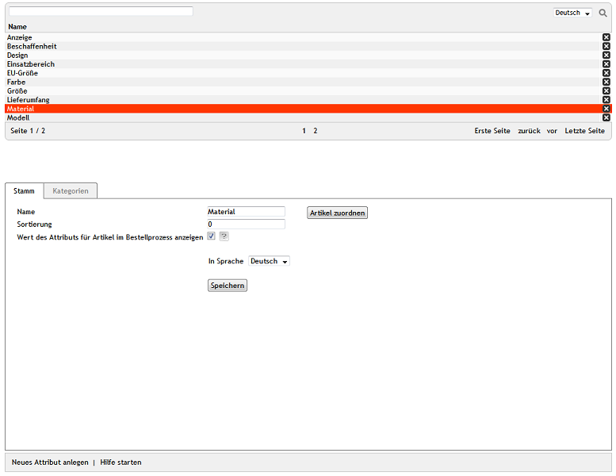

Attribute
*********
Artikel verfügen standardmäßig über eine Reihe von Eigenschaften, mit denen sie charakterisiert werden können. Dazu gehören beispielsweise das Gewicht, die Abmessungen oder die Menge. Mit den Attributen haben Shopbetreiber eine flexible Lösung, um eigene Artikeleigenschaften zu definieren und diese dem jeweiligen Artikel mit einem entsprechenden Wert zuzuweisen.

In der Detailansicht des Artikels wird dadurch eine neue Registerkarte :guilabel:`SPEZIFIKATION` mit den Attributen und deren Werten eingeblendet. Zusätzlich kann der Wert des Attributes beim Artikel im\Warenkorb und beim Bestellabschluss angezeigt werden.

Werden Attribute zu Kategorien zugeordnet, lassen sich die Kategorien nach diesen Attributen filtern. In der Kategorieübersicht des Shops können in einer Dropdown-Liste alle Werte des Attributes ausgewählt werden.

Attribute dienen auch dazu, ähnliche Artikel zu erkennen und auf der Detailseite oder im Newsletter zu offerieren. Die Anzahl ähnlicher Artikel, die bei einem Artikel angezeigt werden, kann im Administrationsbereich unter :menuselection:`Stammdaten --> Grundeinstellungen --> Einstell. --> Artikel` definiert werden. Achten Sie bitte darauf, dass das Kontrollkästchen bei :guilabel:`Ähnliche Artikel laden` auf der Registerkarte :guilabel:`Perform.` gesetzt ist.

Attribute können im Administrationsbereich unter :menuselection:`Artikel verwalten --> Attribute` bearbeitet werden. Es werden eine Liste der Attribute und darunter der Eingabebereich für die Attribute angezeigt.

Die Attributliste zeigt alle verfügbaren Attribute in alphabetischer Reihenfolge. Nach Attributen kann gesucht werden, indem das Suchfeld für dessen Namen und das Lupensymbol verwendet wird. Geben Sie beispielsweise in das Suchfeld ein \"z\" ein, werden Ihnen die Attribute \"Anzeige\" und \"Einsatzbereich\" angezeigt.

Attribute lassen sich durch einen Klick auf das Löschsymbol am Ende der Zeile endgültig aus der Datenbank entfernen.

Wird ein Attribut aus der Attributliste gewählt, werden dessen Informationen in den Eingabebereich geladen. Zum Erstellen eines neuen Attributes klicken Sie am unteren Bildschirmrand auf :guilabel:`Neues Attribut anlegen`.

-----------------------------------------------------------------------------------------

.. |link| image:: ../../media/icons-de/link.png
.. |br| raw:: html 

    

Registerkarte Stamm
+++++++++++++++++++
**Inhalte**: Attribut eines Artikels, Sortierung der Attribute, Attribut im Bestellprozess, kaufrelevante Informationen, Button-Lösung, Attribut zu Artikeln zuordnen, ähnliche Artikel |br|
:doc:`Artikel lesen <registerkarte-stamm>` |link|

Registerkarte Kategorien
++++++++++++++++++++++++
**Inhalte**: Attribut zu Kategorien zuordnen, Kategorien nach Attributen filtern, Sortierung der Attribute |br|
:doc:`Artikel lesen <registerkarte-kategorien>` |link|

Registerkarte Mall
++++++++++++++++++
Nur in der Enterprise Edition vorhanden |br|
**Inhalte**: Attribute vererben, Attribute verknüpfen, Elternshop, Subshop, Supershop, Multishop, Mall, Enterprise Edition |br|
:doc:`Artikel lesen <registerkarte-mall>` |link|

.. seealso:: :doc:`Artikel <../artikel/artikel>` | :doc:`Artikel - Registerkarte Auswahl <../artikel/registerkarte-auswahl>`