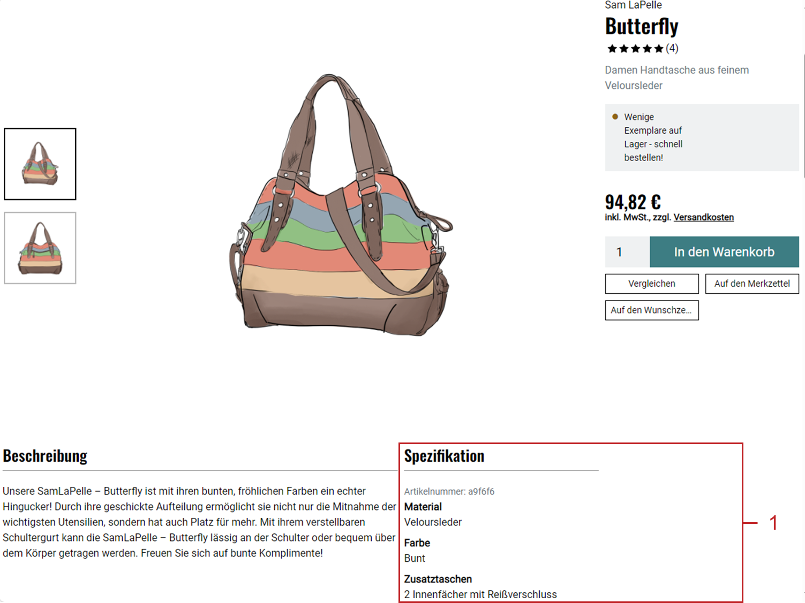
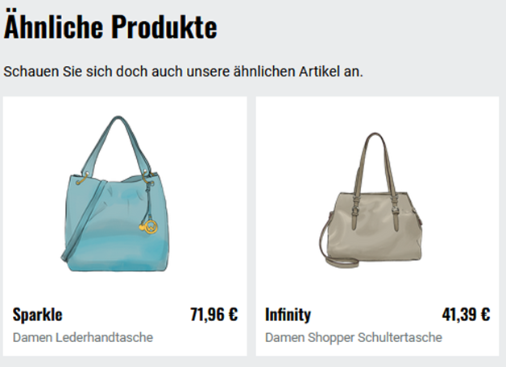

Attribute
=========

Artikel haben standardmäßig verschiedene Eigenschaften, mit denen sie charakterisiert werden können. Dazu gehören beispielsweise die Standardattribute Gewicht, Abmessungen oder Menge.

Mit benutzerdefinierten Attributen können Sie als Shopbetreiber eigene Artikeleigenschaften definieren und jedem Artikel einen entsprechenden Wert zuweisen.

Mit Attributen haben Sie folgende Möglichkeiten:

* Zeigen Sie Informationen übersichtlich an.
* Geben Sie den Kunden die Möglichkeit, Produkte zu filtern.
* Zeigen Sie ähnliche Produkte an.

Attribute anzeigen
------------------

Zeigen Sie Attribute auf der Detailseite oder im Bestellprozess zusätzlich zur Beschreibung an.

|procedure|

* Um Attribute in der Detailansicht des Produkts unter :guilabel:`Spezifikation` anzuzeigen, stellen Sie sicher, dass jedem Attribut ein Wert zugewiesen ist.
* Um Attribute beim Artikel im Warenkorb und beim Bestellabschluss anzuzeigen, tun Sie Folgendes:

  a. Wählen Sie unter :menuselection:`Artikel verwalten --> Attribute` das gewünschte Attribut.
  #. Stellen Sie sicher, dass das Kontrollkästchen :guilabel:`Wert des Attributs für Artikel im Bestellprozess anzeigen` markiert ist.

|result|

Die Attribute erscheinen unter :guilabel:`Spezifikation` (:ref:`oxbaff01`, Pos. 1).

.. _oxbaff01:

   Abb.: Attribute auf der Detailseite anzeigen

Filtern mit Attributwerten ermöglichen
--------------------------------------

.. include:: /_static/reuse/filtern-nach-attributen.rst

Ähnliche Produkte anzeigen
--------------------------

Nutzen Sie Attribute, um ähnliche Artikel zu erkennen und auf der Detailseite zu präsentieren (:ref:`oxbaff03`).

.. _oxbaff03:

   Abb.: Ähnliche Produkte anzeigen

|procedure|

1. Legen Sie die Anzahl ähnlicher Artikel fest, die bei einem Artikel angezeigt werden.

   Legen Sie dazu den gewünschten Wert im Administrationsbereich unter :menuselection:`Stammdaten --> Grundeinstellungen --> Einstell. --> Artikel` im Eingabefeld :guilabel:`Anzahl ähnlicher Artikel, die bei einem Artikel angezeigt werden` fest.

#. Stellen Sie unter :menuselection:`Stammdaten --> Grundeinstellungen` auf der Registerkarte :guilabel:`Perform.` sicher, dass das Kontrollkästchen :guilabel:`Ähnliche Artikel laden` markiert ist.
#. Tun Sie unter :menuselection:`Artikel verwalten --> Attribute` Folgendes:

   a. Legen Sie benutzerdefinierte Attribute an, um möglichst viele charakteristische Merkmale Ihrer Produkte abzubilden.

      Hintergrund: Je größer die Schnittmenge gemeinsamer Attribute, desto "ähnlicher" sind die Produkte.

      Beispiel: Koffer und Fahrzeuge werden als ähnliche Produkte angezeigt, wenn sie lediglich das Attribut :technicalname:`Gewicht` gemeinsam haben.

      Damit bei einem Fahrzeug nur andere :emphasis:`Fahrzeuge` als ähnliche Produkte erscheinen, müssen Sie weitere Attribute zuordnen.

      Die größte Ähnlichkeit haben Produkte, die ein spezifisches Merkmal teilen, beispielsweise bei Fahrzeugen die Beschleunigung.

      .. note::
         Die spezifischen :emphasis:`Werte`, die Sie den Attributen für jedes Produkt zuordnen, beeinflussen :emphasis:`nicht` die Ähnlichkeit.

         Beispiel: Ihre Produkte teilen nur das Attribut :technicalname:`Gewicht`. Fahrzeuge wiegen zwischen 1600 kg und 2500 kg, Regenschirme zwischen 1 kg und 1,5 kg. Ein Fahrzeug mit 2000 kg ist einem Regenschirm mit 1 kg genauso ähnlich wie einem anderen Fahrzeug.

   #. Ordnen Sie den benutzerdefinierten Attributen jeweils die betreffenden Produkte zu.

      Wählen Sie dazu das Attribut und wählen Sie :guilabel:`Produkte zuordnen`.

#. Ordnen Sie den betreffenden Produkten möglichst viele charakterisierende Merkmale (Attribute) zu.

   Um einem Produkt ein Standard-Attribut zuzuordnen, tun Sie Folgendes:

   a. Wählen Sie unter :menuselection:`Artikel verwalten --> Artikel` das Produkt.
   #. Wählen Sie :guilabel:`Erweitert`.
   #. Legen Sie Gewicht, Maße oder Menge fest.

   Um ein benutzerdefiniertes Attribut zuzuweisen, tun Sie Folgendes:

   a. Wählen Sie unter :menuselection:`Artikel verwalten --> Artikel` das Produkt.
   #. Wählen Sie :guilabel:`Auswahl` (:ref:`oxbaff04`, Pos. 1).
   #. Wählen Sie :guilabel:`Attribute zuordnen` (:ref:`oxbaff04`, Pos. 2).
   #. Ordnen Sie dem Artikel das Attribut zu.
   #. Klicken Sie auf den Namen des Attributs.

      Ein Eingabefeld für das Eingeben des Attributwerts erscheint (:ref:`oxbaff04`, Pos. 3).

   #. Geben Sie den Wert ein und speichern Sie Ihre Eingabe.

   .. _oxbaff04:

   .. figure:: ../../media/screenshots/oxbaff04.png
      :alt: Benutzerdefiniertes Attribut zuweisen und Wert festlegen
      :width: 650
      :class: with-shadow

      Abb.: Benutzerdefiniertes Attribut zuweisen und Wert festlegen

|result|

Auf der Detailseite wird der Bereich ähnliche Produkte angezeigt (:ref:`oxbaff03a`).

.. _oxbaff03a:

   Abb.: Ähnliche Produkte anzeigen

-----------------------------------------------------------------------------------------

Registerkarte Stamm
-------------------
**Inhalte**: Attribut eines Artikels, Sortierung der Attribute, Attribut im Bestellprozess, kaufrelevante Informationen, Button-Lösung, Attribut zu Artikeln zuordnen, ähnliche Artikel |br|
:doc:`Artikel lesen <registerkarte-stamm>` |link|

Registerkarte Kategorien
------------------------
**Inhalte**: Attribut zu Kategorien zuordnen, Kategorien nach Attributen filtern, Sortierung der Attribute |br|
:doc:`Artikel lesen <registerkarte-kategorien>` |link|

Registerkarte Mall
------------------
Nur in der Enterprise Edition vorhanden |br|
**Inhalte**: Attribute vererben, Attribute verknüpfen, Elternshop, Subshop, Supershop, Multishop, Mall, Enterprise Edition |br|
:doc:`Artikel lesen <registerkarte-mall>` |link|

.. seealso:: :doc:`Artikel <../artikel/artikel>` | :doc:`Artikel - Registerkarte Auswahl <../artikel/registerkarte-auswahl>`

.. Intern: oxbaff, Status: