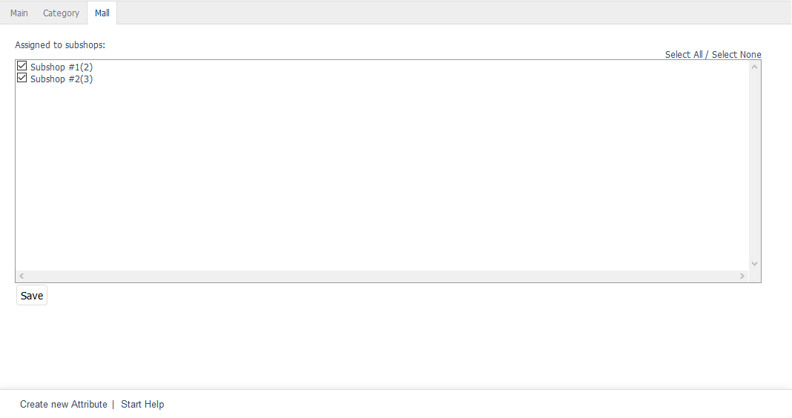

Mall tab
==================
The :guilabel:`Mall` tab is only available for attributes in OXID eShop Enterprise Edition.

Attributes can be inherited when creating shops. If the option :guilabel:`Shop inherits all inheritable items (products, discounts etc) from it's parent shop` is selected, the new shop will also contain all the attributes of the parent shop. The inherited attributes can’t be changed and retain their original assignment to products. However, they can be assigned to categories so that the latter can be filtered by attributes.

The :guilabel:`Mall` tab can be used to manage attribute assignments to subshops and supershops. Multishops don’t inherit attributes from other shops.

The inheritance of all attributes for a shop can be undone. To do this, uncheck the inheritance settings box in the :guilabel:`Mall` tab of the subshop or supershop under :menuselection:`Master Settings --> Core Settings`.

:guilabel:`Assigned to following subshops` |br|
Check or uncheck the appropriate box to assign/unassign an attribute to/from subshops and supershops. If the box is not checked, the attribute will be available in the parent shop but not in the respective subshop or supershop.

Use the :guilabel:`Select All` and :guilabel:`Select None` links on the right side of the window to assign/unassign the attribute to/from all shops. Any changes made must be saved and will immediately be effective for subshops or supershops.

.. Intern: oxbagi, Status:, F1: attribute_mall.html