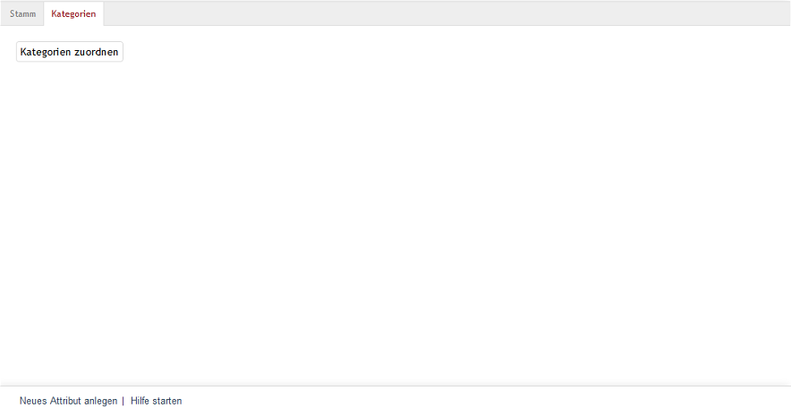

Registerkarte Kategorien
========================

Auf der Registerkarte :guilabel:`Kategorien` ordnen Sie ein Attribut einer oder mehreren Kategorien zu. Wenn eine Kategorie mehrere Attribute verwendet, können Sie zusätzlich deren Sortierreihenfolge anpassen.

Diese Zuordnung ermöglicht es, Produkte in der jeweiligen Kategorie nach Attributwerten zu filtern. Weitere Informationen finden Sie unter :doc:`Artikel filtern <../artikel-und-kategorien/filtern-von-artikeln>`.

In der Kategorieansicht des Shops erscheint eine Dropdown-Liste mit allen Werten des Attributs. Sobald ein Besucher einen Wert auswählt, wendet der Shop den Filter an und zeigt nur die entsprechenden Artikel in der Kategorie an.

Klicken Sie auf die Schaltfläche :guilabel:`Kategorien zuordnen`, um ein neues Fenster zu öffnen. Dort weisen Sie dem Attribut Kategorien zu. Die linke Liste zeigt alle verfügbaren Kategorien. Ziehen Sie die gewünschten Kategorien per Drag & Drop in die mittlere Liste. Diese enthält alle Kategorien, in denen das Attribut verwendet wird. Um mehrere Kategorien gleichzeitig auszuwählen, halten Sie die Strg-Taste gedrückt.

Wenn eine Kategorie mehrere Attribute enthält, können Sie in der rechten Liste die Sortierung dieser Attribute anpassen. Verwenden Sie dazu die Pfeilschaltflächen, um das markierte Attribut in die gewünschte Reihenfolge

.. seealso:: :doc:`Kategorien <../kategorien/kategorien>` | :doc:`Artikel filtern <../artikel-und-kategorien/filtern-von-artikeln>`

.. Intern: oxbafh, Status:, F1: attribute_category.html