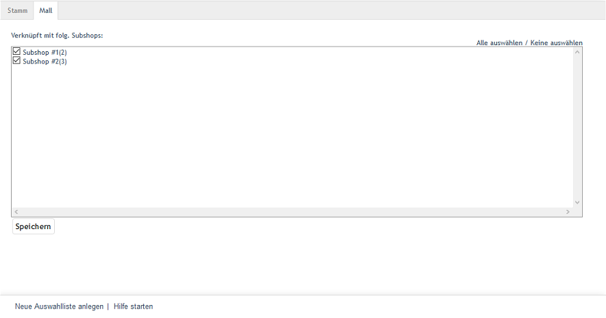

Registerkarte Mall
==================
Die Registerkarte :guilabel:`Mall` ist bei Auswahllisten nur in der OXID eShop Enterprise Edition vorhanden.

Auswahllisten können beim Erstellen von Shops an diese vererbt werden. Wird die Option :guilabel:`Dieser Shop erbt alle Artikel und Einstellungen vom Elternshop` gewählt, enthält ein neuer Shop auch alle Auswahllisten des Elternshops. Die vererbten Auswahllisten sind nicht änderbar und behalten ihre ursprüngliche Verknüpfung mit Artikeln.

Auf der Registerkarte :guilabel:`Mall` werden die Verknüpfungen der Auswahlliste zu Subshops und Supershops verwaltet. Multishops übernehmen keine Auswahllisten aus anderen Shops.

Es ist möglich, die Vererbung aller Auswahllisten für einen Shop rückgängig zu machen. Dazu muss in der Registerkarte :guilabel:`Mall` des Subshops oder Supershops unter :menuselection:`Stammdaten --> Grundeinstellungen` das Häkchen bei der Vererbungseinstellung entfernt werden.

:guilabel:`Verknüpft mit folg. Subshops` |br|
Die Verknüpfung einer Auswahlliste mit Subshops und Supershops kann hinzugefügt oder entfernt werden, indem das entsprechende Kontrollkästchen angehakt wird oder nicht. Bei nicht aktiviertem Kontrollkästchen ist die Auswahlliste im Elternshop vorhanden, aber nicht im jeweiligen Subshop oder Supershop.

Über die Links :guilabel:`Alle auswählen` und :guilabel:`Keine auswählen` auf der rechten Seite des Fensters können alle Shops verknüpft oder alle Verknüpfungen zu den Shops entfernt werden. Vorgenommene Änderungen müssen gespeichert werden und sind für die Subshops oder Supershops sofort wirksam.

.. Intern: oxbagj, Status:, F1: selectlist_mall