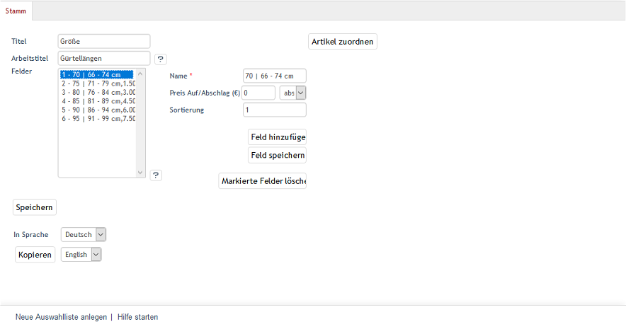

Registerkarte Stamm
===================

Auf der Registerkarte :guilabel:`Stamm` lassen sich Auswahllisten erstellen, bearbeiten und den gewünschten Artikeln zuordnen.

Mit der Sprachumstellung im unteren Teil des Eingabebereichs können die Informationen und Einstellungen zur Auswahlliste auch direkt in einer weiteren Sprache bearbeitet werden. Bitte beachten Sie, dass die Sprachumstellung erst nach dem ersten Speichern der Auswahlliste möglich ist.

:guilabel:`Titel`
   Titel der Auswahlliste, wie er auf der Detailseite eines Artikels angezeigt wird, der diese Auswahlliste verwendet. Auf der Detailseite des Artikels wird über der Preisangabe eine Dropdown-Liste eingeblendet, die diesen Titel trägt. In der Auswahlliste finden sich alle, hier als Felder definierten Ausführungen.

:guilabel:`Arbeitstitel`
   Der Arbeitstitel wird nicht im Shop angezeigt, sondern dient der besseren Unterscheidung der Auswahllisten im Administrationsbereich. Haben Sie beispielsweise mehrere Auswahllisten mit dem Titel \"Größe\" erstellt, können Sie durch den Arbeitstitel deutlich machen, um welche Art von Größen es sich handelt.

:guilabel:`Felder`
   Mit einem Feld wird die eigentliche Ausführung oder Auswahl angelegt, also das, was der Kunde auf der Detailseite aus der Auswahlliste wählen kann. Wird die Auswahlliste zum Erstellen von Varianten verwendet, ist der vergebene Name und ein definierter Preisaufschlag bzw. Preisabschlag die Grundlage jeweils einer Variante.

:guilabel:`Name`
   Name der Auswahl, wie er in der Auswahlliste eines Artikels erscheint. Wird die Auswahlliste zum Erstellen von Varianten verwendet, wird der Name auch zur Auswahl der jeweiligen Variante.

:guilabel:`Preis Auf/Abschlag (€)`
   Legen Sie den Auf- oder Abschlag auf den Preis für diese Ausführung fest. Der Preis kann absolut oder prozentual definiert werden. Damit der Preis je nach Auswahl auch neu berechnet und auf der Detailseite angezeigt wird, muss das Kontrollkästchen :guilabel:`Preisänderungen durch Auswahllisten unterstützen` unter :menuselection:`Stammdaten --> Grundeinstellungen`, Registerkarte :guilabel:`Perform`:guilabel:`.` aktiviert sein.

:guilabel:`Sortierung`
   Die Sortierung legt die Reihenfolge fest, in der die Ausführung in der Auswahlliste erscheint. Die Auswahl mit dem kleinsten Wert steht jeweils an erster Stelle. Die Sortierung beginnt mit dem Wert 1.

:guilabel:`Feld hinzufügen`
   Diese Schaltfläche leert die Eingabefelder, damit ein neues Feld erstellt und der Auswahlliste hinzugefügt werden kann.

:guilabel:`Feld speichern`
   Mit der Schaltfläche können die Eingaben zu einem Feld gespeichert werden.

:guilabel:`Markierte Felder löschen`
   Bereits angelegte Felder können gelöscht werden, nachdem sie in der Liste markiert wurden. Eine Mehrfachauswahl der Felder ist bei gedrückter Strg-Taste möglich.

:guilabel:`Artikel zuordnen`
   Die Schaltfläche :guilabel:`Artikel zuordnen` öffnet ein neues Fenster, in dem die Auswahlliste Artikeln zugewiesen werden kann. Im Zuordnungsfenster werden in der linken Liste alle Artikel angezeigt. Die gewünschten Artikel können per Drag \& Drop in die mittlere Liste verschoben werden. Diese zeigt alle Artikel, welche diese Auswahlliste verwenden. Eine Mehrfachauswahl ist bei gedrückter Strg-Taste möglich. In der rechten Liste lässt sich die Sortierung der Auswahllisten eines Artikels ändern, wenn es für einen Artikel mehrere Auswahllisten gibt. Verwenden Sie dafür die kleinen Schaltflächen mit den Pfeilsymbolen, um eine markierte Auswahlliste an die gewünschte Position zu verschieben. Mit der Sortierung kann beeinflusst werden, in welcher Reihenfolge die Auswahllisten auf der Detailseite eines Artikels angeordnet sind.

.. Intern: oxbafj, Status:, F1: selectlist_main