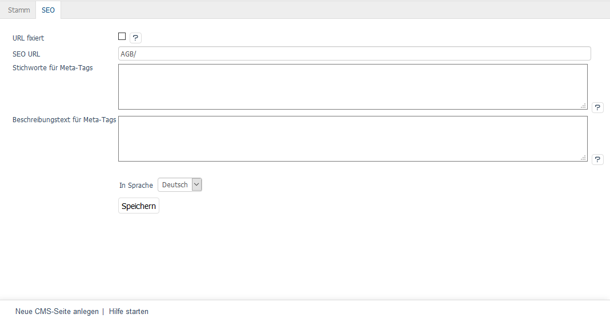

Registerkarte SEO
=================

Die Registerkarte :guilabel:`SEO` der CMS-Seite beinhaltet Informationen und Einstellungen, die für Suchmaschinen relevant sind.

Mit der Sprachumstellung am unteren Ende des Eingabebereichs lassen sich die Informationen und Einstellungen auch in einer weiteren aktiven Sprache bearbeiten.

:guilabel:`URL fixiert`
   Ändern sich Daten einer CMS-Seite, wie beispielsweise deren Titel, wird die SEO URL neu berechnet. Die Änderung wird in der Datenbanktabelle :db:`oxseohistory` protokolliert. Damit kann auf den Aufruf der bisherigen URL, die beispielsweise noch in einem Suchindex oder einer älteren E-Mail an Kunden enthalten ist, mit einer Weiterleitung (301-Header) reagiert werden.

Ist dieses Kontrollkästchen aktiviert, wird die ursprüngliche SEO URL nicht geändert.

:guilabel:`SEO URL`
   Die URL der CMS-Seite wird angezeigt. Sie kann geändert und auch fixiert werden.

:guilabel:`Stichworte für Meta-Tags`
   Die Stichwörter, die von Suchmaschinen ausgewertet werden, sind in den HTML-Quelltext (Meta Keywords) eingebunden. Wenn Sie nichts eingeben, werden die Stichwörter automatisch aus dem Titel der CMS-Seite erzeugt.

:guilabel:`Beschreibungstext für Meta-Tags`
   Dieser Beschreibungstext wird in den HTML-Quelltext (Meta Description) eingebunden. Dieser Text wird von vielen Suchmaschinen bei den Suchergebnissen angezeigt. Wenn Sie nichts eingeben, wird die Beschreibung automatisch aus dem Titel der CMS-Seite erzeugt.

:guilabel:`In Sprache`
   Wählen Sie eine Sprache aus der Liste aus, für die Sie die SEO-Informationen und -Einstellungen bearbeiten möchten.

.. Intern: oxbajk, Status: