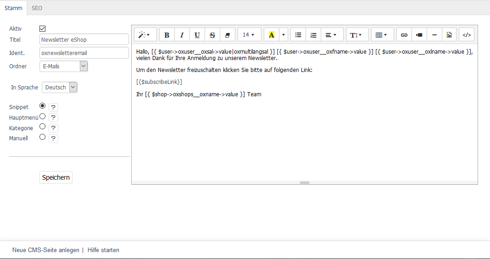

Registerkarte Stamm
===================

Auf der Registerkarte :guilabel:`Stamm` werden Einstellungen zur CMS-Seite vorgenommen und deren Inhalt gepflegt. Es können bestehende CMS-Seiten bearbeitet oder neue erstellt werden. Um eine neue CMS-Seite zu erstellen, verwenden Sie den Link :guilabel:`Neue CMS-Seite anlegen` in der Fußzeile des Eingabebereiches. Mit der Sprachumstellung in der Mitte des linken Eingabebereichs lassen sich die Einstellungen und Inhalte zur CMS-Seite auch direkt in einer weiteren Sprache bearbeiten.

:guilabel:`Aktiv`
   Ein aktiviertes Kontrollkästchen bewirkt, dass die CMS-Seite für die Anzeige im Shop oder als jeweilige E-Mail verfügbar ist. Eine nicht aktive CMS-Seite ist in der Datenbank gespeichert, wird aber nirgends verwendet.

:guilabel:`Titel`
   Der Titel der CMS-Seite ist deren kurze und eindeutige Beschreibung. Er wird, wenn CMS-Seiten als ganze Seiten des Frontends angezeigt werden, als Seitenüberschrift verwendet. Nach Titel können CMS-Seiten auch im Administrationsbereich gesucht werden.

:guilabel:`Ident.`
   Eine eindeutige Kennung für die CMS-Seite, mit der diese intern aufgerufen wird. Mit dem Ident wird die CMS-Seite in Templates angesprochen und damit ihr Inhalt angezeigt. Beim Erstellen einer neuen CMS-Seite wird als Ident ein alphanumerischer Code wie beispielsweiser dieser erzeugt: ``67ae4e9e4538360cb4d22320e9742466``. Für die Verwendung der CMS-Seite empfiehlt sich eher ein lesbarer, aber dennoch eindeutiger Ident.

:guilabel:`Ordner`
   CMS-Seiten lassen sich einem Ordner zuweisen, um sie zu kategorisieren und damit besser in der Liste der CMS-Seiten finden zu können. Standardmäßig gibt es im Shop die Ordner E-Mails, Kunden-Infos, Artikel-Information und Keine. Neue Ordner können, wie im Dokument :doc:`cms-seiten` beschrieben, einfach hinzugefügt werden. Damit ist es möglich, die CMS-Seiten nach eigenen Anforderungen zu organisieren.

:guilabel:`In Sprache`
   Die CMS-Seite lässt sich auch in weiteren aktiven Sprachen des Shops bearbeiten. Wählen Sie eine Sprache aus der Liste aus.

:guilabel:`Snippet`
   Wird diese Option gewählt, kann die CMS-Seite als Textbaustein in Shopseiten oder E-Mails verwendet werden. Dabei täuscht der Begriff Snippet, zu deutsch Schnipsel, ein wenig darüber hinweg, dass die CMS-Seite auch den Inhalt einer kompletten Shopseite bereistellen kann. Beispiele dafür sind auf der einen Seite die Fußzeile des Shops, auf der anderen Seite die AGB oder das Impressum. Die CMS-Seite wird in den Templates mit ihrem Ident angesprochen. Beispiel: ``[{ oxcontent ident=oxagb }]``

:guilabel:`Hauptmenü`
   Diese Option war ursprünglich dafür vorgesehen, die CMS-Seite als Link im Menü anzuzeigen. Im nicht mehr unterstützten Theme "Basic" tauchte der Link im Shop rechts oben neben AGB und Impressum auf. Die nachfolgenden Themes "Azure", "Flow" und "Wave" sind anders aufgebaut und haben für diese Option keine Verwendung mehr.

:guilabel:`Kategorie`
   Damit eine CMS-Seite als Link in der Kategorienavigation auftaucht, muss diese Option aktiviert sein. Nach dem Speichern wird die Auswahlliste :guilabel:`Eingefügt vor` eingeblendet, mit der die genaue Position der CMS-Seite zwischen den Kategorien festgelegt werden kann.

:guilabel:`Manuell`
   Die Option erlaubt das Einbinden einer CMS-Seite in eine andere. Dafür wird nach dem Speichern ein Link angezeigt, mit dem sich die CMS-Seite inkludieren lässt. Beispiel: ``[{ oxgetseourl ident="oxcredits" type="oxcontent" }]``

:guilabel:`Eingefügt vor`
   Auswahlliste, mit der die Position der CMS-Seite in der Kategorienavigation festgelegt werden kann. Nur sichtbar bei Option :guilabel:`Kategorie`.

:guilabel:`Link`
    Anzeige eines Links, mit der eine CMS-Seite in eine andere inkludiert werden kann. Nur sichtbar bei Option :guilabel:`Manuell`.

---------------------------------------------------------------------------------------------------

Der Text der CMS-Seite kann komfortabel in einen Editor eingegeben werden, der den rechten Teil des Eingabebereiches ausfüllt. Der Editor arbeitet nach dem Prinzip WYSIWYG (What You See Is What You Get), er zeigt also Text so an, wie er später im Shop zu sehen sein wird. Der Editor bietet die Möglichkeit der Textformatierung, des Einfügens von Links, Bildern und Videos. Für spezielle und darüber hinausgehende Anforderungen kann der HTML-Code angezeigt und bearbeitet werden. Es ist auch möglich, Smarty-Ausdrücke zu verwenden, um dynamische Inhalte anzeigen. Ein Beispiel dafür finden Sie in der CMS-Seite "Ihr Passwort im eShop", die als E-Mail auf Anforderung an den Kunden verschickt wird.

.. Intern: oxbajj, Status: