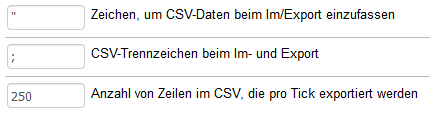

Einstellungen
=============

Der Export und der Import basieren jeweils auf einer CSV-Datei. Beim Export wird eine solche vom Shop erstellt, beim Import eingelesen. Diese Datei enthält Datensätze, die aus einzelnen Datenfeldern bestehen. Spezielle Zeichen fassen die einzelnen Datenfelder ein und trennen sie voneinander. Der Aufbau der Daten ist Namensgeber für das Dateiformat: Comma-separated values (CSV). Er stellt sicher, dass die Daten strukturiert aufbereitet, übergeben und verarbeitet werden können.

Feldbegrenzerzeichen und Datenfeld-Trennzeichen werden im Abschnitt :guilabel:`Weitere Einstellungen` unter :menuselection:`Stammdaten --> Grundeinstellungen`, Registerkarte :guilabel:`Einstell.` festgelegt. Das Trennzeichen für die Datensätze ist der Zeilenumbruch (CR LF) und kann nicht geändert werden.

Zeichen, um CSV-Daten beim Im/Export einzufassen
   Zeichen, welches am Anfang und am Ende eines Datenfeldes steht und es somit begrenzt. So wird sichergestellt, dass die Daten korrekt verarbeitet werden, auch wenn sie beispielsweise Leerzeichen oder gar das definierte Trennzeichen enthalten. Der Standardwert ist das Anführungszeichen (").

CSV-Trennzeichen beim Im- und Export
   Zeichen, welches die einzelnen Datenfelder voneinander trennt. Der Standardwert ist das Semikolon (;).

Anzahl von Zeilen im CSV, die pro Tick exportiert werden
   Definition der Verarbeitungsgeschwindigkeit. Legen Sie hier fest, wie viele Datensätze pro Tick exportiert werden sollen. Tick ist dabei eine Zeiteinheit, in der Einzelaufgaben simultan verarbeitet werden. Systemkonfiguration und Performance von Server und Datenbank sind dabei bestimmend. Die Standardeinstellung legt die Verarbeitung von 250 Datensätzen pro Tick fest und sollte reduziert werden, wenn es zu Problemen bei der Performance kommt.

.. seealso:: `CSV (Dateiformat) <https://de.wikipedia.org/wiki/CSV_(Dateiformat)>`_

.. Intern: oxbaiu, Status: