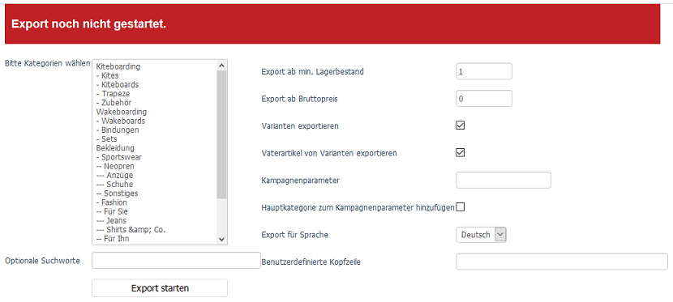

Generischer Export und Import
=============================

OXID eShop ermöglicht mit dem generischen Export und Import, Daten mit anderen Systemen auszutauschen.

Beim Export werden Artikeldaten in eine CSV-Datei geschrieben und können so zur weiteren Verarbeitung an andere Systeme oder Plattformen, wie beispielsweise Online-Versandhändler, Preis-Suchmaschinen, Affiliate-Netzwerke oder Warenwirtschaftssysteme, übergeben werden.

Der Import erlaubt es, Artikel-, Kunden- und Bestelldaten sowie Zuordnungen von Artikeln beispielsweise zu Kategorien, Aktionen oder als Zubehör schnell und unkompliziert in den Shop zu übernehmen. Die Daten können beispielsweise von Herstellern, Großhändlern, Webportalen, Speditionen oder beliebigen Dienstleistern stammen. Denkbar ist auch eine Datenübernahme aus anderen Shopsystemen. Basis des Imports sind CSV-Dateien, deren Inhalt vom Shop verarbeitet und direkt in die Datenbank geschrieben wird.

-----------------------------------------------------------------------------------------

Einstellungen
-------------
**Inhalte**:
Comma-separated values, CSV, Datenfeld, Datensatz, Trennzeichen, Feldbegrenzer, Verarbeitungsgeschwindigkeit, Tick |br|
:doc:`Artikel lesen <einstellungen>` |link|

Export
------
**Inhalte**:
Export von Artikeldaten, Artikel durch Kategorie(n) auswählbar, Suchworte für Artikeltitel, Filterung nach Lagerbestand und Preis, Export von Vaterartikeln und/oder Varianten, Sprachauswahl, benutzerdefinierte Kopfzeile, CSV-Datei, genexport.txt, Verzeichnis /export |br|
:doc:`Artikel lesen <export>` |link|

Import
------
**Inhalte**:
Import von Kunden- und Bestelldaten sowie Zuordnungen von Artikeln, CSV-Datei, Trennzeichen, Feldbegrenzer, Header-Informationen, Datenbanktabellen oxaccessoire2article, oxactions2article, oxartextends, oxarticles, oxcategories, oxcountry, oxobject2article, oxobject2category, oxorder, oxorderarticles, oxprice2article, oxuser und oxvendor, Datenfelder zu Tabellenspalten zuordnen, Tabellenspalten der Datenbanktabellen |br|
:doc:`Artikel lesen <import>` |link|

.. Intern: oxbait, Status: