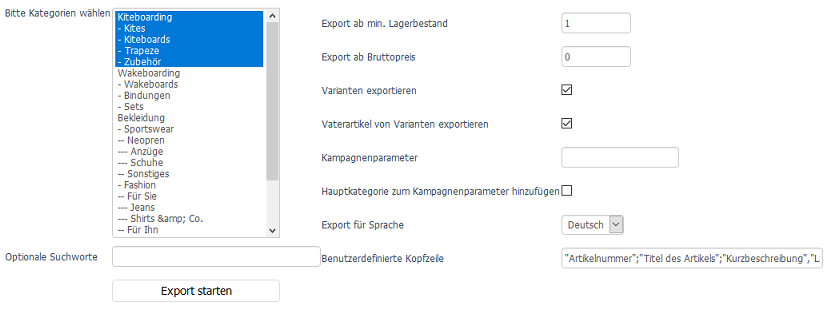

Export
======

OXID eShop bietet die Möglichkeit, Artikeldaten zu exportieren. Die Datensätze werden in eine CSV-Datei geschrieben und als :file:`genexport.txt` im Verzeichnis :file:`/export` des Shops gespeichert. Diese Datei kann zur weiteren Verarbeitung beispielsweise an andere Systeme oder Plattformen übergeben werden.

Die Einstellmöglichkeiten für den Export befinden sich im Administrationsbereich unter :menuselection:`Service --> Gener. Export`. Auf der linken Seite des Fensters wird der Kategoriebaum des Shops angezeigt. Hier können die Kategorien ausgewählt werden, deren Artikel exportiert werden sollen. Es werden nur aktive und nicht versteckte Artikel berücksichtigt. Eine Mehrfachauswahl von Kategorien ist bei gedrückter Strg-Taste möglich. Strg-a markiert alle vorhandenen Kategorien und exportiert damit alle vorhandenen Artikel. Das Gleiche passiert übrigens, wenn keine Kategorie ausgewählt wurde. Der Versuch, ausschließlich eine Kategorie zu exportieren, welche keine Artikel enthält, führt zu einer Fehlermeldung.

Optionale Suchworte
   Bietet die Möglichkeit zum Filtern von Artikeln. Zusätzlich zur Einschränkung auf Kategorien, können Artikel nach bestimmten Begriffen gefiltert werden, die im Titel der Artikel vorkommen. Werden mehrere Worte angegeben, müssen diese genau so im Titel des Artikels vorkommen. Es handelt sich also dabei nicht um eine logische Verknüpfung mehrerer Suchbegriffe.

Auf der rechten Seite des Fensters, finden sich weitere Einstellungen, welche die zu exportierenden Artikeldaten beeinflussen.

Export ab min. Lagerbestand
   Artikel, deren Lagerbestand dem hier angegebenen entsprechen, können exportiert werden. Der Vorgabewert 1 führt dazu, dass mindestens ein Stück von einem Artikel auf Lager sein muss, damit der Artikel für den Export berücksichtigt wird.

Export ab Bruttopreis
   Möglichkeit, den Export auf Artikel ab einem bestimmten Preis einzuschränken. Standardmäßig ist 0 eingestellt, was dazu führt, dass auch Gratisartikel mit exportiert werden.

Varianten exportieren
   Beim Export werden alle Varianten von Artikeln einbezogen.

Vaterartikel von Varianten exportieren
   Beim Export werden auch die Vaterartikel der Varianten berücksichtigt, auch wenn diese nicht kaufbar sind. Vaterartikel können nicht gekauft werden, solange die Einstellung :guilabel:`Varianten-"Vater" ist kaufbar` in den Grundeinstellungen nicht aktiviert wurde.

Kampagnenparameter
   Name einer Kampagne, welcher an die im Datensatz enthaltene SEO-URL angehängt wird. Damit kann über Tracking ausgewertet werden, wie viele Zugriffe über diese spezielle URL auf den Artikel erfolgten. Die Funktion ist derzeit nicht aktiv.

Hauptkategorie zum Kampagnenparameter hinzufügen
   Der Name der Hauptkategorie wird dem Kampagnenparameter hinzugefügt, wenn das Kontrollkästchen angehakt ist. Die Funktion ist derzeit nicht aktiv.

Export für Sprache
   Aus der Liste kann die im Shop aktive Sprache ausgewählt werden, in welcher der Artikeltitel, die Kurz- und Langbeschreibung etc. exportiert werden sollen.

Benutzerdefinierte Kopfzeile
   Es kann eine Kopfzeile festgelegt werden, die als erste Zeile in die Datei :file:`genexport.txt` geschrieben wird.

Betätigen Sie die Schaltfläche :guilabel:`Export starten`, um den Export der Artikel gemäß den getroffenen Einstellungen anzustoßen. Nach Abschluss des Exports wird die Meldung "Export beendet. Erfolg! Sie können Ihre Exportdatei hier herunterladen." ausgegeben. Das Wort **hier** ist mit der Exportdatei verlinkt und ein Klick darauf öffnet diese im Browserfenster. Für jeden exportierten Artikel gibt es in der Datei einen Datensatz mit Artikelnummer, Titel, Kurzbeschreibung, Langbeschreibung, UVP, Preis und SEO-URL.

-----------------------------------------------------------------------------------------

Mögliche Probleme beim Export
-----------------------------
Sollte keine oder nur eine unvollständige Datei :file:`genexport.txt` erstellt worden sein, überprüfen Sie bitte die Zugriffsrechte für den Ordner :file:`/export` des Shops. Engpässe könnten auch durch Server-Timeout oder das Memory Limit des Servers, zumal bei Hosting-Paketen, entstehen. Der Export einer leeren Kategorie wird, wie bereits erwähnt, mit einer Fehlermeldung quittiert.

.. Intern: oxbaiv, Status: