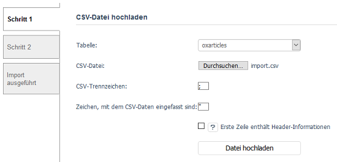
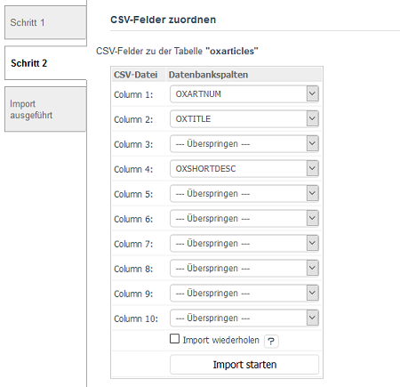

Import
======

Während ausschließlich Artikeldaten exportiert werden können, bietet der Import flexiblere Möglichkeiten. Neben den Artikeldaten können auch Kunden- und Bestelldaten sowie Zuordnungen von Artikeln beispielsweise zu Kategorien, Aktionen oder als Zubehör importiert werden. Der Import basiert auf CSV-Dateien, die zum Shop hochgeladen werden. Anschließend erfolgt die Zuordnung der Datenfelder der CSV-Datei zu den korrespondierenden Spalten der jeweiligen Datenbanktabelle und der eigentliche Import.

Im ersten Schritt wird die Datenbanktabelle festgelegt, in welche importiert werden soll. Die CSV-Datei wird mit Hilfe eines Dateidialogs auf dem Rechner ausgewählt und zur Verarbeitung in den Shop geladen.

Tabelle
   Aus einer Dropdown-Liste kann die Datenbanktabelle für den Import ausgewählt werden. In folgende Datenbanktabellen kann importiert werden: :db:`oxaccessoire2article`, :db:`oxactions2article`, :db:`oxartextends`, :db:`oxarticles`, :db:`oxcategories`, :db:`oxcountry`, :db:`oxobject2article`, :db:`oxobject2category`, :db:`oxorder`, :db:`oxorderarticles`, :db:`oxprice2article`, :db:`oxuser` und :db:`oxvendor`.

CSV-Datei
   Die Schaltfläche :guilabel:`Durchsuchen...` öffnet einen Dateidialog, in dem Sie die Importdatei auf dem Rechner auswählen können.

CSV-Trennzeichen
   Zeichen, welches die einzelnen Datenfelder der Importdatei voneinander trennt. Es kann den Standardwert Semikolon (;) ersetzen, der im Abschnitt :guilabel:`Weitere Einstellungen` unter :menuselection:`Stammdaten --> Grundeinstellungen`, Registerkarte :guilabel:`Einstell.` definiert wurde.

Zeichen, mit dem CSV-Daten eingefasst sind
   Zeichen, welches am Anfang und am Ende eines Datenfeldes steht und es somit begrenzt. Auch hier kann das Anführungszeichen (") als Standardwert überschrieben werden.

Erste Zeile enthält Header-Informationen
   Die erste Zeile einer CSV-Datei kann Informationen über die zu importierenden Datenfelder enthalten. Sie bildet Struktur und Inhalt der Datensätze ab. Beispiel für eine erste Zeile vor den eigentlichen Benutzerdaten: :db:`OXACTIVE`; :db:`OXRIGHTS`; :db:`OXSHOPID`; :db:`OXUSERNAME`; :db:`OXCUSTNR`; :db:`OXFNAME`; :db:`OXLNAME`. Eine Zeile mit Header-Informationen erleichtert die spätere Zuordnung der Datenfelder zu den Tabellenspalten der Datenbank.

Datei hochladen
   Mit einem Klick auf diese Schaltfläche wird die CSV-Datei in den Shop geladen und zur Verarbeitung zwischengespeichert. Nach dem erfolgreichen Import wird die CSV-Datei gelöscht.

-----------------------------------------------------------------------------------------

Im zweiten Schritt des Imports werden die Datenfelder der CSV-Datei den Tabellenspalten der ausgewählten Datenbank zugeordnet.

CSV-Felder zu der Tabelle "..."
   Die links angezeigten Datenfelder sind die aus der CSV-Datei. Ohne eine erste Zeile mit Header-Informationen wird hier nur :guilabel:`Column 1`, :guilabel:`Column 2`, :guilabel:`Column 3` usw. angezeigt, ansonsten die Bezeichnungen der Datenfelder aus der ersten Zeile. Pro Datenfeld gibt es eine kleine Dropdown-Liste, aus der die gewünschte Tabellenspalte der Datenbank ausgewählt werden kann. Der Import muss nicht alle Tabellenspalten befüllen. Datenfelder können übersprungen werden. Es erfolgt keine Zuordnung zu einer Tabellenspalte. Tabellenspalten können leer bleiben oder sie werden von der Datenbank mit dort hinterlegten Standartwerten beschrieben. Darüber hinaus können sie wie im Fall der Tabellenspalte :db:`OXID` vom Shop automatisch generiert und eingetragen werden, wenn dafür kein Wert importiert wird.

Import wiederholen
   Wird dieses Kontrollkästchen aktiviert, wird nach erfolgreichem Import sofort wieder Schritt 1 angezeigt, damit ein weiterer Import durchgeführt werden kann. Ist diese Einstellung nicht aktiv, wird der Import mit einer Statusmeldung in Schritt 3 beendet.

Import starten
   Drücken Sie auf :guilabel:`Import starten`, um die Daten aus der Importdatei in den Shop zu übernehmen.

-----------------------------------------------------------------------------------------

Datenbanktabellen und Tabellenspalten
-------------------------------------

Um Struktur und Inhalt der Datensätze der CSV-Datei effektiv aufbauen zu können, lohnt sich ein Blick auf die Datenbanktabellen, in welche importiert werden kann. Die Titel der Tabellenspalten eignen sich auch gut, um eine erste Zeile mit Header-Informationen für die CSV-Datei zu erstellen.

.. list-table::
   :header-rows: 1
   :widths: 20, 80

   * - Datenbanktabelle
     - Tabellenspalten
   * - :db:`oxaccessoire2article`
     - :db:`OXID`; :db:`OXOBJECTID`; :db:`OXARTICLENID`; :db:`OXSORT`; :db:`OXTIMESTAMP`
   * - :db:`oxactions2article`
     - :db:`OXID`; :db:`OXSHOPID`; :db:`OXACTIONID`; :db:`OXARTID`; :db:`OXSORT`; :db:`OXTIMESTAMP`
   * - :db:`oxartextends`
     - :db:`OXID`; :db:`OXLONGDESC`; :db:`OXLONGDESC_1`; :db:`OXLONGDESC_2`; :db:`OXLONGDESC_3`; :db:`OXTIMESTAMP`
   * - :db:`oxarticles`
     - :db:`OXID`; :db:`OXSHOPID`; :db:`OXPARENTID`; :db:`OXACTIVE`; :db:`OXHIDDEN`; :db:`OXACTIVEFROM`; :db:`OXACTIVETO`; :db:`OXARTNUM`; :db:`OXEAN`; :db:`OXDISTEAN`; :db:`OXMPN`; :db:`OXTITLE`; :db:`OXSHORTDESC`; :db:`OXPRICE`; :db:`OXBLFIXEDPRICE`; :db:`OXPRICEA`; :db:`OXPRICEB`; :db:`OXPRICEC`; :db:`OXBPRICE`; :db:`OXTPRICE`; :db:`OXUNITNAME`; :db:`OXUNITQUANTITY`; :db:`OXEXTURL`; :db:`OXURLDESC`; :db:`OXURLIMG`; :db:`OXVAT`; :db:`OXTHUMB`; :db:`OXICON`; :db:`OXPIC1`; :db:`OXPIC2`; :db:`OXPIC3`; :db:`OXPIC4`; :db:`OXPIC5`; :db:`OXPIC6`; :db:`OXPIC7`; :db:`OXPIC8`; :db:`OXPIC9`; :db:`OXPIC10`; :db:`OXPIC11`; :db:`OXPIC12`; :db:`OXWEIGHT`; :db:`OXSTOCK`; :db:`OXSTOCKFLAG`; :db:`OXSTOCKTEXT`; :db:`OXNOSTOCKTEXT`; :db:`OXDELIVERY`; :db:`OXINSERT`; :db:`OXTIMESTAMP`; :db:`OXLENGTH`; :db:`OXWIDTH`; :db:`OXHEIGHT`; :db:`OXFILE`; :db:`OXSEARCHKEYS`; :db:`OXTEMPLATE`; :db:`OXQUESTIONEMAIL`; :db:`OXISSEARCH`; :db:`OXISCONFIGURABLE`; :db:`OXVARNAME`; :db:`OXVARSTOCK`; :db:`OXVARCOUNT`; :db:`OXVARSELECT`; :db:`OXVARMINPRICE`; :db:`OXVARM`; :db:`AXPRICE`; :db:`OXVARNAME_1`; :db:`OXVARSELECT_1`; :db:`OXVARNAME_2`; :db:`OXVARSELECT_2`; :db:`OXVARNAME_3`; :db:`OXVARSELECT_3`; :db:`OXTITLE_1`; :db:`OXSHORTDESC_1`; :db:`OXURLDESC_1`; :db:`OXSEARCHKEYS_1`; :db:`OXTITLE_2`; :db:`OXSHORTDESC_2`; :db:`OXURLDESC_2`; :db:`OXSEARCHKEYS_2`; :db:`OXTITLE_3`; :db:`OXSHORTDESC_3`; :db:`OXURLDESC_3`; :db:`OXSEARCHKEYS_3`; :db:`OXBUNDLEID`; :db:`OXFOLDER`; :db:`OXSUBCLASS`; :db:`OXSTOCKTEXT_1`; :db:`OXSTOCKTEXT_2`; :db:`OXSTOCKTEXT_3`; :db:`OXNOSTOCKTEXT_1`; :db:`OXNOSTOCKTEXT_2`; :db:`OXNOSTOCKTEXT_3`; :db:`OXSORT`; :db:`OXSOLDAMOUNT`; :db:`OXNONMATERIAL`; :db:`OXFREESHIPPING`; :db:`OXREMINDACTIVE`; :db:`OXREMINDAMOUNT`; :db:`OXAMITEMID`; :db:`OXAMTASKID`; :db:`OXVENDORID`; :db:`OXMANUFACTURERID`; :db:`OXSKIPDISCOUNTS`; :db:`OXRATING`; :db:`OXRATINGCNT`; :db:`OXMINDELTIME`; :db:`OXMAXDELTIME`; :db:`OXDELTIMEUNIT`; :db:`OXUPDATEPRICE`; :db:`OXUPDATEPRICEA`; :db:`OXUPDATEPRICEB`; :db:`OXUPDATEPRICEC`; :db:`OXUPDATEPRICETIME`; :db:`OXISDOWNLOADABLE`; :db:`OXSHOWCUSTOMAGREEMENT`
   * - :db:`oxcategories`
     - :db:`OXID`; :db:`OXPARENTID`; :db:`OXLEFT`; :db:`OXRIGHT`; :db:`OXROOTID`; :db:`OXSORT`; :db:`OXACTIVE`; :db:`OXHIDDEN`; :db:`OXSHOPID`; :db:`OXTITLE`; :db:`OXDESC`; :db:`OXLONGDESC`; :db:`OXTHUMB`; :db:`OXTHUMB_1`; :db:`OXTHUMB_2`; :db:`OXTHUMB_3`; :db:`OXEXTLINK`; :db:`OXTEMPLATE`; :db:`OXDEFSORT`; :db:`OXDEFSORTMODE`; :db:`OXPRICEFROM`; :db:`OXPRICETO`; :db:`OXACTIVE_1`; :db:`OXTITLE_1`; :db:`OXDESC_1`; :db:`OXLONGDESC_1`; :db:`OXACTIVE_2`; :db:`OXTITLE_2`; :db:`OXDESC_2`; :db:`OXLONGDESC_2`; :db:`OXACTIVE_3`; :db:`OXTITLE_3`; :db:`OXDESC_3`; :db:`OXLONGDESC_3`; :db:`OXICON`; :db:`OXPROMOICON`; :db:`OXVAT`; :db:`OXSKIPDISCOUNTS`; :db:`OXSHOWSUFFIX`; :db:`OXTIMESTAMP`
   * - :db:`oxcountry`
     - :db:`OXID`; :db:`OXACTIVE`; :db:`OXTITLE`; :db:`OXISOALPHA2`; :db:`OXISOALPHA3`; :db:`OXUNNUM3`; :db:`OXVATINPREFIX`; :db:`OXORDER`; :db:`OXSHORTDESC`; :db:`OXLONGDESC`; :db:`OXTITLE_1`; :db:`OXTITLE_2`; :db:`OXTITLE_3`; :db:`OXSHORTDESC_1`; :db:`OXSHORTDESC_2`; :db:`OXSHORTDESC_3`; :db:`OXLONGDESC_1`; :db:`OXLONGDESC_2`; :db:`OXLONGDESC_3`; :db:`OXVATSTATUS`; :db:`OXTIMESTAMP`
   * - :db:`oxobject2article`
     - :db:`OXID`; :db:`OXOBJECTID`; :db:`OXARTICLENID`; :db:`OXSORT`; :db:`OXTIMESTAMP`
   * - :db:`oxobject2category`
     - :db:`OXID`; :db:`OXOBJECTID`; :db:`OXCATNID`; :db:`OXPOS`; :db:`OXTIME`; :db:`OXTIMESTAMP`
   * - :db:`oxorder`
     - :db:`OXID`; :db:`OXSHOPID`; :db:`OXUSERID`; :db:`OXORDERDATE`; :db:`OXORDERNR`; :db:`OXBILLCOMPANY`; :db:`OXBILLEMAIL`; :db:`OXBILLFNAME`; :db:`OXBILLLNAME`; :db:`OXBILLSTREET`; :db:`OXBILLSTREETNR`; :db:`OXBILLADDINFO`; :db:`OXBILLUSTID`; :db:`OXBILLCITY`; :db:`OXBILLCOUNTRYID`; :db:`OXBILLSTATEID`; :db:`OXBILLZIP`; :db:`OXBILLFON`; :db:`OXBILLFAX`; :db:`OXBILLSAL`; :db:`OXDELCOMPANY`; :db:`OXDELFNAME`; :db:`OXDELLNAME`; :db:`OXDELSTREET`; :db:`OXDELSTREETNR`; :db:`OXDELADDINFO`; :db:`OXDELCITY`; :db:`OXDELCOUNTRYID`; :db:`OXDELSTATEID`; :db:`OXDELZIP`; :db:`OXDELFON`; :db:`OXDELFAX`; :db:`OXDELSAL`; :db:`OXPAYMENTID`; :db:`OXPAYMENTTYPE`; :db:`OXTOTALNETSUM`; :db:`OXTOTALBRUTSUM`; :db:`OXTOTALORDERSUM`; :db:`OXARTVAT1`; :db:`OXARTVATPRICE1`; :db:`OXARTVAT2`; :db:`OXARTVATPRICE2`; :db:`OXDELCOST`; :db:`OXDELVAT`; :db:`OXPAYCOST`; :db:`OXPAYVAT`; :db:`OXWRAPCOST`; :db:`OXWRAPVAT`; :db:`OXGIFTCARDCOST`; :db:`OXGIFTCARDVAT`; :db:`OXCARDID`; :db:`OXCARDTEXT`; :db:`OXDISCOUNT`; :db:`OXEXPORT`; :db:`OXBILLNR`; :db:`OXBILLDATE`; :db:`OXTRACKCODE`; :db:`OXSENDDATE`; :db:`OXREMARK`; :db:`OXVOUCHERDISCOUNT`; :db:`OXCURRENCY`; :db:`OXCURRATE`; :db:`OXFOLDER`; :db:`OXTRANSID`; :db:`OXPAYID`; :db:`OXXID`; :db:`OXPAID`; :db:`OXSTORNO`; :db:`OXIP`; :db:`OXTRANSSTATUS`; :db:`OXLANG`; :db:`OXINVOICENR`; :db:`OXDELTYPE`; :db:`OXTIMESTAMP`; :db:`OXISNETTOMODE`
   * - :db:`oxorderarticles`
     - :db:`OXID`; :db:`OXORDERID`; :db:`OXAMOUNT`; :db:`OXARTID`; :db:`OXARTNUM`; :db:`OXTITLE`; :db:`OXSHORTDESC`; :db:`OXSELVARIANT`; :db:`OXNETPRICE`; :db:`OXBRUTPRICE`; :db:`OXVATPRICE`; :db:`OXVAT`; :db:`OXPERSPARAM`; :db:`OXPRICE`; :db:`OXBPRICE`; :db:`OXNPRICE`; :db:`OXWRAPID`; :db:`OXEXTURL`; :db:`OXURLDESC`; :db:`OXURLIMG`; :db:`OXTHUMB`; :db:`OXPIC1`; :db:`OXPIC2`; :db:`OXPIC3`; :db:`OXPIC4`; :db:`OXPIC5`; :db:`OXWEIGHT`; :db:`OXSTOCK`; :db:`OXDELIVERY`; :db:`OXINSERT`; :db:`OXTIMESTAMP`; :db:`OXLENGTH`; :db:`OXWIDTH`; :db:`OXHEIGHT`; :db:`OXFILE`; :db:`OXSEARCHKEYS`; :db:`OXTEMPLATE`; :db:`OXQUESTIONEMAIL`; :db:`OXISSEARCH`; :db:`OXFOLDER`; :db:`OXSUBCLASS`; :db:`OXSTORNO`; :db:`OXORDERSHOPID`; :db:`OXISBUNDLE`
   * - :db:`oxprice2article`
     - :db:`OXID`; :db:`OXSHOPID`; :db:`OXARTID`; :db:`OXADDABS`; :db:`OXADDPERC`; :db:`OXAMOUNT`; :db:`OXAMOUNTTO`; :db:`OXTIMESTAMP`
   * - :db:`oxuser`
     - :db:`OXID`; :db:`OXACTIVE`; :db:`OXRIGHTS`; :db:`OXSHOPID`; :db:`OXUSERNAME`; :db:`OXPASSWORD`; :db:`OXPASSSALT`; :db:`OXCUSTNR`; :db:`OXUSTID`; :db:`OXCOMPANY`; :db:`OXFNAME`; :db:`OXLNAME`; :db:`OXSTREET`; :db:`OXSTREETNR`; :db:`OXADDINFO`; :db:`OXCITY`; :db:`OXCOUNTRYID`; :db:`OXSTATEID`; :db:`OXZIP`; :db:`OXFON`; :db:`OXFAX`; :db:`OXSAL`; :db:`OXBONI`; :db:`OXCREATE`; :db:`OXREGISTER`; :db:`OXPRIVFON`; :db:`OXMOBFON`; :db:`OXBIRTHDATE`; :db:`OXURL`; :db:`OXUPDATEKEY`; :db:`OXUPDATEEXP`; :db:`OXPOINTS`; :db:`OXTIMESTAMP`
   * - :db:`oxvendor`
     - :db:`OXID`; :db:`OXSHOPID`; :db:`OXACTIVE`; :db:`OXICON`; :db:`OXTITLE`; :db:`OXSHORTDESC`; :db:`OXTITLE_1`; :db:`OXSHORTDESC_1`; :db:`OXTITLE_2`; :db:`OXSHORTDESC_2`; :db:`OXTITLE_3`; :db:`OXSHORTDESC_3`; :db:`OXSHOWSUFFIX`; :db:`OXTIMESTAMP`

.. Intern: oxbaiw, Status:
