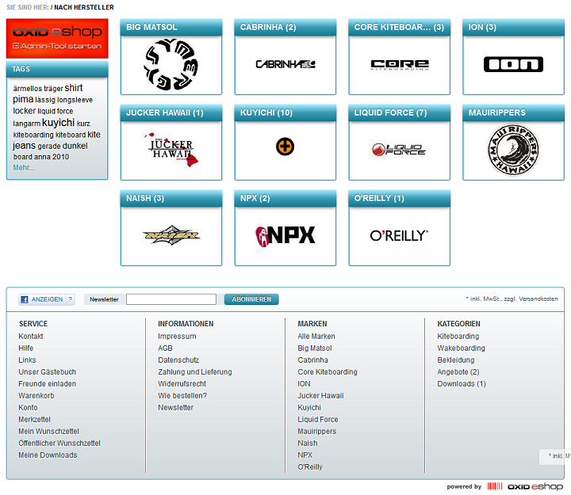
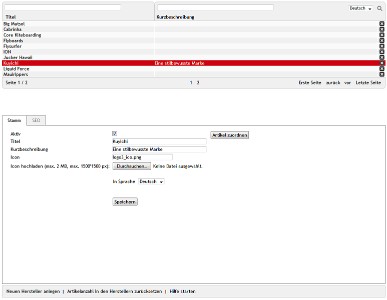

Hersteller
**********
Im OXID eShop lassen sich Hersteller verwalten, denen Artikel zugeordnet werden können. Auf diese Weise lassen sich Artikel unabhängig von den Kategorien im Shop unter dem Aspekt der Markenzugehörigkeit zusammenfassen. Im Administrationsbereich können Artikel nach der Hersteller-ID gefiltert und angezeigt werden. Im Frontend werden alle Marken im Fußbereich aufgelistet.

Darüber kann eine Übersicht aller Marken oder eine Übersicht aller Artikel einer Marke aufgerufen werden. Damit die Hersteller als Marken im Frontend angezeigt werden, muss die Funktion Herstellerliste laden und anzeigen in den Performance-Einstellungen aktiviert sein. Setzen Sie ein Häkchen in das Kontrollkästchen unter :menuselection:`Stammdaten --> Grundeinstellungen` --> Registerkarte :guilabel:`Perform.`

Um Hersteller zu erstellen oder zu bearbeiten, gehen Sie im Administrationsbereich des Shops zu :menuselection:`Stammdaten --> Hersteller`.

Es werden eine Liste der Hersteller und darunter der Eingabebereich für den Hersteller angezeigt. Die Herstellerliste enthält Titel und Kurzbeschreibung der Hersteller. Nach Herstellern kann gesucht werden, indem die Suchfelder verwendet werden. Geben Sie beispielsweise in das Suchfeld über :guilabel:`Titel` die Zeichenfolge \"er\" ein, so bekommen Sie drei Hersteller aus den Demodaten aufgelistet, bei denen \"er\" im Titel vorkommt.

Hersteller lassen sich löschen. Verwenden Sie dafür das Löschsymbol am Ende der Zeile in der Herstellerliste.

Wird ein Hersteller aus der Liste gewählt, werden dessen Informationen in den Eingabebereich geladen. In der Fußzeile finden Sie die Funktionen: :guilabel:`Neuen Hersteller anlegen`, :guilabel:`Artikelanzahl in den Herstellern zurücksetzen` und :guilabel:`Hilfe starten`.

.. hint:: Um in der Artikelliste nach Herstellern suchen zu können, benötigen Sie die Hersteller-ID. Diese wird Ihnen am unteren Bildschirmrand angezeigt, sobald Sie einen Hersteller aus der Herstellerliste auswählen. Mit der rechten Maustaste kann dieser Link kopiert und die jeweilige Hersteller-ID entnommen werden. Beispiel für einen Link: javascript:top.oxid.admin.editThis('9434afb379a46d6c141de9c9e5b94fcf'); Die Hersteller-ID für Kuyichi aus den Demodaten lautet 9434afb379a46d6c141de9c9e5b94fcf.

-----------------------------------------------------------------------------------------

.. |link| image:: ../../media/icons-de/link.png
.. |br| raw:: html 

    

Registerkarte Stamm
+++++++++++++++++++
**Inhalte**: aktiver Hersteller, Marke, Titel, Kurzbeschreibung, Icon, Herstellerlogo, Hochladen, Upload auf Webserver, automatisch generiert, Artikel zuordnen |br|
:doc:`Artikel lesen <registerkarte-stamm>` |link|

Registerkarte Mall
++++++++++++++++++
Nur in der Enterprise Edition vorhanden |br|
**Inhalte**: Hersteller vererben, Hersteller verknüpfen, Elternshop, Subshop, Supershop, Multishop, Mall, Enterprise Edition |br|
:doc:`Artikel lesen <registerkarte-mall>` |link|

Registerkarte SEO
+++++++++++++++++
**Inhalte**: Suchmaschinenoptimierung, SEO, SEO URL, Titel Suffix, URL fixieren, Meta-Tags, Stichwörter, meta name=\"keywords\", Beschreibung, meta name=\"description\"\ |br|
:doc:`Artikel lesen <registerkarte-seo>` |link|

.. seealso:: :doc:`Artikel <../artikel/artikel>` | :doc:`Lieferanten <../lieferanten/lieferanten>`