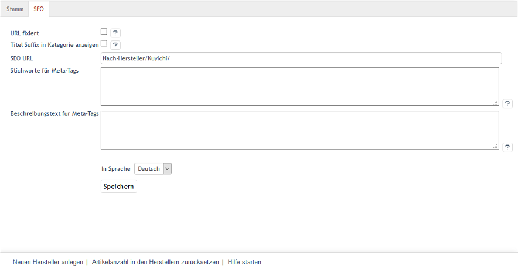

Registerkarte SEO
=================

Die Registerkarte :guilabel:`SEO` des Herstellers beinhaltet Informationen und Einstellungen, die für Suchmaschinen relevant sind.

Mit der Sprachumstellung am unteren Ende des Eingabebereichs lassen sich die Informationen und Einstellungen auch in einer weiteren aktiven Sprache bearbeiten.

:guilabel:`URL fixiert` |br|
Ändert sich der Titel eines Herstellers, wird die SEO URL neu berechnet. Sie können das für die URL des Herstellers deaktivieren, indem dieses Kontrollkästchen angehakt wurde. Eine bestehende SEO URL bleibt dadurch unverändert.

:guilabel:`Titel Suffix in Kategorie anzeigen` |br|
Aktivieren Sie diese Einstellung, um das Titel-Suffix im Seitentitel anzuzeigen. Wird die Übersicht aller Artikel dieser Marke aufgerufen, enthält der Seitentitel auch den Titel-Suffix, der unter :menuselection:`Stammdaten --> Grundeinstellungen --> SEO --> Titel Suffix` definiert wurde. Beispiel Demoshop:\<title\>OXID Surf- und Kiteshop | www.true-fashion.com | online kaufen\</title\>. Mehr Informationen dazu finden Sie unter\ `SEO-Einstellungen <../../konfiguration/seo-einstellungen.rst>`_ .

:guilabel:`SEO URL` |br|
Die angezeigte URL des Herstellers wird angezeigt. Sie kann geändert und auch fixiert werden.

:guilabel:`Stichworte für Meta-Tags` |br|
Die Stichwörter, die von Suchmaschinen ausgewertet werden, sind in den HTML-Quelltext (Meta Keywords) eingebunden. Wenn Sie nichts eingeben, werden die Stichwörter automatisch, beispielsweise aus dem Titel des Herstellers, der Kategorie (Nach-Hersteller) und den Suchbegriffen der zugeordneten Artikel erzeugt.

:guilabel:`Beschreibungstext für Meta-Tags` |br|
Dieser Beschreibungstext wird in den HTML-Quelltext (Meta Description) eingebunden. Dieser Text wird von vielen Suchmaschinen bei den Suchergebnissen angezeigt. Wenn Sie nichts eingeben, wird die Beschreibung automatisch aus dem Titel des Herstellers, der Kategorie (Nach-Hersteller) und den Titeln der zugeordneten Artikel gebildet.

:guilabel:`In Sprache` |br|
Wählen Sie eine Sprache aus der Liste aus, für die Sie die SEO-Informationen und -Einstellungen bearbeiten möchten.

.. Intern: oxbagd, Status:, F1: manufacturer_seo.html