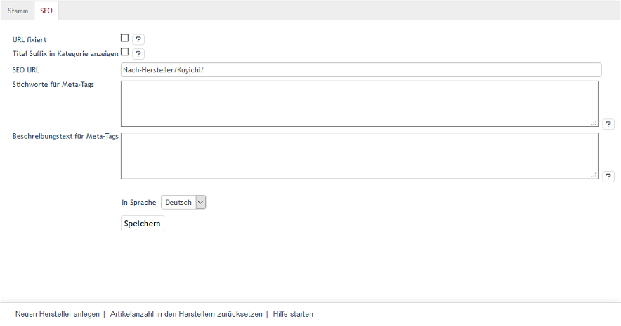

Registerkarte SEO
=================

.. todo: SB: vorerst noch gültig

Optimieren Sie auf der Registerkarte :guilabel:`SEO` (:ref:`oxbagd01`) die SEO-Einstellungen der Herstellerseite, um deren Sichtbarkeit in Suchmaschinen zu verbessern.

* Vergeben Sie eine sprechende SEO-URL, damit die Herstellerseite leichter gefunden wird.
* Hinterlegen Sie einen aussagekräftigen Meta-Titel und eine Meta-Beschreibung, um die Klickrate in den Suchergebnissen zu steigern.
* Definieren Sie relevante Stichwörter (Meta-Keywords), damit die Seite für passende Suchanfragen erscheint.
* Fixieren Sie die SEO-URL, um unerwünschte Änderungen zu vermeiden und Duplicate Content zu reduzieren.
* Nutzen Sie die Sprachoptionen, um die SEO-Informationen für jede aktive Sprache individuell anzupassen.

.. _oxbagd01:

   Abb.: Hersteller - Registerkarte SEO

Durch die Sprachumstellung am unteren Ende des Eingabebereichs können Sie die Informationen und Einstellungen in jeder weiteren aktiven Sprache bearbeiten.

:guilabel:`URL fixiert`
   Ändert sich der Titel eines Herstellers, wird die SEO-URL neu berechnet. Sie können die automatische Neuberechnung der URL deaktivieren, indem Sie dieses Kontrollkästchen aktivieren. Eine bestehende SEO-URL bleibt dadurch unverändert.

:guilabel:`Titel-Suffix in Kategorie anzeigen`
   Aktivieren Sie diese Einstellung, um das Titel-Suffix im Seitentitel anzuzeigen. Wird die Übersicht aller Artikel dieser Marke aufgerufen, enthält der Seitentitel auch den Titel-Suffix, der unter :menuselection:`Stammdaten --> Grundeinstellungen --> SEO --> Titel-Suffix` definiert wurde. Beispiel Demoshop:\<title\>OXID Surf- und Kiteshop | www.true-fashion.com | online kaufen\</title\>.

   Weitere Informationen finden Sie unter :doc:`SEO-Einstellungen <../../konfiguration/seo-einstellungen>`.

:guilabel:`SEO-URL`
   Die SEO-URL des Herstellers wird angezeigt und kann geändert oder fixiert werden.

:guilabel:`Stichworte für Meta-Tags`
   Die Stichwörter, die von Suchmaschinen ausgewertet werden, sind in den HTML-Quelltext (Meta-Keywords) eingebunden.

   Wenn Sie nichts eingeben, werden die Stichwörter automatisch beispielsweise aus dem Titel des Herstellers, der Kategorie (Nach-Hersteller) und den Suchbegriffen der zugeordneten Artikel erzeugt.

:guilabel:`Beschreibungstext für Meta-Tags`
   Dieser Beschreibungstext wird in den HTML-Quelltext (Meta Description) eingebunden und von vielen Suchmaschinen in den Suchergebnissen angezeigt.

   Wenn Sie nichts eingeben, wird die Beschreibung automatisch aus dem Titel des Herstellers, der Kategorie (Nach-Hersteller) und den Titeln der zugeordneten Artikel gebildet.

:guilabel:`In Sprache`
   Wählen Sie eine Sprache aus der Liste aus, für die Sie die SEO-Informationen und -Einstellungen bearbeiten möchten.

.. Intern: oxbagd, Status:, F1: manufacturer_seo.html