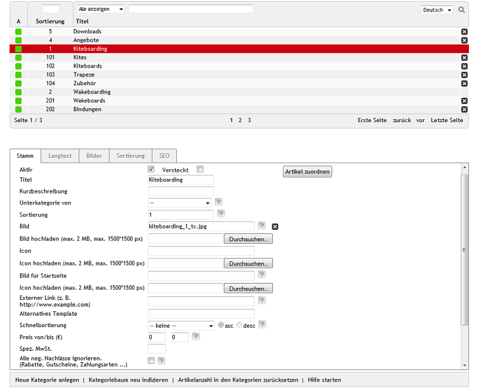

Kategorien
**********
Kategorien dienen dazu, Kunden des Onlineshops intuitiv zum gewünschten Artikel zu führen. Kategorien fassen Artikel zu Produktgruppen zusammen, präsentieren Artikel einer bestimmten Rubrik oder offerieren Sonderangebote. Kategorien stellen durch ihre Struktur auch das Navigationsmenü im Shop dar.

Der Abschnitt \"Kategorien\" informiert Sie über das Erstellen und Verwalten von Kategorien. Um Kategorien zu bearbeiten, gehen Sie im Administrationsbereich des Shops zu :menuselection:`Artikel verwalten --> Kategorien`. Es werden die Kategorieliste und darunter der Eingabebereich für die Kategorie angezeigt.

In der Kategorieliste symbolisiert ein kleines grünes Quadrat am Anfang der Zeile eine aktive Kategorie. Wurde eine Kategorie nicht aktiviert, fehlt dieses Symbol. Desweiteren wird die Sortierung und der Kategorietitel angezeigt. Nach Kategorien kann gesucht werden, indem Suchfelder für Sortierung und Kategorietitel sowie ein Filter für die Kategorien verwendet werden. Kategorien lassen sich durch einen Klick auf das Löschsymbol am Ende der Zeile aus der Datenbank entfernen. Kategorien mit Unterkategorien können nicht gelöscht werden.

Wird eine Kategorie aus der Kategorieliste gewählt, werden deren Informationen in den Eingabebereich geladen. Wollen Sie eine neue Kategorie erstellen, klicken Sie am unteren Bildschirmrand auf :guilabel:`Neue Kategorie anlegen`.

In der Fußzeile finden Sie\die Funktionen: :guilabel:`Neue Kategorie anlegen`, :guilabel:`Kategoriebaum neu indizieren`, :guilabel:`Artikelanzahl in den Kategorien zurücksetzen` und :guilabel:`Hilfe starten`.

-----------------------------------------------------------------------------------------

.. |link| image:: ../../media/icons-de/link.png
.. |br| raw:: html 

    

Registerkarte Stamm
+++++++++++++++++++
**Inhalte**: aktive Kategorie, Titel, Kurzbeschreibung, Haupt- und Unterkategorien, Kategoriestruktur, Kategoriebilder, externer Link, alternatives Template, Schnellsortierung der Artikel, spezielle Mehrwertsteuer, negative Nachlässe |br|
`Artikel lesen <registerkarte-stamm.html>`_ |link|

Registerkarte Langtext
++++++++++++++++++++++
**Inhalte**: Beschreibung der Kategorie, Editor, WYSIWYG, HTML-Tags, SelfHTML, OXID eXchange |br|
`Artikel lesen <registerkarte-langtext.html>`_ |link|

Registerkarte Bilder
++++++++++++++++++++
**Inhalte**: Kategoriebilder, Bild, Thumbnail, Icon, Vorschau |br|
`Artikel lesen <registerkarte-bilder.html>`_ |link|

Registerkarte Sortierung
++++++++++++++++++++++++
**Inhalte**: Artikel sortieren, manuelle Sortierung, Reihenfolge der Artikel in Kategorie, neue Sortierung |br|
`Artikel lesen <registerkarte-sortierung.html>`_ |link|

Registerkarte Mall
++++++++++++++++++
Nur in der Enterprise Edition vorhanden |br|
**Inhalte**: Kategorien verknüpfen, Elternshop, Subshop, Supershop, Multishop, Kategorien aller Shops, Mall |br|
`Artikel lesen <registerkarte-mall.html>`_ |link|

Registerkarte Rechte
++++++++++++++++++++
Nur in der Enterprise Edition vorhanden |br|
**Inhalte**: Kategorie sichtbar, Artikel der Kategorie kaufbar, Benutzergruppen zuordnen, ausschließliches Recht, Rechte und Rollen, Berechtigung für Shop (Frontend) |br|
`Artikel lesen <registerkarte-rechte.html>`_ |link|

Registerkarte SEO
+++++++++++++++++
**Inhalte**: Suchmaschinenoptimierung, SEO, URL fixieren, SEO URL, Seitentitel, Titel Suffix, Metadaten, Meta-Tags, meta name=\"description\", meta name=\"keywords\" |br| 
`Artikel lesen <registerkarte-seo.html>`_ |link|

.. seealso:: `Artikel <../artikel/artikel.html>`_ | `Artikel und Kategorien <../artikel-und-kategorien/artikel-und-kategorien.html>`_