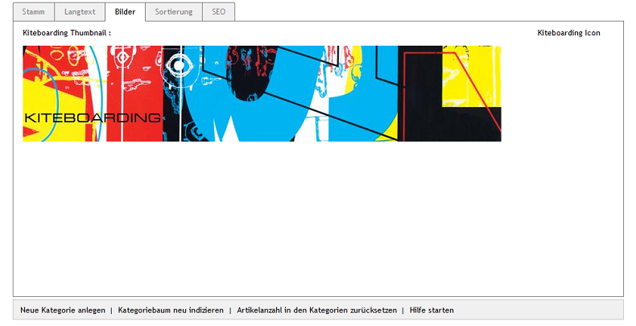

Registerkarte Bilder
====================
Wurden für die Kategorie ein Bild und/oder ein Icon hochgeladen, werden die Bilder auf dieser Registerkarte in der Vorschau angezeigt.

Als :guilabel:`Thumbnail` ist dabei das Bild zu sehen, welches in der Kategorieansicht als Banner angezeigt wird, sobald die Kategorie im Shop aufgerufen wird. Das :guilabel:`Icon` stellt eine Unterkategorie in der Kategorieansicht dar.

.. image:: ../../media/screenshots-de/oxbabm02.png
   :alt: Kategorieansicht
   :height: 189
   :width: 450

Im Screenshot wird die Kategorie \"Kiteboarding\" mit einem Bild/Thumbnail dargestellt, für die Unterkategorien \"Kites\", \"Kiteboards\", \"Trapeze\" und \"Zubehör\" wird deren Icon angezeigt.

.. Intern: oxbabm, Status:, F1: category_pictures.html