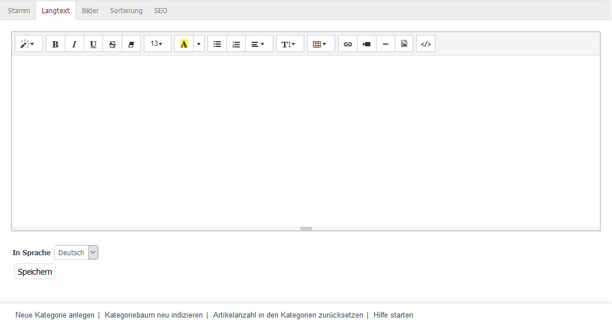

Registerkarte Langtext
======================
Die Kategorie wird hier im Detail beschrieben.

In der Enterprise und der Professional Edition kann der Langtext komfortabel in einen Editor eingegeben werden. Der Editor arbeitet nach dem Prinzip WYSIWYG (What You See Is What You Get), er zeigt also den Text so an, wie er später in der Kategorieansicht zu sehen sein wird. Der Editor bietet die Möglichkeit der Textformatierung, des Einfügens von Bildern und von Links.

In der Community Edition kann standardmäßig nur Text in ein großes Eingabefeld eingetragen werden. Soll mehr als nur einfacher Text in der Kategorieansicht angezeigt werden, helfen HTML-Tags bei der Formatierung. Mit ``\<h1\>...\</h1\>`` wird beispielsweise Text als erste Überschrift formatiert. Einen guten Überblick zur Auszeichnungen von Text mit HTML-Tags erhalten Sie bei `SelfHTML <http://de.selfhtml.org/>`_ .

Eine weitere Alternative wäre, den OXID eShop durch ein Modul zu erweitern, welches die praktischen Editierfunktionen bereitstellt. Im `OXID eXchange <http://exchange.oxid-esales.com/startseite>`_ , der zentralen Plattform für Erweiterungen des OXID eShop, finden Sie nicht nur einen passenden Editor. Hier gibt es Erweiterungen zu allen Bereichen des Onlineshops, von Bezahlung und Logistik, Artikeldarstellung und -suche, bis zu Themes und Templates.

Der Langtext wird im Shop in der Kategorieansicht angezeigt.

.. Intern: oxbabl, Status:, F1: category_text.html
.. Sreenshot #summernote