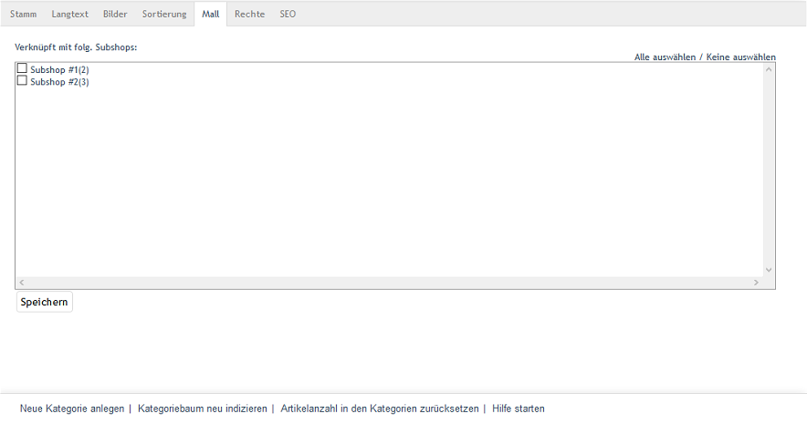

Registerkarte Mall
******************
Die Registerkarte :guilabel:`Mall` bei Kategorien gibt es nur in der Enterprise Edition.

Beim Erstellen neuer Shops werden die Kategorien eines Elternshops nicht vererbt. Es ist allerdings möglich, diese später auf den Registerkarten :guilabel:`Mall` der Kategorien des Elternshops mit Subshops und Supershops zu verknüpfen. Enthält eine Kategorie Unterkategorien, werden dabei alle zugehörigen Kategorien vererbt. Diese enthalten nur Artikel, wenn auch diese vererbt wurden. Ansonsten sind es leere Kategorien mit den jeweiligen Unterkategorien.

Für Multishops gibt es die Möglichkeit, dass sie alle Kategorien von allen Shops erben können. Diese Funktion befindet sich auf der Registerkarte :guilabel:`Mall` unter :menuselection:`Stammdaten --> Grundeinstellungen` des Multishops.

:guilabel:`Verknüpft mit folg. Subshops`

Eine Verknüpfung der Kategorie mit Subshops und Supershops kann hinzugefügt oder entfernt werden, indem das entsprechende Kontrollkästchen angehakt wird oder nicht. Bei nicht aktiviertem Kontrollkästchen ist die Kategorie im Elternshop vorhanden, nicht aber im jeweiligen Subshop oder Supershop.

Über die Links :guilabel:`Alle auswählen` und :guilabel:`Keine auswählen` auf der rechten Seite des Fensters können alle Shops verknüpft oder alle Verknüpfungen zu den Shops entfernt werden. Vorgenommene Änderungen müssen gespeichert werden und sind für die Subshops oder Supershops sofort wirksam.