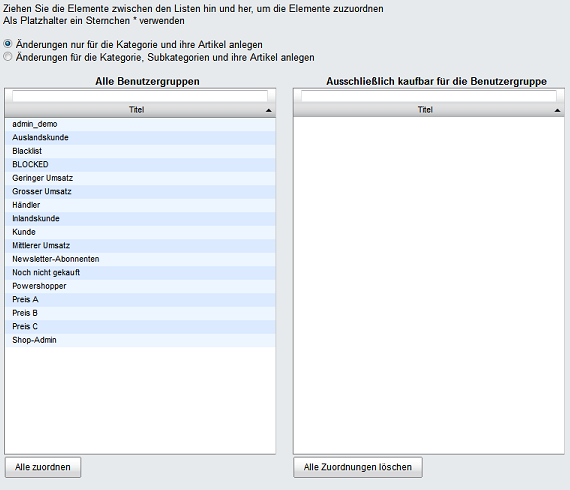

Registerkarte Rechte
********************
Auf der Registerkarte :guilabel:`Rechte` können einer Kategorie Benutzergruppen zugeordnet werden, deren Benutzer diese Kategorie mit ihren Artikeln im Shop sehen dürfen und/oder kaufen können. Diese Zuordnung ist Teil der Rechte- und Rollenverwaltung der Enterprise Edition.

.. image:: ../../media/screenshots-de/oxbacg01.png
   :alt: Kategorien - Registerkarte Rechte
   :height: 306
   :width: 650

Das ausschließliche Recht legt zum einen fest, dass die Kategorie nur für Benutzer, die den zugewiesenen Benutzergruppen angehören, nach Anmeldung am Shop sichtbar ist. Allen übrigen Benutzern und Benutzergruppen wird diese Kategorie und deren Artikel niemals angezeigt, der Menüpunkt ausgeblendet.

Wurden Benutzergruppen als ausschließlich kaufbar zugewiesen, gibt es zum anderen für nicht berechtigte Benutzer keine Möglichkeit, Artikel dieser Kategorie in den Warenkorb zu legen. Mit der Schaltfäche :guilabel:`Mehr Informationen` kann lediglich die Detailseite des Artikels aufgerufen werden. Auch dort fehlt die Schaltfläche :guilabel:`In den Warenkorb legen`, solange der Kunde nicht am Shop angemeldet ist und er der berechtigten Benutzergruppe angehört.

Um einer Kategorie Benutzergruppen zuzuweisen, betätigen Sie die Schaltfläche :guilabel:`Benutzergruppen zuordnen (Ausschließlich sichtbar)` bzw. :guilabel:`Benutzergruppen zuordnen (Ausschließlich kaufbar)`. Es öffnet sich jeweils ein Zuordnungsfenster, in dem Sie Kategorien aus der Liste :guilabel:`Alle Benutzergruppen` auswählen können.

Per Option kann festgelegt werden, ob die jeweilige Berechtigung ausschließlich für die Kategorie und ihre Artikel oder aber auch für deren Unterkategorien und Artikel gelten soll.

Die Benutzergruppen lassen sich nach Titel filtern und sortieren. Ziehen Sie die gewünschten Benutzergruppen mit der Maus von der linken in die rechte Liste. Eine Mehrfachauswahl ist bei gedrückter Strg-Taste möglich. Die Zuordnung ist abgeschlossen.

.. seealso:: `Rechte und Rollen <../../enterprise-edition/rechte-und-rollen>`_