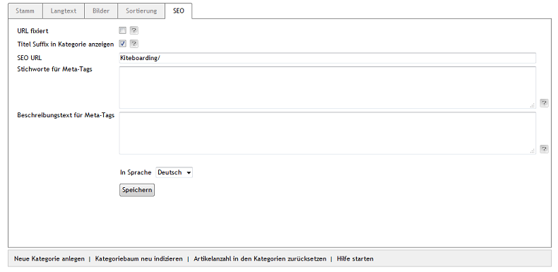

Registerkarte SEO
=================

Die Registerkarte :guilabel:`SEO` der Kategorie beinhaltet Informationen und\Einstellungen, die für Suchmaschinen relevant sind.

Mit der Sprachumstellung am unteren Ende des Eingabebereichs lassen sich die Informationen und Einstellungen auch direkt in einer weiteren Sprache bearbeiten.

:guilabel:`URL fixiert` |br|
Es kann eine feste, sich nicht ändernde URL für die Kategorie definiert werden. Standardmäßig ändert sich die URL, sobald sich der Titel einer Kategorie ändert oder ihre Position in der Kategoriestruktur. Ist die Einstellung aktiv, bleibt bei einer solchen Änderung die SEO URL der Kategorie unverändert.

:guilabel:`Titel Suffix in Kategorie anzeigen` |br|
Bei aktiviertem Kontrollkästchen wird das Titel Suffix im Seitentitel angezeigt. Das Titel Suffix wird unter :menuselection:`Stammdaten --> Grundeinstellungen --> SEO` definiert. Mehr Informationen dazu finden Sie unter :doc:`SEO-Einstellungen <../../konfiguration/seo-einstellungen>`.

:guilabel:`SEO URL` |br|
Die aktuelle URL der Kategorie wird angezeigt. Sie kann geändert und auch fixiert werden.

:guilabel:`Stichworte für Meta-Tags` |br|
Die Stichwörter, die von Suchmaschinen ausgewertet werden, sind in den HTML-Quelltext (Meta Keywords) eingebunden. Wenn Sie nichts eingeben, werden die Stichwörter automatisch erzeugt.

:guilabel:`Beschreibungstext für Meta-Tags` |br|
Dieser Beschreibungstext wird in den HTML-Quelltext (Meta Description) eingebunden. Dieser Text wird von vielen Suchmaschinen bei den Suchergebnissen angezeigt. Wenn Sie nichts eingeben, wird die Beschreibung automatisch erzeugt.

:guilabel:`In Sprache` |br|
Wählen Sie eine Sprache aus der Liste aus, für die Sie die SEO-Informationen und -Einstellungen bearbeiten möchten.

.. Intern: oxbabo, Status:, F1: category_seo.html