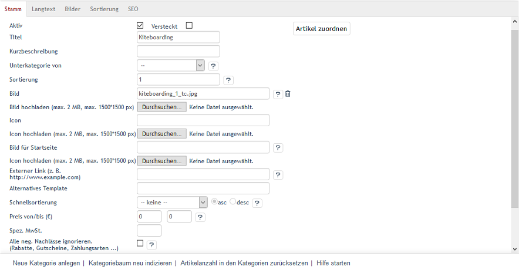

Registerkarte Stamm
*******************
Auf der Registerkarte :guilabel:`Stamm` werden wichtige Informationen zur Kategorie hinterlegt und Einstellungen vorgenommen. Erstellen oder bearbeiten Sie eine Kategorie. Sie können hier auch der Kategorie deren Artikel zuweisen. Es lassen sich dabei viele Artikel auf einmal mit der Kategorie verbinden.

Mit der Sprachumstellung am unteren linken Ende des Eingabebereichs lassen sich die Informationen und Einstellungen zur Kategorie auch direkt in einer weiteren Sprache bearbeiten. Bitte beachten Sie, dass die Sprachumstellung erst nach Anlegen der Kategorie möglich ist.

:guilabel:`Aktiv`

Ein aktiviertes Kontrollkästchen bewirkt, dass die Kategorie im Shop angezeigt wird. Wenn eine Kategorie nicht aktiviert ist, ist sie in der Datenbank vorhanden, erscheint jedoch nicht im Shop.

:guilabel:`Versteckt`

Wenn eine Kategorie versteckt ist, wird sie nicht angezeigt, auch wenn die Kategorie aktiv ist. Das Kontrollkästchen ist im Normalfall nicht angehakt. Eine versteckte Kategorie kann dafür verwendet werden, ausgesuchte Artikel für besondere Zuordnungen zu gruppieren. Das können beispielsweise spezielle Versandkosten oder Verkaufsaktionen sein.

:guilabel:`Titel`

Die Kategorie wird mit dem hier vergebenen Titel im Shop angezeigt. Der Titel der Kategorie sollte kurz und eindeutig sein. Er ist auch Teil der URL, über welche die Artikel aufgerufen werden.

:guilabel:`Kurzbeschreibung`

Die Kurzbeschreibung wird im Shop in der Kategorieansicht angezeigt. Sie sollte mit wenigen Worten über diese Kategorie und die darin angebotenen Artikel informieren.

:guilabel:`Unterkategorie von`

Hier kann eine übergeordnete Kategorie ausgewählt und zugeordnet werden. Durch die Zuordnung von Kategorien zueinander ist es möglich, eine Kategoriestruktur aufzubauen. Wenn die Kategorie keiner anderen Kategorie untergeordnet sein soll, dann wählen Sie :guilabel:`--` aus.

:guilabel:`Sortierung`

Legt die Reihenfolge fest, in der Unterkategorien in einer Hauptkategorie angezeigt werden. Im Eingabefeld wird eine Zahl zwischen 0 und 9999 erwartet. Die Kategorie mit der kleinsten Zahl wird als erste Unterkategorie angezeigt, die mit der größten Zahl als letzte. Vermeiden Sie direkt aufeinanderfolgende Zahlen. Kommt einmal eine neue Unterkategorie hinzu, lässt diese sich gut einsortieren, ohne gleich die Sortierung aller anderen Unterkategorien ändern zu müssen.

:guilabel:`Bild`

Dateiname des Kategoriebildes, welches in der Kategorieansicht als Banner angezeigt wird, sobald die Kategorie im Shop aufgerufen wird. Das Kategoriebild sollte ein Foto oder eine Grafik sein, welche die Kategorie optisch ansprechend präsentiert. Der Dateiname ist nach dem Hochladen des Kategoriebildes sichtbar.

:guilabel:`Bild hochladen (max. 2 MB, max. 1500*1500 px)`

Mit der Schaltfläche :guilabel:`Durchsuchen...` wählen Sie das Kategoriebild aus. Es öffnet sich ein Dateidialog, mit dem Sie das Bild auf der lokalen Festplatte auswählen können. Drücken Sie auf :guilabel:`Speichern`, um das Bild auf den Server des Shops hochzuladen.

Achten Sie darauf, dass die Datei nicht größer als 2 Megabyte ist bzw. das Foto eine maximale Auflösung von 1.500 mal 1.500 Bildpunkten hat. Für die Veränderung der Bildgröße während des Uploads zum Server beansprucht der PHP-Prozess nicht unerheblichen Arbeitsspeicher.

:guilabel:`Icon`

Das Icon wird verwendet, um die Kategorie in der Kategorieansicht als Unterkategorie anzuzeigen. Verwenden Sie :guilabel:`Icon hochladen` (max. 2 MB, max. 1500*1500 px), um die Datei auf der lokalen Festplatte auszuwählen. Auch hier wird nach dem erfolgreichen Hochladen der Dateiname angezeigt.

:guilabel:`Bild für Startseite`

Dateiname des Kategoriebildes, welches als Aktion auf der Startseite angezeigt werden soll. Der Dateiname wird nach dem Hochladen des Kategoriebildes angezeigt.

:guilabel:`Externer Link (z. B. http://www.example.com)`

Sie haben in OXID eShop die Möglichkeit, innerhalb des Navigationsmenüs auch auf externe Seiten zu verlinken. Hier können Sie einen Link eingeben, der geöffnet wird, wenn Benutzer auf die :guilabel:`Kategorie` klicken. Die externe Webseite öffnet sich im gleichen Browserfenster, der gleichen Registerkarte oder im gleichen Tab. Es wird dabei die Session-ID an die aufgerufene Webseite übergeben. Diese könnte beispielsweise von eine eigenentwickelten PHP-Seite übernommen und weiterverwendet werden.

:guilabel:`Alternatives Template`

Im OXID eShop könnte jede Kategorie ein anderes Erscheinungsbild haben. Um bestimmte Kategorien anders als alle anderen im Shop zu präsentieren, kann ein eigenes Template zugewiesen werden. Tragen Sie hier dessen Pfad und Namen ein. Die Pfadangabe ist relativ zum Templateverzeichnis des verwendeten Themes.

Beispiel: Der Eintrag page/list/mylist.tpl würde beim Theme \"Flow\" das Template :file:`mylist.tpl` aus dem Verzeichnis :file:`/application/views/flow/tpl/page/list` aufrufen.

:guilabel:`Schnellsortierung`

Für die Artikel einer Kategorie kann die Sortierung nach einem Artikelmerkmal eingestellt werden. In einer Dropdown-Liste kann ein bestimmtes Artikelmerkmal, wie beispielsweise :guilabel:`Titel`,:guilabel:` Preis` oder :guilabel:`Letzte Änderung` gewählt werden. Als Sortierreihenfolge lässt sich :guilabel:`asc` (aufsteigend) oder :guilabel:`desc` (absteigend) festlegen.

:guilabel:`Preis von/bis (€)`

In einer Kategorie können alle Artikel angezeigt werden, die einen bestimmten Preis haben. Im ersten Eingabefeld wird die Untergrenze eingegeben, in das zweite Eingabefeld die Obergrenze. Damit haben Sie die Möglichkeit, preisabhängige Kategorien einzurichten. So lassen sich beispielsweise alle Artikel des Shops unter 10 Euro anzeigen.

:guilabel:`Spez. MwSt.`

Für alle Artikel in dieser Kategorie kann ein spezieller Mehrwertsteuersatz gelten, der hier definiert wird.

:guilabel:`Alle neg. Nachlässe ignorieren. (Rabatte, Gutscheine, Zahlungsarten ...)`

Ist diese Einstellung aktiv, werden für alle Artikel in dieser Kategorie keine negativen Nachlässe berechnet. Das sind vor allem Rabatte und Gutscheine, die damit für Artikel dieser Kategorie nicht gelten, ebenso wie negative Nachlässe bei Zahlungsarten (Skonto).

:guilabel:`In Sprache`

Die Kategorie lässt sich auch in weiteren aktiven Sprachen des Shops bearbeiten. Wählen Sie eine Sprache aus der Liste aus.\\\

:guilabel:`Artikel zuordnen`

Der Kategorie können Artikel zugeordnet werden. Die Schaltfläche :guilabel:`Artikel zuordnen` öffnet ein neues Fenster.

.. image:: ../../media/screenshots-de/oxbabk02.png
   :alt: Artikel zuordnen
   :height: 325
   :width: 400

In diesem Zuordnungsfenster werden in der linken Liste alle Artikel angezeigt. Die Anzeige kann auf eine Kategorie beschränkt werden, indem diese aus einer Dropdown-Liste ausgewählt wird. Artikel können auch nach Artikelnummer, Titel und/oder EAN gefiltert und sortiert werden. Die Artikel werden per Drag \& Drop in die rechte Liste verschoben und damit der Kategorie zugeordnet. Eine Mehrfachauswahl ist bei gedrückter Strg-Taste möglich.

.. seealso:: `Artikel <../artikel/artikel.html>`_ | `Zuordnung von Artikeln zu Kategorien <../artikel-und-kategorien/zuordnung-von-artikeln-zu-kategorien.html>`_ | `Sortierung von Artikeln <../artikel-und-kategorien/sortierung-von-artikeln.html>`_