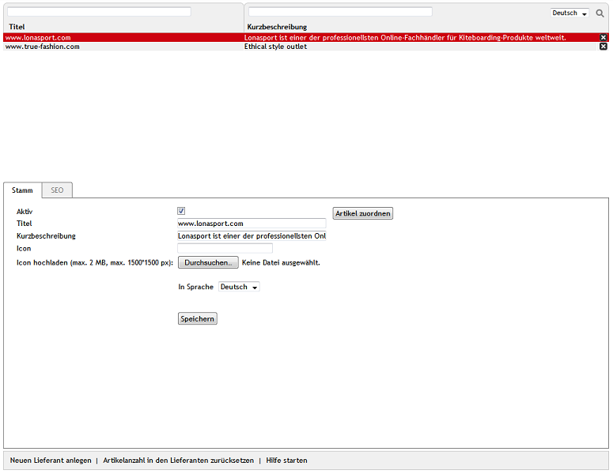

Lieferanten
***********
Der OXID eShop bietet die Möglichkeit, Lieferanten zu verwalten. Artikel können diesen Lieferanten zugeordnet werden, um die Bezugsquellen der Waren zu dokumentieren. Im Administrationsbereich lassen sich Artikel nach der Lieferanten-ID filtern und anzeigen. Im Frontend des Shops gibt es keine Verwendung für die Lieferanten, denn Shopbetreiber sind mit Sicherheit nicht daran interessiert, diese Information öffentlich zu machen. In frühen Shopversionen gab es noch keine Hersteller, sondern diese wurden - nicht ganz korrekt - als Lieferanten geführt. Mit OXID eShop 4.0.1 wurde die Unterscheidung von Lieferanten und Hersteller umgesetzt.

Lieferanten können im Administrationsbereich unter :menuselection:`Stammdaten --> Lieferanten` bearbeitet werden. Es werden die Lieferantenliste und darunter der Eingabebereich für die Lieferanten angezeigt. Die Lieferantenliste enthält Titel und Kurzbeschreibung der Lieferanten. Nach Lieferanten kann unter Verwendung der Suchfelder gesucht werden. Geben Sie beispielsweise in das Suchfeld über :guilabel:`Titel` die Zeichenfolge \"nas\" ein, so wird nur der Lieferant www.lonasport.com aus den Demodaten gefunden und angezeigt.

Lieferanten lassen sich durch einen Klick auf das Löschsymbol am Ende der Zeile endgültig aus der Datenbank entfernen.

Wird ein Lieferant aus der Lieferantenliste gewählt, werden dessen Informationen in den Eingabebereich geladen. Zum Erstellen eines neuen Lieferanten klicken Sie am unteren Bildschirmrand auf :guilabel:`Neuen Lieferant anlegen`. Weitere Funktionen in der Fußzeile sind :guilabel:`Artikelanzahl in den Lieferanten zurücksetzen` und :guilabel:`Hilfe starten`.

.. hint:: Um in der Artikelliste nach Lieferanten suchen zu können, benötigen Sie die Lieferanten-ID. Diese wird Ihnen am unteren Bildschirmrand angezeigt, sobald Sie einen Lieferanten aus der Lieferantenliste auswählen. Mit der rechten Maustaste lässt sich dieser Link kopieren und die jeweilige Lieferanten-ID entnehmen. Beispiel für einen Link: javascript:top.oxid.admin.editThis('b564341636908e3e2d559eb1e690c344'); Die Lieferanten-ID für www.lonasport.com aus dem Demodaten ist b564341636908e3e2d559eb1e690c344.

-----------------------------------------------------------------------------------------

.. |link| image:: ../../media/icons-de/link.png
.. |br| raw:: html 

    

Registerkarte Stamm
+++++++++++++++++++
**Inhalte**: aktiver Lieferant, Titel, Kurzbeschreibung, Icon, Lieferantenlogo, Hochladen, Upload auf Webserver, automatisch generiert, Artikel zuordnen |br|
`Artikel lesen <registerkarte-stamm.html>`_ |link|

Registerkarte Mall
++++++++++++++++++
Nur in der Enterprise Edition vorhanden |br|

**Inhalte**: Lieferanten vererben, Lieferanten verknüpfen, Elternshop, Subshop, Supershop, Multishop, Mall, Enterprise Edition |br|
`Artikel lesen <registerkarte-mall.html>`_ |link|

Registerkarte SEO
+++++++++++++++++
**Inhalte**: Suchmaschinenoptimierung, SEO, SEO URL, Titel Suffix, URL fixieren, Meta-Tags, Stichwörter, meta name=\"keywords\", Beschreibung, meta name=\"description\" |br|
`Artikel lesen <registerkarte-seo.html>`_ |link| 

.. seealso:: `Artikel <../artikel/artikel.html>`_ | `Hersteller <../hersteller/hersteller.html>`_