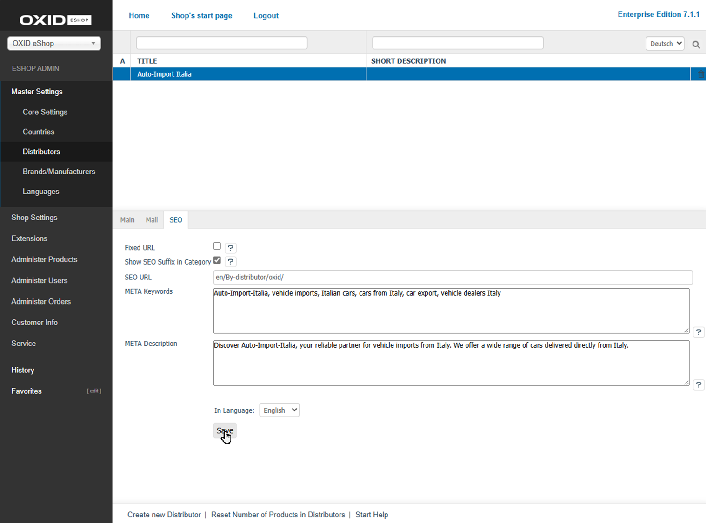

Registerkarte SEO
=================

Optimieren Sie auf der Registerkarte :guilabel:`SEO` (:ref:`oxbagg01`) die SEO-Einstellungen der Herstellerseite, um deren Sichtbarkeit in Suchmaschinen zu verbessern.

* Vergeben Sie eine sprechende SEO-URL, damit die Lieferantenseite leichter gefunden wird.
* Hinterlegen Sie einen aussagekräftigen Meta-Titel und eine Meta-Beschreibung, um die Klickrate in den Suchergebnissen zu steigern.
* Definieren Sie relevante Stichwörter (Meta-Keywords), damit die Seite bei passenden Suchanfragen erscheint.
* Fixieren Sie die SEO-URL, um unerwünschte Änderungen zu vermeiden und doppelten Inhalt zu reduzieren.
* Nutzen Sie die Sprachoptionen, um die SEO-Informationen für jede aktivierte Sprache individuell anzupassen.

.. _oxbagg01:

   Abb.: Lieferanten - Registerkarte SEO

Um die Informationen und Einstellungen in jeder weiteren aktivierten Sprache zu bearbeiten, verwenden Sie die Sprachumstellung am unteren Rand des Eingabebereichs.

:guilabel:`URL fixiert`
   Wenn sich der Titel eines Herstellers ändert, wird die SEO-URL neu berechnet.

   Um die automatische Neuberechnung der URL zu deaktivieren, aktivieren Sie das Kontrollkästchen. Eine bestehende SEO-URL bleibt dadurch unverändert.

:guilabel:`Titel-Suffix in Kategorie anzeigen`
   Aktivieren Sie diese Einstellung, um das Titel-Suffix im Seitentitel anzuzeigen (Titel-Suffix am Beispiel einer Hersteller-Seite: :ref:`oxbagg02`, Pos. 1).

   Weitere Informationen zum Festlegen des Titel-Suffixes finden Sie unter :doc:`SEO-Einstellungen <../../konfiguration/seo-einstellungen>`.

   Im Frontend gibt es standardmäßig keinen Aufruf der Übersicht aller Artikel eines Lieferanten.

   .. _oxbagg02:

   .. figure:: ../../media/screenshots/oxbagd02.png
      :alt: Titel-Suffix anzeigen (Beispiel: Hersteller)
      :width: 650
      :class: with-shadow

      Abb.: Titel-Suffix anzeigen (Beispiel: Hersteller)

:guilabel:`SEO-URL`
   Die SEO-URL des Herstellers wird angezeigt und kann bearbeitet oder fixiert werden.

:guilabel:`Stichworte für Meta-Tags`
   Die Stichwörter, die von Suchmaschinen ausgewertet werden, sind in den HTML-Quelltext (Meta-Keywords) eingebunden.

   Wenn Sie nichts eingeben, werden die Stichwörter automatisch beispielsweise aus dem Titel des Herstellers, der Kategorie (Nach-Hersteller) und den Suchbegriffen der zugeordneten Artikel erzeugt.

:guilabel:`Beschreibungstext für Meta-Tags`
   Dieser Beschreibungstext wird in den HTML-Quelltext (Meta Description) eingebunden und in den Suchergebnissen vieler Suchmaschinen angezeigt.

   Wenn Sie nichts eingeben, wird die Beschreibung automatisch aus dem Titel des Herstellers, der Kategorie (Nach-Hersteller) und den Titeln der zugeordneten Artikel erstellt.

:guilabel:`In Sprache`
   Wählen Sie eine Sprache aus der Liste aus, für die Sie die SEO-Informationen und -Einstellungen bearbeiten möchten.

.. Intern: oxbagg, Status:, F1: vendor_seo.html