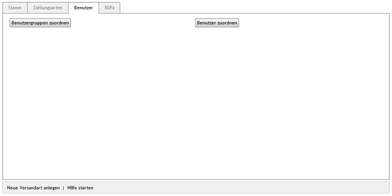

Registerkarte Benutzer
======================
Versandarten können so konfiguriert werden, dass sie für bestimmte Benutzergruppen und/oder Benutzer gelten. Die Zuordnung erfolgt auf der Registerkarte :guilabel:`Benutzer`.

Wird keine Benutzergruppe zugewiesen, gilt die Versandart für alle Benutzergruppen. Versandarten können auch nur für einzelne Benutzer gelten. Diese Art der Zuordnung bewirkt allerdings, dass nur ausgewählte Benutzer diese Versandart verwenden können. Zugewiesene Benutzergruppen werden damit hinfällig.

:guilabel:`Benutzergruppen zuordnen` |br|
Das Zuordnungsfenster, welches über diese Schaltfläche geöffnet wird, zeigt die beiden Listen :guilabel:`Alle Benutzergruppen` und :guilabel:`Zugeordnete Benutzergruppen`. Die Benutzergruppen lassen sich nach Titel filtern und sortieren. Ziehen Sie die gewünschten Benutzergruppen mit der Maus von der linken in die rechte Liste. Eine Mehrfachauswahl ist bei gedrückter Strg-Taste möglich. Die Zuordnung ist abgeschlossen.

:guilabel:`Benutzer zuordnen` |br|
Um einzelne Benutzer für die Versandart festzulegen, betätigen Sie die Schaltfläche :guilabel:`Benutzer zuordnen`. Im Zuordnungsfenster, welches sich öffnet, werden die beiden Listen :guilabel:`Alle Benutzer` und :guilabel:`Zugeordnete Benutzer` angezeigt. In der linken Liste kann die Anzeige auf alle Benutzer einer Benutzergruppe eingeschränkt werden, indem eine Benutzergruppe aus der Download-Liste ausgewählt wird. In beiden Listen können Benutzer nach Login (E-Mail des Benutzers) gefiltert und/oder sortiert werden.

Auch in diesem Zuordnungsfenster ist eine Mehrfachauswahl möglich. Die gewünschten Benutzer werden per Drag \& Drop in die rechte Liste verschoben. Die Zuordnung ist abgeschlossen.

.. Intern: oxbadg, Status:, F1: deliveryset_users.html