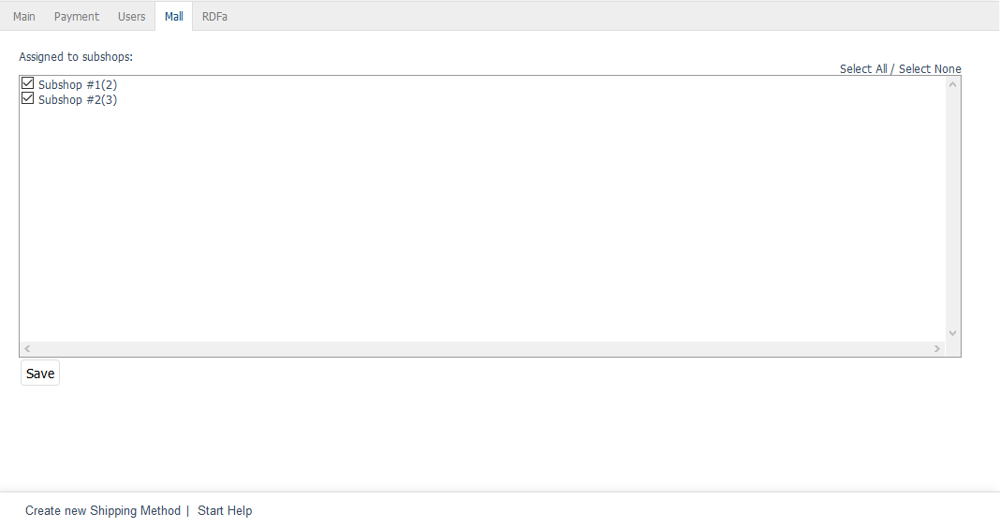

Registerkarte Mall
==================

Die Registerkarte :guilabel:`Mall` ist bei Versandarten nur in der OXID eShop Enterprise Edition vorhanden.

Versandarten können beim Erstellen von Shops an diese vererbt werden. Wird die Option :guilabel:`Dieser Shop erbt alle Artikel und Einstellungen vom Elternshop` gewählt, enthält ein neuer Shop auch alle Versandarten des Elternshops. Die vererbten Versandarten sind nicht änderbar und behalten auch die ursprünglichen Verknüpfungen mit den Zahlungsarten, den Benutzergruppen oder einzelnen Benutzern bei.

Auf der Registerkarte :guilabel:`Mall` werden die Verknüpfungen der Versandart zu Subshops und Supershops verwaltet. Multishops übernehmen keine Versandarten aus anderen Shops.

Es ist möglich, die Vererbung aller Versandarten für einen Shop rückgängig zu machen. Dazu muss in der Registerkarte Mall des Subshops oder Supershops unter :menuselection:`Stammdaten --> Grundeinstellungen` das Häkchen von :guilabel:`Alle Lieferinformationen vom Elternshop erben` entfernt werden. Dadurch wird auch die Verknüpfung zu den geerbten Versandkostenregeln aufgehoben.

:guilabel:`Verknüpft mit folg. Subshops`
   Die Verknüpfung einer Versandart mit Subshops und Supershops kann hinzugefügt oder entfernt werden, indem das entsprechende Kontrollkästchen angehakt wird oder nicht. Bei nicht aktiviertem Kontrollkästchen ist die Versandart im Elternshop vorhanden, aber nicht im jeweiligen Subshop oder Supershop.

Über die Links :guilabel:`Alle auswählen` und :guilabel:`Keine auswählen` auf der rechten Seite des Fensters können alle Shops verknüpft oder alle Verknüpfungen zu den Shops entfernt werden. Vorgenommene Änderungen müssen gespeichert werden und sind für die Subshops oder Supershops sofort wirksam.

.. Intern: oxbadh, Status:, F1: deliveryset_mall.html