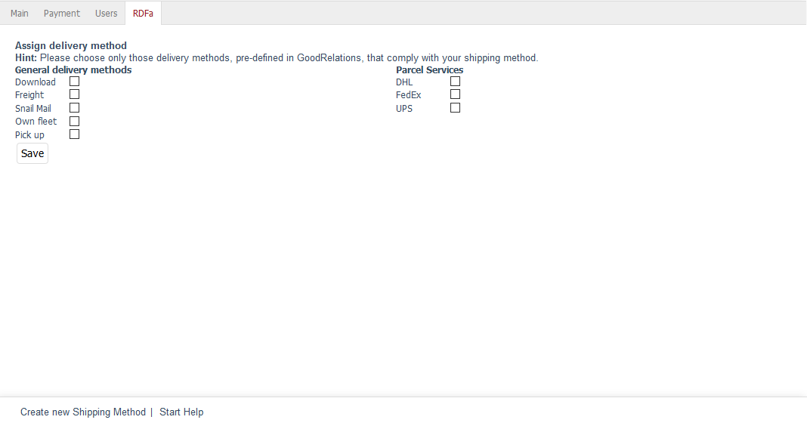

Registerkarte RDFa
==================

OXID eShop stellt Informationen gut aufbereitet für Suchmaschinen, Portale und andere Systeme bereit. Diese können beispielsweise als so genannte Rich Snippets - ausführliche Informationen zu einem Suchergebnis - dargestellt werden. Die Aufbereitung der Daten erfolgt auf Basis des Resource Description Framework (RDFa) und der für den E-Commerce optimierten Beschreibungssprache GoodReleations.

Auf der Registerkarte :guilabel:`RDFa` wird eine logische Verknüpfung der Versandart mit den in GoodReleations vordefinierten Werten für den Versand hergestellt.

.. hint:: Damit der Shop die RDFa-Integration verwenden kann, muss die Funktion unter :menuselection:`Stammdaten --> Grundeinstellungen --> RDFa` aktiviert werden.

:guilabel:`Versandarten zuordnen` |br|
:guilabel:`Hinweis: Bitte wählen Sie nur die in GoodRelations vordefinierten Versandarten aus, die Ihrer Versandart entsprechen.`

Setzen Sie ein Häkchen bei allen Angaben, welche die Versandart exakt beschreiben.

:guilabel:`Allgemeine Versandarten` |br|
:guilabel:`Download` |br|
:guilabel:`Fracht` |br|
:guilabel:`Briefpost` |br|
:guilabel:`Eigener Fuhrpark` |br|
:guilabel:`Selbstabholung`

:guilabel:`Paketdienst` |br|
:guilabel:`DHL` |br|
:guilabel:`FedEx` |br|
:guilabel:`UPS`

.. Intern: oxbadi, Status:, F1: deliveryset_rdfa.html
.. ToDo Hinweiszeile ist fehlerhaft: %s (Screenshot erneuern, wenn Wert korrekt angezeigt wird)