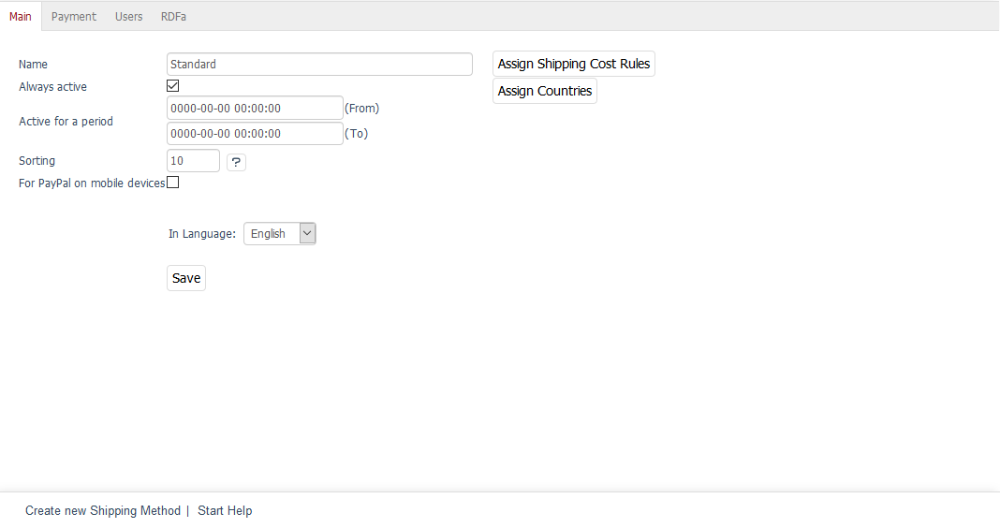

Registerkarte Stamm
===================

Die Registerkarte :guilabel:`Stamm` stellt einige Einstellungen für die Versandart zur Verfügung. Es können Versandkostenregeln und Länder zugewiesen werden.

:guilabel:`Name`
   Tragen Sie hier die Bezeichnung der Versandart ein. Diese wird dem Kunden im Bestellschritt 3 angezeigt. Sind mehrere Versandarten gültig, muss eine davon aus einer Dropdown-Liste ausgewählt werden.

:guilabel:`Immer aktiv`
   Ein Häkchen in diesem Kontrollkästchen bewirkt, dass die Versandart aktiv ist und verwendet werden kann.

:guilabel:`Aktiv für Zeitraum`
   Legen Sie hier einen Zeitraum fest, in dem die Versandart aktiv sein soll. Das Eingabeformat ist dabei JJJJ-MM-TT HH:MM:SS. Damit der Zeitraum berücksichtigt wird, darf :guilabel:`Aktiv` nicht angehakt sein.

:guilabel:`Sortierung`
   Die Sortierung legt die Reihenfolge der Versandarten in der Dropdown-Liste fest. Die Versandart mit der kleinsten Zahl steht als erste zur Auswahl und ist damit vorausgewählt.

:guilabel:`In Sprache`
   Die Versandart kann in weiteren aktiven Sprachen des Shops bearbeitet werden. Wählen Sie eine Sprache aus der Dropdown-Liste aus.

:guilabel:`Kopieren`
   Bevor eine Versandart in einer weiteren aktiven Sprache bearbeitet werden kann, muss sie kopiert werden. Wählen Sie die Sprache aus der Dropdown-Liste aus und drücken Sie die Schaltfläche :guilabel:`Kopieren`. Ist keine weitere aktive Sprache im Shop vorhanden, wird diese Schaltfläche nicht angezeigt.

:guilabel:`Versandkostenregeln zuordnen`
   Der Versandart muss mindestens eine Versandkostenregel zugeordnet sein. Die Schaltfläche :guilabel:`Versandkostenregeln zuordnen` öffnet ein neues Fenster. In diesem Zuordnungsfenster werden in der linken Liste alle Versandkostenregeln angezeigt. Versandkostenregeln lassen sich nach Titel, Kosten und/oder Typ (absoluter oder prozentualer Preis) filtern sowie auf- und absteigend sortieren. Verschieben Sie die Versandkostenregeln per Drag \& Drop in die rechte Liste. Die Zuordnung ist damit abgeschlossen.

:guilabel:`Länder zuordnen`
   Der Versandart sollten Länder zugeordnet werden, um eindeutige Zahlungs- und Versandbedingungen zu haben. Wurden Länder zugewiesen und ein Kunde bestellt aus einem Land, dem keine Versandart zugewiesen wurde, erhält er den Hinweis: \"Derzeit ist keine Versandart für dieses Land definiert. Wir werden versuchen, Liefermöglichkeiten zu finden und Sie über die Versandkosten informieren.\". Die Zahlungsarten werden ihm nicht angezeigt.

   Ohne Länderzuordnung gilt die Versandart für alle Länder.

   Mit der Schaltfläche :guilabel:`Länder zuordnen` wird ein neues Fenster geöffnet, in dem in dessen linker Liste alle aktiven Länder angezeigt werden. Länder lassen sich nach Titel und/oder der Länderabkürzung (ISO Alpha 2) sortieren und filtern. Ziehen Sie die gewünschten Länder mit der Maus in die rechte Liste. Eine Mehrfachauswahl ist bei gedrückter Strg-Taste möglich. Die Zuordnung zur Versandart ist damit abgeschlossen.

.. Intern: oxbade, Status:, F1: deliveryset_main.html