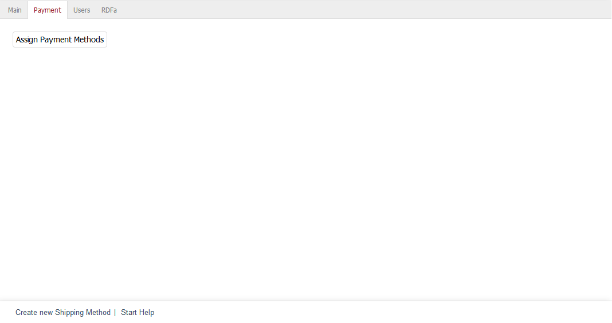

Registerkarte Zahlungsarten
===========================

Auf dieser Registerkarte können der Versandart die Zahlungsarten zugeordnet werden. Es ist mindestens eine Zahlungsart notwendig.

Um die für die Versandart geltenden Zahlungsarten festzulegen, betätigen Sie die Schaltfläche :guilabel:`Zahlungsarten zuordnen`. Im sich öffnenden Zuordnungsfenster sehen Sie die Zahlungsarten in der linken Liste. Zahlungsarten lassen sich nach Beschreibung und/oder Kosten filtern und sortieren. Ziehen Sie die gewünschten Zahlungsarten mit der Maus in die rechte Liste. Eine Mehrfachauswahl ist bei gedrückter Strg-Taste möglich. Die Zuordnung ist abgeschlossen.

.. Intern: oxbadf, Status:, F1: deliveryset_payment.html