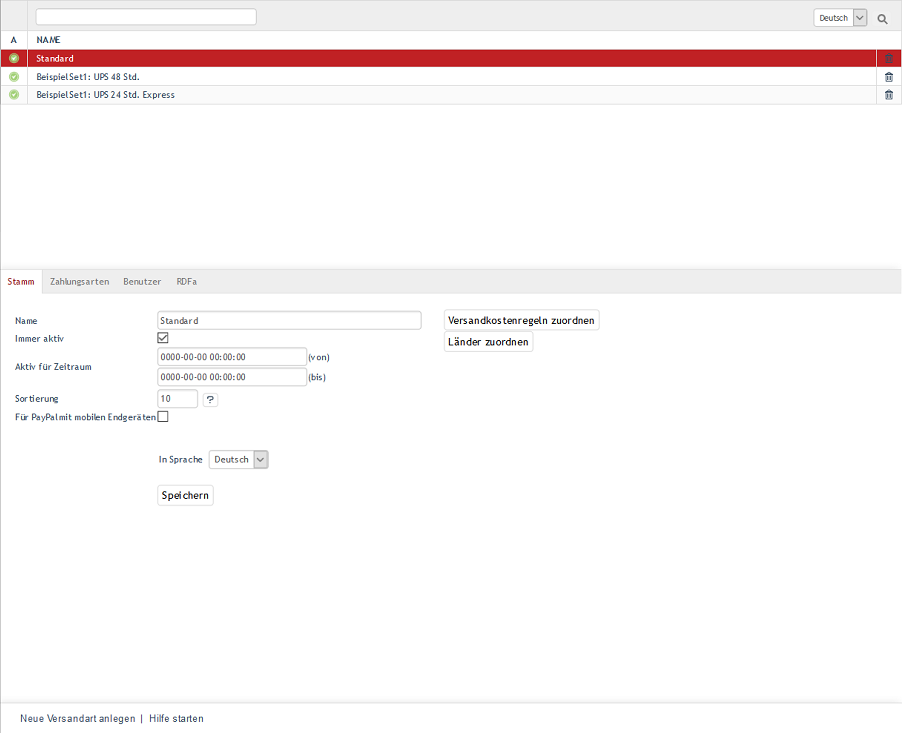

Versandarten
************
Versand und Zahlung sind wichtige Funktionen in einem Online-Shop. Sie werden durch die Definition von Versandarten, Versandkostenregeln und Zahlungsarten bestimmt, die in einem wechselseitigen Zusammenhang zueinander stehen.

Im dritten Schritt des Bestellprozesses können Kunden auswählen, wie die bestellte Ware geliefert werden soll. Der OXID eShop zeigt die gültigen Versandarten an. Ist nur eine Versandart gültig, wird diese automatisch ausgewählt. Welche Versandarten angeboten werden, hängt davon ab, aus welchem Land der Kunde bestellt. Es spielt auch eine Rolle, welche Benutzer oder Benutzergruppen eine Versandart nutzen dürfen. Den Versandarten müssen letztlich mindestens eine Zahlungsart und eine Versandkostenregel zugeordnet worden sein.

Alle Einstellungen und Zuordnungen können im Administrationsbereich unter :menuselection:`Shopeinstellungen --> Versandarten` vorgenommen werden. Dort werden alle Versandarten mit ihrem Namen aufgelistet. Nach Versandarten kann gesucht werden, indem das Suchfeld für den Namen verwendet wird. Versandarten können durch einen Klick auf das Löschsymbol am Ende der Zeile endgültig aus der Datenbank entfernt werden.

Unter der Liste befindet sich der Eingabebereich für die Versandart. Wird eine Versandart aus der Liste gewählt, werden deren Informationen in den Eingabebereich geladen. Zum Erstellen einer neuen Versandart klicken Sie am unteren Bildschirmrand auf :guilabel:`Neue Versandart anlegen`.

Der OXID eShop wird mit den vorbereiteten Versandarten \"Standard\", \"Beispiel Set1: UPS 48 Std.\" und \"Beispiel Set1: UPS 24 Std. Express\" ausgeliefert. Diese können verwendet werden, nachdem sie individuell angepasst wurden, oder als Vorlage für neu zu definierende Versandarten dienen.

.. hint:: Bei der Einrichtung der Versandart muss darauf geachtet werden, dass mindestens eine Versandkostenregel und mindestens eine Zahlungsart zugeordnet wurde. Länder sollten zugewiesen sein, damit die Definition von Versand und Zahlung stringent ist. Ohne Länderzuordnung kann die Logik von Zahlung und Versand im Bestellprozess schon einmal abhandenkommen. Wurde kein Land zugewiesen, gilt die Versandart für alle Länder.

Benutzer und Benutzergruppen können, müssen aber nicht zugeordnet sein. Fehlt letztere Zuordnung, gilt die Versandart für alle Benutzer. Nur, wenn alle Bedingungen erfüllt sind, ist eine Versandart im Bestellprozess gültig und wird angezeigt. Achten Sie auch darauf, dass die Versandart aktiv ist.

-----------------------------------------------------------------------------------------

.. |link| image:: ../../media/icons-de/link.png
.. |br| raw:: html 

    

Registerkarte Stamm
+++++++++++++++++++
**Inhalte**: aktive Versandart, aktiver Zeitraum, Sortierung, Versandkostenregeln und Länder zuordnen |br|
`Artikel lesen <registerkarte-stamm>`_ |link|

Registerkarte Zahlungsarten ** 
+++++++++++++++++++++++++++++++
**Inhalte**: Zahlungsarten zuordnen |br|
`Artikel lesen <registerkarte-zahlungsarten>`_ |link|

Registerkarte Benutzer
++++++++++++++++++++++
**Inhalte**: Benutzer und Benutzergruppen zuordnen |br|
`Artikel lesen <registerkarte-benutzer>`_ |link|

Registerkarte Mall
++++++++++++++++++
Nur in der Enterprise Edition vorhanden |br|
**Inhalte**: Versandarten vererben, Versandarten verknüpfen, Elternshop, Subshop, Supershop, Multishop, Mall, Enterprise Edition |br|
`Artikel lesen <registerkarte-mall>`_ |link|

Registerkarte RDFa
++++++++++++++++++
**Inhalte**: RDFa, Resource Description Framework, GoodReleations, Vokabular für E-Commerce, allgemeine Versandarten und Paketdienste, Rich Snippets |br|
`Artikel lesen <registerkarte-rdfa>`_ |link|

.. seealso:: `Zahlungsarten <../zahlungsarten/zahlungsarten>`_ | `Versandkostenregeln <../versandkostenregeln/versandkostenregeln>`_ | `Zahlung und Versand <../zahlung-und-versand/zahlung-und-versand>`_