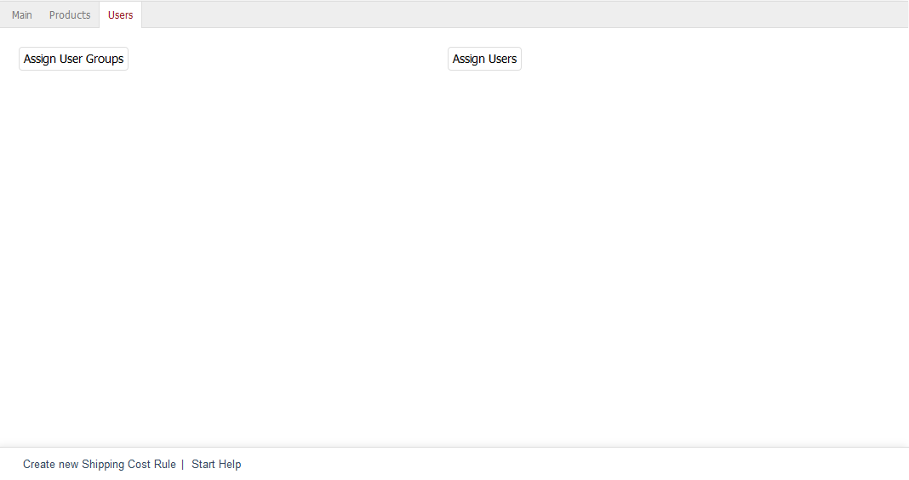

Users tab
======================

Shipping cost rules can apply to specific user groups and/or users. Go to the :guilabel:`User` tab to configure the necessary settings. Without the assignment of user groups and/or users, the shipping cost rule will apply to all.

:guilabel:`Assign User Groups` |br|
Clicking on this button opens the assignment window and displays the two lists :guilabel:`All User Groups` and :guilabel:`Assigned User Groups`. User groups can be filtered and sorted by title. Drag the desired user groups from the left-hand list into the right-hand list using the mouse. Hold down the Ctrl key to select multiple user groups. The assignment is now completed.

:guilabel:`Assign Users` |br|
Click on :guilabel:`Assign Users` to define individual users for the shipping cost rule. The assignment window opens and displays the two lists :guilabel:`All Users` and :guilabel:`Assigned Users`. Select a user group from the drop-down list in the left-hand list of the assignment window to only display users from this group. Users in both lists can be filtered and/or sorted by login (user email).

You can also select multiple users. Drag and drop the desired users into the right-hand list The assignment is now completed.

.. Intern: oxbadm, Status:, F1: delivery_users.html