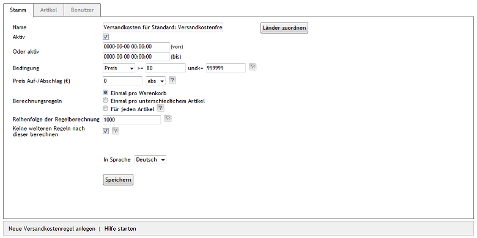

Registerkarte Stamm
===================

Bedingungen und Konditionen für die Berechnung der Versandkosten werden auf der Registerkarte :guilabel:`Stamm` der Versandkostenregeln definiert. Über einen Dialog erfolgt die Zuordnung der Länder zur Versandkostenregel. Mindestens ein Land muss zugewiesen sein.

:guilabel:`Name` |br|
Das Eingabefeld nimmt die Bezeichnung der Versandkostenregel auf. Der Name ist frei definierbar, sollte aber einen logischen Bezug zur Versandart haben, für welche die Versandkostenregel erstellt wird. Das erleichtert den Überblick, wenn sehr viele Versandkostenregeln notwendig sind, um den Versand abzubilden. Das Wort \"Standard\" in den Versandkostenregeln des OXID eShop weist beispielsweise auf die zugrunde liegende Versandart hin.

:guilabel:`Aktiv` |br|
Die Versandkostenregel ist aktiv, wenn das Kontrollkästchen angehakt ist.

:guilabel:`Oder aktiv` ... :guilabel:`(von)` ... :guilabel:`(bis)` |br|
Alternativ kann eine Versandkostenregel so eingerichtet werden, dass sie nur für einen bestimmten Zeitraum gilt. Der Zeitraum dafür wird hier festgelegt. Das Eingabeformat ist dabei JJJJ-MM-TT HH:MM:SS. Damit der Zeitraum berücksichtigt wird, darf :guilabel:`Aktiv` nicht angehakt sein, und es muss ein Bis-Datum geben.

:guilabel:`Bedingung \>=` ...\:guilabel:`und \<=` ... |br|
Eine Versandkostenregel kann auf Basis der Menge, der Größe, des Gewichtes oder des Preises der bestellten Artikel definiert werden. Die Auswahl erfolgt mit einer kleinen Dropdown-Liste. Die Bedingung muss so formuliert werden, dass sie gültig ist. Achten Sie daher darauf, immer eine Bis-Menge, eine Bis-Größe, ein Bis-Gewicht oder eine Bis-Preis einzutragen.

:guilabel:`Preis Auf-/Abschlag (€)` |br|
Geben Sie hier die Kosten für den Versand absolut oder prozentual an. Wählen Sie \"abs\" oder \"%\" in der kleinen Dropdown-Liste aus. Über den Abschlag können im Zusammenhang mit Zeitraum oder mit Menge als Bedingung Zeit- oder Mengenrabatte abgebildet werden.

:guilabel:`Berechnungsregeln` |br|
Der Preis für den Versand kann auf drei verschiedene Arten berechnet werden.

:guilabel:`Einmal pro Warenkorb` |br|
Der Preis für den Versand wird einmal pro Warenkorb berechnet.

:guilabel:`Einmal pro unterschiedlichem Artikel` |br|
Der Preis für den Versand wird einmal pro unterschiedlichem Artikel berechnet. Es wird dabei nicht berücksichtigt, wie viele Artikel jeweils in den Warenkorb gelegt wurden.

:guilabel:`Für jeden Artikel` |br|
Der Preis für den Versand wird für jeden einzelnen Artikel im Warenkorb berechnet.

:guilabel:`Reihenfolge der Regelberechnung` |br|
Legen Sie fest, wann die Versandkostenregel angewendet werden soll. Die Versandkostenregel mit der kleinsten Zahl wird als erste bei der Berechnung berücksichtigt. Die Reihenfolge der Verarbeitung muss gut durchdacht sein. Es gilt zu bedenken, welche Versandkostenregel zuerst geprüft werden muss und ob danach eine weitere Versandkostenregel zu berücksichtigen ist. Alle Regeln, die nur eine einzige Bedingung prüfen und die nicht in Kombination mit anderen Regeln funktionieren, sollten immer zuerst berücksichtigt werden.

:guilabel:`Keine weiteren Regeln nach dieser berechnen` |br|
Treffen die Bedingungen mehrerer Versandkosten zu, addieren sich die Versandkosten. Werden die Versandkosten bereits durch eine Versandkostenregel adäquat berechnet, kann eine weitere Berechnung unterbunden werden. Setzen Sie dafür ein Häkchen in dieses Kontrollkästchen.

:guilabel:`In Sprache` |br|
Die Versandkostenregel kann in weiteren aktiven Sprachen des Shops bearbeitet werden. Wählen Sie eine Sprache aus der Dropdown-Liste aus.

:guilabel:`Kopieren` |br|
Bevor eine Versandkostenregel in einer weiteren aktiven Sprache bearbeitet werden kann, muss sie kopiert werden. Wählen Sie die Sprache aus der Dropdown-Liste aus und drücken Sie die Schaltfläche :guilabel:`Kopieren`. Ist keine weitere aktive Sprache im Shop vorhanden, wird diese Schaltfläche nicht angezeigt.

:guilabel:`Länder zuordnen` |br|
Der Versandkostenregel sollten Länder zugeordnet sein, die idealerweise mit denen in der zugehörigen Zahlungsart und der Versandart übereinstimmen. Das sorgt für eine transparente Logik bei der Definition von Zahlung und Versand. Wurde kein Land zugewiesen, gilt die Versandkostenregel für alle Länder.

Nehmen Sie diese Zuordnung vor, indem Sie auf die Schaltfläche :guilabel:`Länder zuordnen` klicken. In einem neuen Fenster können Sie Länder aus der Liste :guilabel:`Alle Länder` auswählen. Länder lassen sich nach Namen und/oder der Länderabkürzung (ISO Alpha 2) sortieren und filtern. Ziehen Sie die gewünschten Länder mit der Maus in die rechte Liste. Eine Mehrfachauswahl ist bei gedrückter Strg-Taste möglich. Die Zuordnung zur Versandkostenregel ist damit abgeschlossen.

.. hint:: Der Versand in In- und Ausland sollte immer über Versandkostenregeln gesteuert werden. Verwenden Sie dafür nicht die Versandarten. Es könnten dadurch Probleme auftreten, wenn bei einer Bestellung Rechnungsadresse und Lieferadresse in verschiedenen Ländern liegen.

.. seealso:: :doc:`Gewichtsabhängige Versandkosten <../zahlung-und-versand/gewichtsabhaengige-versandkosten>` | :doc:`Versandkostenfrei ab Warenwert <../zahlung-und-versand/versandkostenfrei-ab-warenwert>` | :doc:`Versandkosten für In- und Ausland <../zahlung-und-versand/versandkosten-fuer-in-und-ausland>`

.. Intern: oxbadk, Status:, F1: delivery_main.html