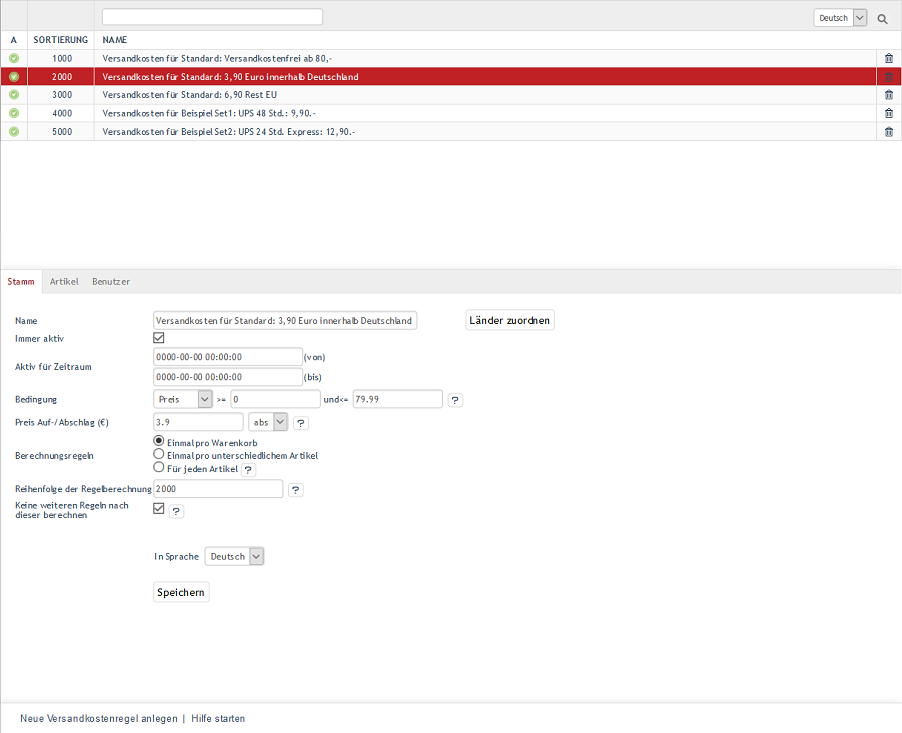

Versandkostenregeln
*******************
Versand und Zahlung sind wichtige Funktionen in einem Online-Shop. Sie werden durch die Definition von Versandkostenregeln, Versand- und Zahlungsarten bestimmt, die in einem wechselseitigen Zusammenhang zueinander stehen. Während für die Versandarten gilt: es ist gut, so wenige wie nötig zu haben, sind die Versandkostenregeln die Feinstellschrauben in der Konfiguration von Zahlung und Versand. Mit denen werden die Konditionen festgelegt, zu denen die Lieferung der bestellten Ware an den Kunden erfolgt. Es können Mindermengenzuschläge berechnet oder Freigrenzen für Versandkosten gesetzt werden. Es lassen sich auch unterschiedliche Versandkosten für verschiedene Länder definieren.

Haben Kunden im dritten Schritt des Bestellprozesses eine Versandart ausgewählt, werden die Versandkosten berechnet. Alle Versandkostenregeln, die der Versandart zugeordnet sind, werden nacheinander auf ihre Gültigkeit geprüft. Diese hängt davon ab, ob bestimmte Einkaufswerte, Gesamtgewichte, Bestellmengen oder Maße zutreffen. Es müssen auch die zugewiesenen Länder, Benutzergruppen, Benutzer, Kategorien und Artikel stimmen. Nur wenn alle Bedingungen erfüllt sind, ist die Versandkostenregel gültig. Die Versandkosten werden aus allen gültigen Versandkostenregeln berechnet. Bei mehreren gültigen Versandkostenregeln addieren sich die Versandkosten.

Alle Einstellungen und Zuordnungen werden im Administrationsbereich unter :menuselection:`Shopeinstellungen --> Versandkostenregeln` vorgenommen. Dort sind alle Versandkostenregeln mit ihrem Namen aufgelistet. Nach ihnen kann gesucht werden, indem das Suchfeld für den Namen verwendet wird. Versandkostenregeln können durch einen Klick auf das Löschsymbol am Ende der Zeile endgültig aus der Datenbank entfernt werden.

Unter der Liste befindet sich der Eingabebereich für die Versandkostenregel. Wird eine Versandkostenregel aus der Liste gewählt, werden deren Informationen in den Eingabebereich geladen. Zum Erstellen einer neuen Versandkostenregel klicken Sie am unteren Bildschirmrand auf :guilabel:`Neue Versandkostenregel anlegen`.

Der OXID eShop wird mit den vorbereiteten Versandkostenregeln\"Versandkosten für Standard: Versandkostenfrei ab 80,-\",\"Versandkosten für Standard: 3,90 Euro innerhalb Deutschland\"und\"Versandkosten für Standard: 6,90 Rest EU\"ausgeliefert. Hinzu kommen zwei weitere Versandkostenregeln als Beispiel für den normalen und den Express-Versand mit UPS. Die Versandkostenregeln können verwendet werden, nachdem sie individuell angepasst wurden. Sie dienen auch als Vorlage für neu zu definierende Versandkostenregeln.

.. hint:: Länder können, aber müssen nicht zugewiesen sein. Damit die Definition von Versand und Zahlung stringent ist, sollte die Länderzuordnung mit der in der zugehörigen Zahlungsart und der Versandart übereinstimmen. Wurde kein Land zugewiesen, gilt die Versandkostenregel für alle Länder. Bitte beachten Sie, dass in früheren Shopversionen (vor OXID eShop 4.6.0) einer Versandkostenregel mindestens ein Land zugewiesen sein musste.

Mit der Versandkostenregel muss eine gültige Bedingung formuliert worden sein. Achten Sie darauf, dass die Versandkostenregel aktiv ist.

-----------------------------------------------------------------------------------------

.. |link| image:: ../../media/icons-de/link.png
.. |br| raw:: html 

    

Registerkarte Stamm
+++++++++++++++++++
**Inhalte**: aktive Versandkostenregel, aktiver Zeitraum, Bedingung der Versandkostenregel, Menge, Größe, Gewicht, Preis, Versandkosten, Preisaufschlag, Preisabschlag, absolut, prozentual, Zeitrabatt, Mengenrabatt, Berechnung des Warenkorbs, Reihenfolge der Versandkosten, Reihenfolge der Berechnung, Berechnung stoppen, keine weitere Regel, Länder zuordnen |br|
`Artikel lesen <registerkarte-stamm.html>`_ |link|

Registerkarte Artikel
+++++++++++++++++++++
**Inhalte**: Kategorien und Artikel zuordnen |br|
`Artikel lesen <registerkarte-artikel.html>`_ |link|

Registerkarte Benutzer
++++++++++++++++++++++
**Inhalte**: Benutzer und Benutzergruppen zuordnen |br|
`Artikel lesen <registerkarte-benutzer.html>`_ |link|

Registerkarte Mall
++++++++++++++++++
Nur in der Enterprise Edition vorhanden |br|
**Inhalte**: Versandkostenregeln vererben, Versandkostenregeln verknüpfen, Elternshop, Subshop, Supershop, Multishop, Mall, Enterprise Edition |br|
`Artikel lesen <registerkarte-mall.html>`_ |link|

.. seealso:: `Zahlungsarten <../zahlungsarten/zahlungsarten.html>`_ | `Versandarten <../versandarten/versandarten.html>`_ | `Zahlung und Versand <../zahlung-und-versand/zahlung-und-versand.html>`_