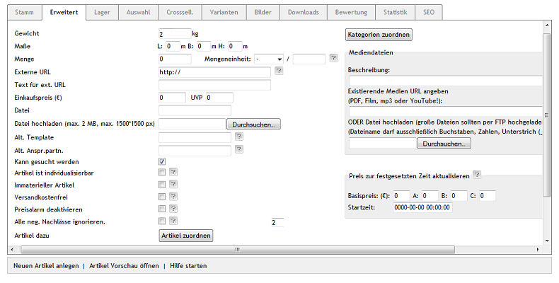

Gewichtsabhängige Versandkosten
===============================
Der OXID eShop kann so eingerichtet werden, dass für die Berechnung der Versandkosten das Gewicht der Artikel berücksichtigt wird.

Dafür werden Versandkostenregeln verwendet, deren Bedingung das Gewicht von Artikeln ist. Im Bestellprozess entscheidet sich der Kunde für eine Versandart. Alle Versandkostenregeln, die zu dieser Versandart gehören, werden abgearbeitet. Es wird geprüft, ob die festgelegte Bedingung (Gewicht) hinsichtlich des Gesamtgewichts der Artikel im Warenkorb erfüllt ist. Nur wenn die Bedingung zutrifft, wird die Versandkostenregel bei der Berechnung der Versandkosten angewandt.

Damit gewichtsabhängige Versandkosten funktionieren, muss bei den Artikeln das Gewicht eingetragen sein. Das hat auch zur Folge, dass das Gewicht auf dessen Detailseite unterhalb des Artikelpreises ausgewiesen wird.

Das Gewicht eines Artikels wird in der Artikelverwaltung festgelegt.

* Gehen Sie zu :menuselection:`Artikel verwalten --> Artikel`.
* Wählen Sie den gewünschten Artikel aus der Artikelliste.
* Geben Sie auf der Registerkarte :guilabel:`Erweitert` das Gewicht ein.
* Speichern Sie die Änderungen.

In den Versandkostenregeln wird Gewicht als Bedingung definiert.

* Gehen Sie zu :menuselection:`Shopeinstellungen --> Versandkostenregeln`.
* Wählen Sie die Versandkostenregel aus der Liste der Versandkostenregeln.
* Auf der Registerkarte :guilabel:`Stamm` finden Sie die Dropdown-Liste :guilabel:`Bedingung`.
* Wählen Sie die Bedingung Gewicht und tragen Sie Werte für :guilabel:`=\>` und :guilabel:`\<=` ein.
* Komplettieren Sie alle weiteren Einstellungen der Versandkostenregel.
* Speichern Sie die Änderungen.

Die Versandkostenregel wird einer Versandart zugeordnet.

* Gehen Sie zu :menuselection:`Shopeinstellungen --> :guilabel:`Versandart`en`.
* Wählen Sie die Versandart aus der Liste der Versandarten.
* Betätigen Sie die Schaltfläche :guilabel:`Versandkostenregeln zuordnen` auf der Registerkarte :guilabel:`Stamm`.
* Verschieben Sie die Versandkostenregel per Drag \& Drop in die rechte Liste des Zuordnungsfensters.
* Schließen Sie das Zuordnungsfenster.

.. hint:: Der Versandart müssen mindestens eine Versandkostenregel und eine Zahlungsart zugeordnet worden sein. Länder sollten zugewiesen sein, damit die Definition von Versand und Zahlung stringent ist. Ohne Länderzuordnung gilt die Versandart für alle Länder.

Beispiel
--------
Ein Artikel und zwei Versandkostenregeln dienen als Beispiel für gewichtsabhängige Versandkosten. Es wird ein Artikel benötigt, dem ein Gewicht von 2 kg zugewiesen wird. In der Artikelverwaltung wird beim Artikel auf der Registerkarte :guilabel:`Erweitert` ein Gewicht von 2 Kilogramm eingetragen.

Es werden zwei Versandkostenregeln erstellt, deren Bedingung das Gewicht ist. Die eine ist für Artikel im Warenkorb unter 3 Kilogramm Gesamtgewicht, die für 3,90 € verschickt werden, die andere für Artikel mit mehr Gewicht und Versandkosten in Höhe von 5,50 €. Die Versandkostenregeln werden so definiert, dass die Berechnung nur einmal pro Warenkorb erfolgt. Länder können, aber müssen nicht zugewiesen sein. Die Versandkostenregel muss aktiv sein.

.. image:: ../../media/screenshots-de/oxaafv02.png
   :alt: Versandkostenregel ab 3 kg Gesamtgewicht
   :height: 314
   :width: 650

Die Versandkostenregeln müssen einer Versandart zugeordnet sein. Wird diese Versandart beim Kauf eines Artikels ausgewählt, werden alle zugehörigen Versandkostenregeln geprüft. Liegt der Artikel mit dem Gewicht von 2 Kilogramm einmal im Warenkorb, greift die erste Versandkostenregel.

Sind zwei oder mehrere Artikel mit einem Gewicht von jeweils 2 Kilogramm im Warenkorb, gilt die zweite Versandkostenregel für die Berechnung der Versandkosten.

.. image:: ../../media/screenshots-de/oxaafv04.png
   :alt: Warenkorb mit 2 Artikeln
   :height: 262
   :width: 500

.. seealso:: :doc:`Artikel - Registerkarte Erweitert <../artikel/registerkarte-erweitert>` | :doc:`Versandkostenregeln - Registerkarte Stamm <../versandkostenregeln/registerkarte-stamm>` | `Versandarten - Registerkarte Stamm <../versandarten/registerkarte-stamm>`

.. Intern: oxaafv, Status: