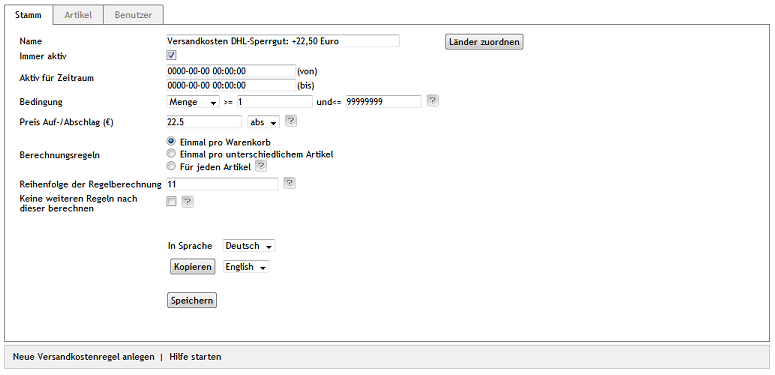

Versandkosten für bestimmte Artikel
***********************************
In einem Online-Shop gibt es in der Regel einen Warenkatalog aus ganz unterschiedlichen Artikeln. Der Versand einiger Artikel kann deutlich höhere Kosten verursachen, da diese nur zu Sonderkonditionen, wie beispielsweise als Sperrgut, verschickt werden können. Der Versand kann daher so eingerichtet werden, dass ein Zuschlag auf die sonst üblichen Versandkosten erhoben wird, sobald bestimmte Artikel in den Warenkorb gelegt werden. Dies lässt sich durch Versandkostenregeln abbilden, die sich auf bestimmte Artikel beziehen.

Im Bestellprozess entscheidet sich der Kunde für eine Versandart. Alle Versandkostenregeln, die zu dieser Versandart gehören, werden abgearbeitet. Es wird geprüft, ob die festgelegte Bedingung (zugewiesene Artikel) hinsichtlich der Artikel im Warenkorb erfüllt ist. Nur wenn eine Bedingung zutrifft, wird die Versandkostenregel bei der Berechnung der Versandkosten angewandt.

In den Versandkostenregeln werden Artikel als Bedingung definiert.

* Gehen Sie zu :menuselection:`Shopeinstellungen --> Versandkostenregeln`.
* Wählen Sie die Versandkostenregel aus der Liste der Versandkostenregeln.
* Betätigen Sie die Schaltfläche :guilabel:`Artikel zuordnen` auf der Registerkarte :guilabel:`Artikel`.
* Verschieben Sie die Artikel per Drag \& Drop in die rechte Liste des Zuordnungsfensters.
* Schließen Sie das Zuordnungsfenster.
* Vergeben Sie einen Preisaufschlag auf der Registerkarte :guilabel:`Stamm`.
* Komplettieren Sie alle weiteren Einstellungen der Versandkostenregel.
* Speichern Sie die Änderungen.

Die Versandkostenregel wird einer Versandart zugeordnet.

* Gehen Sie zu :menuselection:`Shopeinstellungen --> Versandarten`.
* Wählen Sie die Versandart aus der Liste der Versandarten.
* Betätigen Sie die Schaltfläche :guilabel:`Versandkostenregeln zuordnen` auf der Registerkarte :guilabel:`Stamm`.
* Verschieben Sie die Versandkostenregel per Drag\&Drop in die rechte Liste des Zuordnungsfensters.
* Schließen Sie das Zuordnungsfenster.

.. hint:: Der Versandart müssen mindestens eine Versandkostenregel und eine Zahlungsart zugeordnet worden sein. Länder sollten zugewiesen sein, damit die Definition von Versand und Zahlung stringent ist. Ohne Länderzuordnung gilt die Versandart für alle Länder.

Beispiel
++++++++
Im Beispiel werden zwei Versandkostenregeln verwendet, um höhere Versandkosten zu berechnen, sobald bestimmte Artikel in den Warenkorb gelegt werden. Für beide Versandkostenregeln gilt Menge als Bedingung und es wird ein Mengenbereich von 1 bis 99999999 vorgegeben. Dadurch wird sichergestellt, dass die Bedingung immer zutrifft. Die Berechnung erfolgt einmal pro Warenkorb. Länder können, aber müssen nicht zugewiesen sein. Die Versandkostenregel muss aktiv sein.

Die erste Versandkostenregel mit 5,99 € Versandkosten gilt für alle Artikel, die zweite mit einem Preisaufschlag von 22,50 € für alle Wakeboards, die aufgrund ihrer Länge als Sperrgut verschickt werden müssen.

Der im Screenshot gezeigten Versandkostenregel wurden drei Wakeboards zugeordnet. Beide Versandkostenregeln gehören zur Versandart \"DHL GoGreen\". Wird diese Versandart beim Kauf ausgewählt, werden beide Versandkostenregeln geprüft.

Liegt ein Artikel im Warenkorb, der kein Wakeboard ist, greift die erste Versandkostenregel. Der Versand kostet 5,99 €.

.. image:: ../../media/screenshots-de/oxbafy02.png
   :alt: Warenkorb mit einer Wakeboard-Bindung
   :height: 262
   :width: 500

Wird zusätzlich ein Wakeboard in den Warenkorb gelegt, ist auch die zweite Versandkostenregel gültig. Die Versandkosten summieren sich auf 28,49 €.

.. image:: ../../media/screenshots-de/oxbafy03.png
   :alt: Warenkorb mit Wakeboard und Bindung
   :height: 318
   :width: 500

28,49 € kostet auch der Versand eines einzelnen Wakeboards, da beide Versandkostenregeln - die für alle Artikel und die für die Wakeboards - zutreffen.

.. seealso:: `Versandkostenregeln - Registerkarte Artikel <../versandkostenregeln/registerkarte-artikel.html>`_ | `Versandarten - Registerkarte Stamm <../versandarten/registerkarte-stamm.html>`_